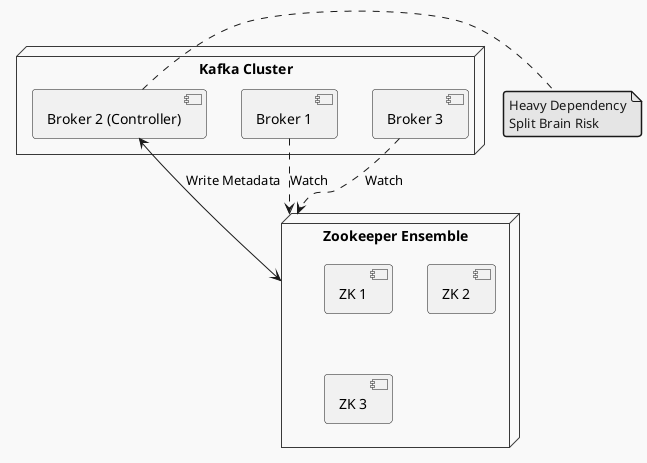
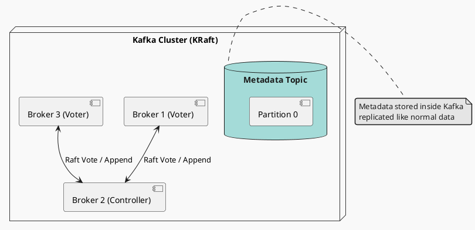

# Kafka 控制面演进：从 Zookeeper 到 KRaft

> “Kafka 3.0+ 引入的 KRaft 模式不仅仅是去除了对外部 Zookeeper 的依赖，更是将元数据管理推向了全新的高性能时代。”

## 1. 为什么需要控制面？ (The Metadata Problem)
Broker 处理数据时需要知道：
- 谁是 Partition 的 Leader？
- 谁在 ISR 列表中？
- 哪些 Broker 存活？

这些 **元数据 (Metadata)** 需要由一个大脑统一管理，确保集群视图一致。

## 2. 旧时代：Zookeeper 模式 (Legacy)
在 2.8 版本之前，Kafka 强依赖 Zookeeper 保存元数据。
一个 Broker 被选为 **Controller**，它负责监听 Zookeeper 并将元数据变更推送给其他 Broker。

### 痛点 (Pain Points)
1.  **扩展性瓶颈**: Zookeeper 不适合存储大量数据。当 Partition 数达到 20万+ 时，元数据读写压力巨大。
2.  **Failover 慢**: Controller 宕机时，新 Controller 需要从 ZK 拉取全量元数据。对于大集群，这可能耗时数十秒甚至分钟（期间集群不可写）。
3.  **双重脑裂 (Split Brain)**: Controller 内存数据与 ZK 可能不一致。

## 3. 新时代：KRaft 模式 (Modern)
KRaft (Kafka Raft) 将 Raft 共识协议集成到了 Broker 内部。
- **Controller Quorum**: 3 或 5 个 Broker 被指定为 Controller 节点，组成 Raft 组。
- **Metadata as a Log**: **元数据本身被存储为一个特殊的 Topic (`__cluster_metadata`)**。
    - 所有的元数据变更（Create Topic, ISR Change）都是这个 Topic 里的一条消息。
    - 其他 Broker 只是这个 Topic 的 Consumer（主从复制）。

### 核心优势 (Key Benefits)
1.  **百万级分区支持**: 元数据存储在本地 Log 中，配合 Snapshot 机制，不再受 ZK 内存限制。
2.  **毫秒级恢复**: 新 Controller 选举也是基于 Raft。且由于它一直同步着 Metadata Topic，内存里已经是热数据，无需重新加载。
3.  **部署简单**: 不再需要单独维护 Zookeeper 集群。

## 4. 架构对比图 (Architecture Comparison)

### Legacy (with Zookeeper)

### Modern (KRaft Mode)

## 5. 总结
KRaft 的本质是将元数据管理 **"Log 化"**。既然 Kafka 擅长处理 Log，为什么不把自己的元数据也当成 Log 来处理呢？这是一种这种递归式的设计美学。

