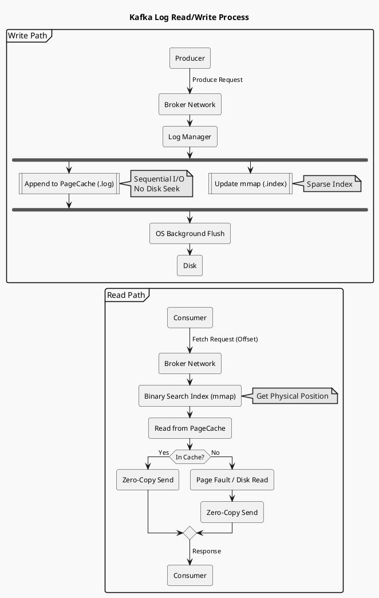

# Kafka 核心架构：日志结构存储 (Log-Structured Storage)

> “Kafka 的快，很大程度上是因为它把磁盘当内存用，把随机 I/O 变成了顺序 I/O。”

## 1. 物理存储层级 (Physical Hierarchy)
Kafka 的数据存储在文件系统中，层级结构如下：

```
Topic (逻辑概念)
└── Partition (物理文件夹, e.g., "my-topic-0")
    └── Segment (逻辑分段)
        ├── 00000000000000000000.log       (数据文件)
        ├── 00000000000000000000.index     (偏移量索引)
        ├── 00000000000000000000.timeindex (时间戳索引)
        └── leader-epoch-checkpoint        (Leader版本检查点)
```

### 为什么需要 Segment？
如果不分段，一个 Partition 就对应一个巨大的文件：
1.  **清理困难**：基于时间或大小的过期数据删除（Log Retention）需要修改头部，操作重。
2.  **索引效率**：大文件索引维护成本高。

**Segment 机制**：将 Partition 切分为多个 Segment，只有一个当前活跃（Active Segment）负责读写，旧 Segment 只读。过期清除直接删除旧文件即可（O(1) 复杂度）。

## 2. `.log` 文件：顺序追加 (Sequential Append)
- **Append Only**: 消息只能追加到 Active Segment 的末尾。
- **Zero-Copy**: 磁盘上的数据格式与网络传输格式完全一致（Binary Protocol）。这意味着 Broker 读取磁盘文件后，可以直接通过 sendfile 系统调用发给网卡，无需解压、无需用户态内核态拷贝。

## 3. `.index` 文件：稀疏索引 (Sparse Index)
Kafka 不会为每条消息都建立索引（那是 MySQL B+Tree 的做法，插入慢）。
它采用**稀疏索引**：每写入 N KB（默认 4KB）数据，才在 Index 文件中记录一条 Entry。

**Entry 结构 (8 Bytes)**:
- `Relative Offset` (4B): 相对当前 Segment 基准 Offset 的差值（省空间）。
- `Physical Position` (4B): 消息在 .log 文件中的物理字节位置。

### 查找过程 (Log Lookup)
假设我们要找 Offset = 3687 的消息：
1.  **定位 Segment**: 二分查找 Partition 下的所有 Segment 文件名（文件名即 BaseOffset）。找到 `.index` 文件。
2.  **查询 Index**: 在 `.index` 文件中进行二分查找，找到 **<= 3687** 的最大索引项。例如找到 Offset=3680, Position=1024。
3.  **扫描 Log**: 从 `.log` 文件的 Position=1024 开始顺序扫描，直到找到 Offset=3687。

## 4. 思考题 (Critical Thinking)
> 为什么 Kafka 索引文件使用 Memory Mapped Files (mmap)？
> 
> **答案**: 
> 索引文件通常较小，将其直接映射到内存地址空间。
> 1.  避免了 read() 系统调用的开销。
> 2.  OS 负责页的加载和置换，就像访问内存数组一样访问磁盘文件。
> 3.  进程重启后的热加载：PageCache 依然在 OS 中。

## 5. 总结
Kafka 的存储引擎极度简化：**仅追加、分段、稀疏索引**。这种设计牺牲了复杂的查询能力（只能按 Offset 或 Time 查），换取了极致的写入吞吐和简单的并发模型（几乎无锁）。

## 6. 读写流程图解 (Log Read/Write Flow)

为了更好地理解上述机制，以下是消息写入与读取的完整流转过程。

### Mermaid 视图 (Browser Render)
```mermaid
graph TD
    subgraph Write_Path [写入流程]
        P[Producer] -->|Produce Request| B_Net[Broker Network]
        B_Net -->|Validation| B_Log[Log Manager]
        B_Log -->|Sequential Append| PC_Log[PageCache (.log)]
        B_Log -->|Update| MM_Idx[mmap (.index)]
        PC_Log -.-|OS Async Flush| D_Disk[Disk]
    end

    subgraph Read_Path [读取流程]
        C[Consumer] -->|Fetch Request| B_Net2[Broker Network]
        B_Net2 -->|Parse Offset| B_Sch[Log Search]
        B_Sch -->|Binary Search| MM_Idx
        MM_Idx -->|Return Position| B_Sch
        B_Sch -->|Read form Position| PC_Log
        PC_Log -->|Zero-Copy (sendfile)| B_Net2
        B_Net2 -->|Response| C
    end

    style PC_Log fill:#f9f,stroke:#333
    style MM_Idx fill:#ccf,stroke:#333
```

### PlantUML 源码 (Source Code)
> 遵循您的 `mars` 主题规范，您可以使用以下代码在本地渲染更精美的图表：



