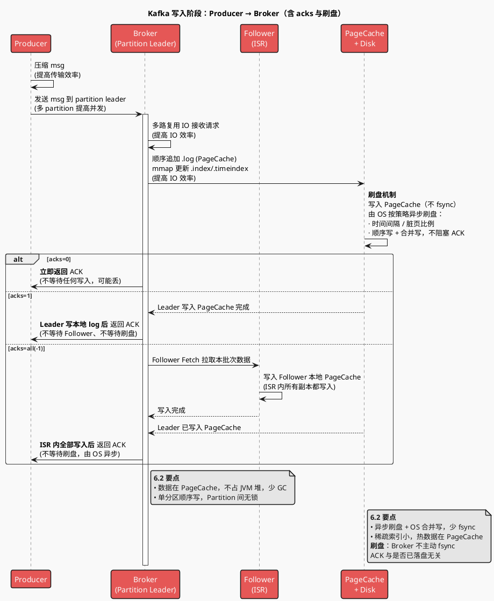
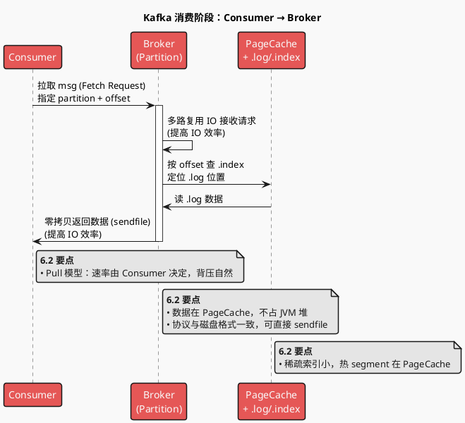
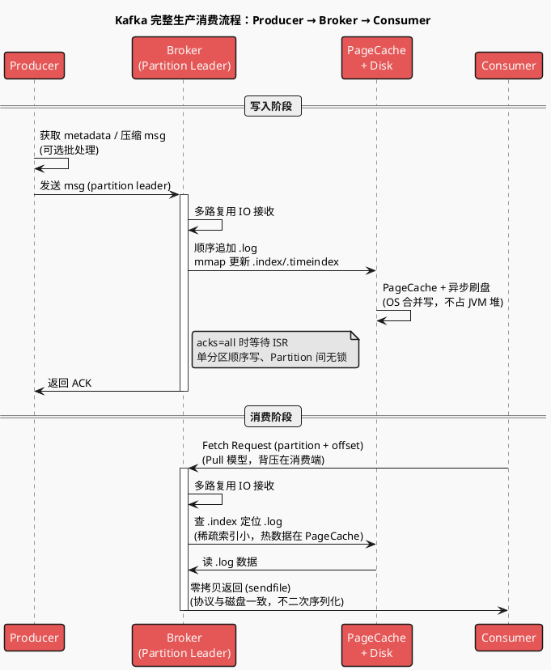

# Kafka 写入与消费流程梳理

## 一、写入阶段：Producer → Broker

### 1.1 流程概要

| 角色 | 步骤 | 目的 |
|------|------|------|
| **生产端** | 0. 获取元数据（Topic/Partition → Leader Broker），可缓存 | 确定请求发往哪台 Broker |
| | 1. 压缩 msg（gzip/snappy/lz4/zstd），可批量攒批后发送 | 提高传输效率、减少 RTT |
| | 2. 发送 msg 到对应 partition leader 所在 Broker | 多 partition 提高并发度 |
| **Broker (Leader)** | 1. 多路复用 IO 模型（NIO/Selector）接收请求 | 提高 IO 效率 |
| | 2. 顺序追加写入 .log（写 PageCache），索引 .index/.timeindex 用 mmap 更新 | 顺序写 + 稀疏索引，提高 IO 效率 |
| | 3. 由 OS 将 PageCache 批量异步刷盘 | 避免同步落盘阻塞 |
| | 4. 若 `acks=all`，需等待 ISR 内 Follower 同步完成 | 保证持久化语义 |
| | 5. 返回 ACK 给 Producer（时机由 `acks` 决定：0/1/all） | |

### 1.2 写入阶段时序图（服务维度）

下图包含：**不同 acks 配置下的处理逻辑**、**刷盘机制**，以及 6.2 要点。

**acks 与刷盘说明**（与上图对应）：

| acks | Broker 行为 | 返回 ACK 时机 | 刷盘 |
|------|-------------|----------------|------|
| **0** | 收到请求即可返回，不保证写入 | 发后即忘（或 Broker 收到即返） | 无保证，可能未写即返 |
| **1** | Leader 写入本地 log（PageCache） | Leader 写 PageCache 完成即返 | 不等待刷盘，由 OS 异步 |
| **all(-1)** | Leader 写 PageCache + ISR 内 Follower 均写入 | 所有 ISR 副本写 PageCache 完成即返 | 不等待刷盘，由 OS 异步 |

**刷盘机制**：Kafka 不主动对每条消息调用 `fsync`。数据先追加到 **PageCache**，由操作系统按内核策略（如脏页比例、定时）将脏页**批量**写回磁盘，顺序写 + 合并写，吞吐高。因此「返回 ACK」与「数据是否已落盘」无关，只与「是否已写入 log（PageCache / 副本）」有关；若需更强持久化，可依赖副本数（acks=all + min.insync.replicas）或外部手段。

---

## 二、消费阶段：Consumer → Broker

### 2.1 流程概要

| 角色 | 步骤 | 目的 |
|------|------|------|
| **消费端** | 0. 获取元数据 + 所属 Consumer Group 的 partition 分配（若使用 Group） | 确定从哪些 partition、哪台 Broker 拉取 |
| | 1. 携带 offset 向对应 partition 的 Leader Broker 发 Fetch 请求（Pull 模型） | 按需拉取，背压可控 |
| **Broker (Leader)** | 1. 多路复用 IO 模型接收请求 | 提高 IO 效率 |
| | 2. 根据 offset 查 .index 定位 segment 与 .log 物理位置，从 PageCache/磁盘读 | 稀疏索引 + 顺序扫 |
| | 3. 零拷贝将 .log 数据发回（sendfile：PageCache/Disk → 网卡） | 减少用户态拷贝与 CPU |
| | 4. 返回数据给 Consumer；Consumer 提交 offset（如写入 `__consumer_offsets`） | 下次拉取或重启后从该 offset 继续 |

### 2.2 消费阶段时序图（服务维度）

---

## 三、说明

- **时序图粒度**：仅到服务维度（Producer、Broker、Storage），不展开到线程/类级别。
- **涉及 Database 时**：若流程中有 DB（如业务库、维表库），需在时序图中体现**库名、表名**（本流程为纯 Kafka 读写，无 DB 参与）。
- **主题**：PlantUML 使用 `!theme mars`。
- **写路径 vs 读路径的“零拷贝”**：
  - **写路径**：数据落盘是顺序追加到 PageCache（.log）+ mmap 更新 .index/.timeindex；不经过用户态二次序列化（协议与磁盘格式一致），由 OS 异步刷盘。一般不把写路径称为 sendfile 式零拷贝，重点在**顺序写 + PageCache + 稀疏索引**。
  - **读路径**：使用 **sendfile**，数据从 PageCache/Disk 经内核直接到网卡，不经用户态，减少拷贝与 CPU，是典型的零拷贝。
- **acks 与可靠性**：`acks=0` 发后即忘；`acks=1` Leader 写本地即返；`acks=all(-1)` 需 ISR 内所有副本写成功才返，配合 `min.insync.replicas` 可避免仅 Leader 在 ISR 时的“假 all”。

---

## 四、流程正确性审阅与补充

### 4.1 正确性核对

| 描述 | 结论 | 备注 |
|------|------|------|
| Producer 压缩 msg | ✓ 正确 | 支持 gzip/snappy/lz4/zstd，可配置 |
| 发送到 partition leader | ✓ 正确 | 需先通过 Metadata 获知 Leader 所在 Broker |
| Broker 多路复用 IO | ✓ 正确 | 基于 NIO Selector，单线程处理多连接 |
| 顺序追加 .log + mmap 索引 | ✓ 正确 | .log 写 PageCache 后由 OS 刷盘；.index/.timeindex 稀疏索引用 mmap |
| PageCache + 异步刷盘 | ✓ 正确 | 不主动 fsync，依赖 OS 的 dirty page 写回 |
| 返回 ACK | ✓ 正确 | 时机由 acks 决定，all 时需等 ISR 副本 |
| Consumer 拉取、Broker sendfile 返回 | ✓ 正确 | Pull 模型；读路径 sendfile 零拷贝 |

### 4.2 已补充的缺失点

- **Producer**：元数据获取（MetadataRequest）、批处理（batch）与压缩的关系、acks 语义及 ISR 同步。
- **Broker 写入**：写路径强调顺序写 + PageCache + mmap，不混淆为“写路径零拷贝”；acks=all 时需等待 Follower 同步。
- **Consumer**：拉取前需知 partition 与 offset；拉取后提交 offset（如 `__consumer_offsets`）；Consumer Group 下 partition 分配决定从哪几个 Broker 拉取。
- **概念区分**：写路径与读路径中“零拷贝”的准确含义（读路径 = sendfile；写路径 = 顺序写 + 无二次序列化）。

---

## 五、完整生产消费时序图

下图将写入与消费合并为一条完整链路：Producer 写 msg 入 Broker，Consumer 再从 Broker 拉取 msg（服务维度，mars 主题）。与上文流程概要、正确性审阅一致。

---

## 六、从流程看 Kafka 高性能：归纳与补充

你梳理的流程已经覆盖了 Kafka 高性能的主要手段。下面按**维度**做归纳，并补上流程里未显式写出的几点，方便回答「为什么 Kafka 快」。

### 6.1 流程与高性能手段的对应关系

| 维度 | 手段 | 在流程中的体现 | 效果 |
|------|------|----------------|------|
| **网络 / 并发** | 多路复用 IO（NIO Selector） | Broker 接收 Produce/Fetch 请求 | 单线程处理大量连接，避免每连接一线程的上下文切换与内存占用 |
| **网络 / 吞吐** | 批处理（batch） | Producer 攒批后发送、Broker 批量写 log | 减少 RTT 次数、提高压缩比，网络与 CPU 利用率更高 |
| **网络 / 带宽** | 压缩（gzip/snappy/lz4/zstd） | Producer 压缩后再发 | 降低带宽与 IO 体积，同等带宽下吞吐更高 |
| **存储写** | 顺序追加 + PageCache | 只追加 .log、写 PageCache 后由 OS 刷盘 | 顺序写逼近磁盘顺序吞吐（如百 MB/s～GB/s），避免随机写与同步 fsync 阻塞 |
| **存储写** | 稀疏索引 + mmap | 仅对 .index/.timeindex 建索引，用 mmap 映射 | 索引小、热数据在 PageCache，写索引几乎不产生随机 IO |
| **存储读** | 零拷贝（sendfile） | Broker 从 PageCache/Disk 读 .log 后直接发网卡 | 数据不经用户态，减少拷贝与 CPU，读路径吞吐高 |
| **存储读** | 顺序读 + OS 预读 | 按 offset 顺序读 .log | 内核 read-ahead 连续页，顺序读命中 PageCache 或顺序磁盘读，延迟与吞吐友好 |
| **扩展性** | 多 Partition 并行 | 消息按 key/轮询发往不同 partition，多 Leader 分布多 Broker | 写/读均可水平扩展，单 partition 内顺序、partition 间无锁 |

### 6.2 流程中未显式写出的高性能要点

- **不用 JVM 堆做消息缓存**  
  数据主要在 **PageCache**，Broker 进程只做路由与索引。这样不把几百 GB 数据放进堆，避免大堆带来的 **GC 停顿**（STW），延迟更稳定，吞吐不受 GC 拖累。

- **二进制协议、存储与网络格式一致**  
  磁盘上的 .log 与网络传输格式一致，Broker 读盘后**无需反序列化再序列化**，可直接通过 sendfile 交给网卡，既省 CPU 又便于零拷贝。

- **Pull 模型与背压**  
  Consumer **拉取**而非 Broker 推送，消费速率由 Consumer 决定。Broker 无需因消费慢而排队或背压，只需按请求读盘并返回，服务端逻辑简单、易做高吞吐。

- **Partition 内顺序、Partition 间无锁**  
  每个 Partition 只有一个 Leader，写请求在单分区内顺序追加，**无需跨分区加锁**。通过增加 Partition 数提高并发，而不是在单一队列上做细粒度锁。

- **异步刷盘与 OS 合并写**  
  不每条消息 fsync，由 OS 将 PageCache 的脏页**批量**写回磁盘。顺序写 + 合并写，磁盘 IO 次数少、吞吐高；用 acks 控制「何时向 Producer 确认」以权衡持久化与延迟。

- **索引小、热数据集中**  
  稀疏索引（如每 4KB 一条）使 .index 很小，易常驻内存；热 segment 的 .log 被重复读时自然留在 PageCache，冷数据才读盘，整体读路径高效。

### 6.3 小结：一句话对应

| 问 | 答（对应流程/设计） |
|----|----------------------|
| 为什么敢用磁盘、不怕慢？ | 顺序写 + 顺序读 + PageCache，磁盘当「顺序缓冲区」用，吞吐高。 |
| 为什么读不占很多 CPU？ | sendfile 零拷贝，数据不经用户态；二进制协议不二次序列化。 |
| 为什么写不阻塞？ | 写 PageCache 即返回（由 acks 决定何时 ack），异步刷盘，不做同步 fsync。 |
| 为什么能水平扩展？ | 多 Partition、多 Broker，无跨分区锁；NIO 多路复用单机连接数高。 |
| 为什么延迟稳定？ | 不大堆缓存消息，GC 压力小；顺序 IO 可预测，无随机 IO 尖刺。 |

以上是对「为什么 Kafka 高性能」的归纳与补充；更细的零拷贝、PageCache、顺序 IO 原理见同目录下的 `05_kafka_performance_principles.md`。

---

## 七、零拷贝与多路复用 IO（引用通用技术文档）

**零拷贝（sendfile）** 与 **多路复用 IO（NIO / select-poll-epoll）** 是通用技术，在 Kafka、Nginx、Redis、Netty 等中间件中普遍使用。本流程文档不再展开原理与时序图，统一参见独立文档：

- **[NIO 与零拷贝：通用技术说明](../NIO与零拷贝_通用技术.md)**（同目录上一级：`be_middleware/NIO与零拷贝_通用技术.md`）

该文档包含：
- **零拷贝**：传统 read+write 与 sendfile 的对比时序图、拷贝次数与上下文切换对比。
- **多路复用 IO**：传统一连接一线程 与 NIO Selector 的对比时序图；**select、poll、epoll** 的区别与原理，以及以「服务端接收数据」为例的三种方式时序图、对比表。

### 7.1 在 Kafka 流程中的位置

- **零拷贝**：对应**消费阶段** Broker 将 .log 数据返回给 Consumer 的路径（读磁盘/PageCache → 网卡）。写入阶段不涉及 sendfile。
- **多路复用 IO**：对应**写入与消费阶段** Broker 接收 Produce 请求、Fetch 请求时的网络层；Linux 上多为 **epoll**，单线程（或少量线程）通过 Selector 处理大量客户端连接。
