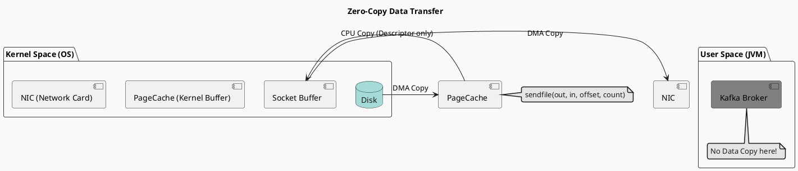

# Kafka 高性能原理 (Performance Principles)

> “Kafka 的设计哲学：Don't fear the Filesystem. (不要害怕文件系统)。”

很多人认为磁盘慢、内存快，但在特定的访问模式下（顺序写），磁盘的速度可以匹敌内存。Kafka 主要是压榨了操作系统的潜能。

## 1. Zero-Copy (零拷贝)
传统的数据传输（Disk -> Network）需要 **4 次上下文切换** 和 **4 次数据拷贝**：
1.  Disk -> Kernel Buffer (DMA Copy)
2.  Kernel Buffer -> User Buffer (CPU Copy) **[浪费]**
3.  User Buffer -> Socket Buffer (CPU Copy) **[浪费]**
4.  Socket Buffer -> NIC Buffer (DMA Copy)

**Kafka 使用 `sendfile` 系统调用**：
实现 **Zero-Copy**，数据直接从 File Channel 传输到 Socket Channel。
- **路径**: Disk -> Kernel Buffer -> NIC Buffer。
- **优势**: 
    - 既然数据不需要在应用层处理（Broker 只是搬运工），就没必要拷到用户态。
    - 显著降低 CPU 使用率（CPU 不再负责数据搬运，只负责控制逻辑）。

## 2. PageCache (页缓存)
Kafka 极少在 JVM 堆内缓存数据（除了少量 Head/Tail 索引），而是大量利用操作系统的 **PageCache**。

### 为什么不用 JVM Heap？
1.  **GC 开销大**: 几百 GB 的堆内存会导致长时间的 STW (Stop-The-World)。
2.  **对象头浪费**: Java 对象有额外开销，内存有效利用率低。
3.  **重启即失**: 进程重启后，堆内缓存瞬间清空，需要重新预热。

### PageCache 的优势
- **OS 管理**: 对所有进程透明，利用空闲内存。
- **重启不丢**: Broker 重启（进程死），但 PageCache 还在 OS 内存里。重启后瞬间热启动。
- **自动预读 (Read-Ahead)**: OS 会自动将相邻的磁盘块预读到内存中，完美契合 Kafka 的顺序读取模式。

## 3. Sequential I/O (顺序读写)
- **随机 I/O**: 也就是让磁头跳来跳去。速度：~100KB/s。
- **顺序 I/O**: 磁头几乎不动。速度：~600MB/s。
- **差距**: 6000 倍。

Kafka 的追加写（Append-Only）模式保证了写入永远是顺序的。
即使是机械硬盘（HDD），只要是顺序写，性能也足以支撑极高的吞吐。这也解释了为什么 Kafka 集群通常还是用 HDD 而不是昂贵的 SSD（当然 SSD 更好）。

## 4. 批处理 (Batching)
Producer 不是生产一条发一条，而是攒一批（Batch）。
- 减少网络 RTT往返。
- 提高压缩率（Compression）。同样的压缩算法（如 Snappy），对单条短文本压缩效果差，但对一大批文本压缩效果极佳。

## 5. 总结图示

