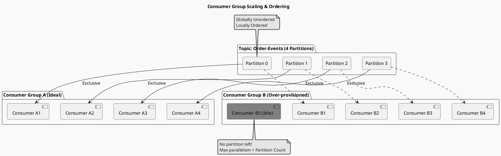

# Kafka 核心架构：Topic & Partition 设计

> “Topic 是逻辑上的概念，Partition 才是物理上的实体。Partition 是 Kafka 扩展性（Scalability）和并行度（Parallelism）的基石。”

## 1. 为什么需要 Partition？ (The "Create" Problem)
假设 Kafka 只有 Topic 没有 Partition，那么一个 Topic 的所有数据都必须存储在一台 Broker 上。
- **存储瓶颈**：单机硬盘容量有限。
- **IO 瓶颈**：单机网卡和磁盘 IO 有限。

**Partition (分片)** 解决了这个问题：
将一个大 Topic 切分成多个 Partition，分布在集群的也就是 Broker 上。
- **无限扩展**：理论上可以通过加机器（Broker）来无限扩展 Topic 的容量。
- **并行读写**：不同的 Partition 可以被并行写入和读取。

## 2. 生产者分发策略 (Load Balancing)
Producer 发送消息时，决定发往哪个 Partition 的算法：
1.  **Direct**: 指定 Partition ID（极少用）。
2.  **Round-Robin (轮询)**: Key 为 `null` 时。消息被均匀打散到所有 Partition，实现负载均衡。
3.  **Hash (Key Hash)**: Key 不为 `null` 时。`hash(key) % num_partitions`。**这是保证“特定业务数据有序”的关键**（如：同一个 UserID 的操作都在 Partition-1）。

## 3. 消费者组模型 (Consumer Group) —— Kafka 的杀手锏
传统的 MQ 只有两种模式：
- **Queue**: 负载均衡，但消息不广播。
- **Pub/Sub**: 广播，但无法负载均衡。

Kafka 引入 **Consumer Group (CG)** 统一了这两者：
- **组内竞争 (Queue)**: 同一个 Partition 只能被组内的一个 Consumer 消费。这保证了 Partition 内的顺序性。
- **组间广播 (Pub/Sub)**: 不同的 Consumer Group 可以消费同一个 Topic 的全量数据，互不干扰。

### 关键约束: Pigeonhole Principle (抽屉原理)
假设 Topic 有 $P$ 个 Partition，组内有 $C$ 个 Consumer：
- **$C = P$**: 最理想。每个 Consumer 消费 1 个 Partition。
- **$C < P$**: 某些 Consumer 会消费多少个 Partition（忙）。
- **$C > P$**: **多余的 Consumer 会空闲（Idle）**！因为 Partition 不能拆开给两个人用（否则这就乱序了）。

> **推论**: Kafka 的最大消费并行度受限于 Partition 数量。如果在这之前你觉得消费慢，加 Consumer 是没用的，必须扩 Partition。

## 4. 顺序性 (Ordering Guarantee)
- **全局有序？** No。Kafka 不保证 Topic 级别的全局有序。
- **局部有序？** Yes。Kafka 保证 Partition 内部的消息是有序的。

**最佳实践**:
如果业务要求“订单状态变更必须有序”，则必须将“OrderID”作为 Key 发送。这样同一个订单的所有消息都会去同一个 Partition，从而被同一个 Consumer 顺序处理。

## 5. 消费组扩容图解 (Scaling Visualization)
> 为什么加消费者没用？这张图展示了 Partition 数量对并行度的硬限制。

