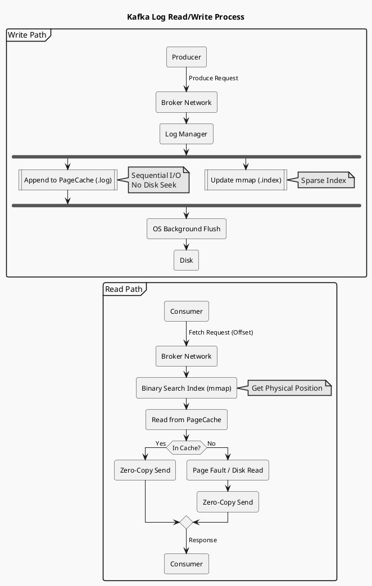
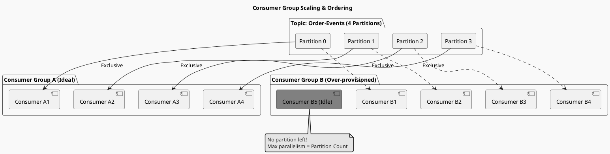
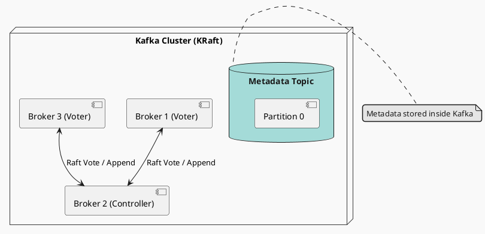

# Kafka 专题深度研习笔记

> 本文档汇集了 Kafka 核心架构、高可用原理、高性能机制及生产实践的深度解析。

---

## 模块一：知识图谱分析 (Mind Map Analysis)

### 1. 核心定位
- **第一性原理**: 分布式的提交日志 (Distributed Commit Log)。
- **核心价值**: 解耦 (Decoupling)、削峰 (Peak Shaving)、异步 (Async)。
- **关键特性**: 高吞吐、低延迟、高可用、可扩展。

### 2. 架构演进方向
- **Control Plane**: 正在从依赖 Zookeeper 转向 **KRaft (Kafka Raft)** 模式，实现元数据管理的 Log 化和一致性收敛。
- **Data Plane**: 始终坚持 **Log-Structured Storage**，利用顺序 I/O 和零拷贝技术榨干硬件性能。

---

## 模块二：核心架构深度解析 (Core Architecture)

### 1. 日志结构存储 (Log-Structured Storage)
Kafka 的快，很大程度上是因为它把磁盘当内存用，把随机 I/O 变成了顺序 I/O。

#### 物理层级
- **Topic**: 逻辑分类。
- **Partition**: 物理分片，扩展性和并行度的基石。
- **Segment**: 物理文件分段 (.log, .index, .timeindex)。

#### 关键机制
- **Segment 分段**: 只有 Active Segment 可写，旧 Segment 只读。便于基于时间的 Log Retention 清理。
- **稀疏索引 (Sparse Index)**: 索引文件 (.index) 使用 mmap 映射到内存。每 4KB 记录一项，二分查找定位 Block，再顺序扫描 Log。
- **Zero-Copy**: 读路径使用 `sendfile`，数据直接从 PageCache -> NIC，不走 User Space。

#### 读写流程图 (Read/Write Flow)

### 2. Topic & Partition 设计
Partition 是 Kafka 的核心扩展单元。

#### 为什么需要 Partition？
- **存储扩展**: 打破单机存储限制。
- **负载均衡**: 将数据分散到多台 Broker。

#### Consumer Group (消费组)
Kafka 通过 Consumer Group 统一了 Queue (点对点) 和 Pub/Sub (广播) 模型。
- **抽屉原理**: 组内 Consumer 数量不应超过 Partition 数量，否则多余的 Consumer 会空闲。
- **有序性**: 仅保证 Partition 内部有序，不保证 Topic 全局有序。

#### 消费组扩容图解

### 3. 控制面：KRaft vs Zookeeper

#### Zookeeper 模式 (Legacy)
- Controller 依赖 ZK 存储元数据。
- 缺点：脑裂风险、元数据加载慢、运维复杂。

#### KRaft 模式 (Modern)
- **Metadata as a Log**: 元数据存储在 `__cluster_metadata` Topic 中。
- **Raft Quorum**: Controller 节点内部运行 Raft 协议选主。
- **优势**: 毫秒级 Failover，支持百 万级 Partition。

#### 架构对比

---

## 模块三：高可用与可靠性 (HA & Reliability)

### 1. 副本机制 (Replication & ISR)
- **ISR (In-Sync Replicas)**: 动态维护的同步列表。只有 ISR 内的副本可参与选主。
- **Acks=-1 (all)**: 必须等待 Leader + ISR 所有副本确认。
- **min.insync.replicas**: 配合 acks=all 使用。建议设为 >1，保证至少写入 2 个副本。

### 2. 水位与一致性 (HW & Leader Epoch)
- **HW (High Watermark)**: 消费者可见的最高偏移量。取所有 ISR 副本 LEO 的最小值。
- **Leader Epoch**: 解决 HW 异步更新导致的数据截断丢失问题。切主时以 Epoch 为准进行日志截断。

### 3. 交付语义 (Delivery Semantics)
- **At-Most-Once**: 发后即忘 (ack=0)。
- **At-Least-Once**: 失败重试 (ack=-1, retries>0)。默认。
- **Exactly-Once (EOS)**:
    - **幂等性 (Idempotence)**: `enable.idempotence=true`。引入 (PID, SeqNum) 解决单分区重复。
    - **事务 (Transactions)**: 解决跨分区原子写入 (`consume-process-produce`)。需引入 Transaction Coordinator 和 Markers。

---

## 模块四：高性能原理 (Performance Principles)

### 1. Zero-Copy (零拷贝)
利用 `sendfile` 系统调用，数据传输路径：`Disk -> Kernel Buffer -> NIC Buffer`。
避免了 `Kernel <-> User` 的两次 CPU 拷贝和上下文切换。

### 2. PageCache (页缓存)
- Kafka 极少使用 JVM 堆内存，而是高度依赖 OS PageCache。
- **优势**: 避免 JVM GC 开销；Broker 重启后缓存依然热（在 OS 层）。

### 3. Sequential I/O (顺序读写)
- Log Append Only 模式保证了磁盘始终处于顺序写状态。
- 顺序写机械硬盘 (HDD) 性能约为 600MB/s，远超随机写 (100KB/s)。

### 4. Batching (批处理)
Producer 使用 Accumulator 攒批发送，配合压缩算法 (LZ4/Zstd/Snappy)，大幅提升吞吐和网络利用率。

---

## 模块五：生产实践与故障排查 (Operations)

### 1. Rebalance (重平衡) 风暴
- **现象**: 消费停顿 (STW)。
- **原因**: 
    - `session.timeout.ms` 过短（心跳超时）。
    - `max.poll.interval.ms` 过短（处理耗时太久）。
- **解法**: 
    - 调大超时时间。
    - 使用 **Static Membership** (`group.instance.id`) 避免滚动发布时的无谓 Rebalance。

### 2. Consumer Lag (积压)
- **监控**: `kafka-consumer-groups.sh --describe`。
- **解法**:
    - **加机器**: 前提是 `Consumer < Partition`。
    - **加线程**: 在 Consumer 内部使用多线程处理 (注意位移提交并发问题)。
    - **丢弃**: 没办法时的办法，重置 Offset 到 Latest。

### 3. 调优 Checklist
- **Broker**: `log.retention.hours` (磁盘控制), `num.network.threads`.
- **Producer**: `Batch Size` (加大), `Linger.ms` (设为 5-10ms), `Compression` (必开).
- **Consumer**: `Fetch Min Bytes` (批量拉取).
