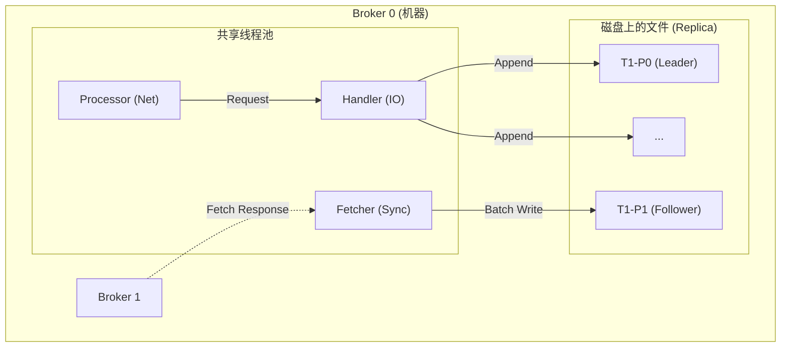
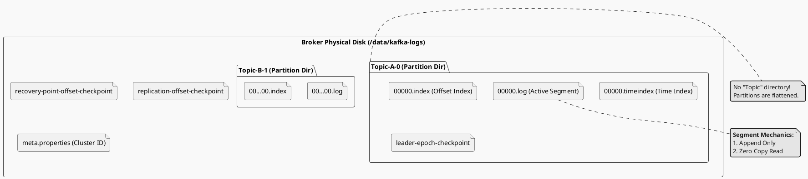

# Kafka 核心疑难杂症 Q&A 补充

> 本文档汇总了在研习过程中产生的关于消费者模型、副本分布及 Broker 线程模型的深度问答。

---

## Q1: 消费者组 (Consumer Group) 与多租户场景

**场景假设**: `Topic A` (3 Partitions), 10 个 Consumer 实例。Topic 有 20 个 Consumer Group。一个 Consumer 能同时消费多个 Group 吗？

### 核心结论

**不能。一个 Consumer 实例永远只属于一个 Consumer Group。**
`group.id` 是 Consumer 启动时的静态配置。它无法同时分饰多角。

### 详细解析

1. **单进程多 Group**: 如果希望一个进程处理 20 个 Group 的数据，必须在代码中实例化 20 个 `KafkaConsumer` 对象，分别配置不同的 `group.id`。
2. **消费资源分配 (抽屉原理)**:
   - **同组内**: 如果这 10 个 Consumer 属于同一个 Group，且 Topic 只有 3 个 Partition，那么 **7 个 Consumer 会空闲 (Idle)**。
   - **跨组间**: 如果这 10 个 Consumer 分属不同的 Group，它们互不干扰，各自消费一份全量数据（广播模式）。

---

## Q2: Partition 与 Replica 的数量关系

**问题**: Partition 数量和 Replica 数量有什么关系？

### 核心结论

**逻辑独立，但物理受限。**

- **Partition**: 为了**扩展性**。数量不限，越多吞吐越高（理论上）。
- **Replica**: 为了**可用性**。数量必须 **<= Broker 数量**。

### 黄金公式

> **总副本文件数 = Partition 数量 × Replica 系数**

**示例**: 3 台 Broker，Topic 有 10 个 Partition，2 个副本。

- 总文件数: $10 \times 2 = 20$ 个。
- 每台 Broker 承载: $20 / 3 \approx 6$ 个副本。

---

## Q3: Broker 内部的线程模型

**问题**: 磁盘上的 Replica 仅仅是文件吗？还是每个 Replica 对应一个线程？

### 核心结论

**Replica 只是磁盘上的文件夹和内存里的状态对象。Broker 绝不会为每个 Replica 启动独立线程。**

Kafka 使用 **IO 多路复用 (Reactor 模式)** 来复用线程：

### 线程分工

1. **Processor Threads (网络线程)**: 比如 3 个。负责 Socket 读写，将字节流扔进 Request Queue。
2. **KafkaRequestHandlerPool (IO 线程)**: 比如 8 个。
   - 它们从 Queue 里取请求。
   - 既然是写 `T1-P0`，就去内存找到 `T1-P0` 的对象（Leader）。
   - 往对应的 PageCache（文件）里追加数据。
3. **ReplicaFetcherThread (同步线程)**:
   - **按 Broker 维度复用**。如果 Broker 0 需要从 Broker 1 拉取 100 个 Partition 的数据，它只会启动 **1 个** 线程去连 Broker 1，批量拉取这 100 个 Partition 的消息。

### 架构图 (Cluster View)

---

## Q4: 文件系统层级全景图

**问题**: 能否直观展示从 Broker 到日志文件的存储结构？

### 核心结论

Kafka 的文件系统设计极度扁平化：

1. **Broker 目录**: 配置 `log.dirs`，通常挂载在大盘上。
2. **Partition 目录**: 命名规则 `Topic-PartitionID`。
3. **Segment 文件**: 真正的存储单元。

### 文件系统视图

