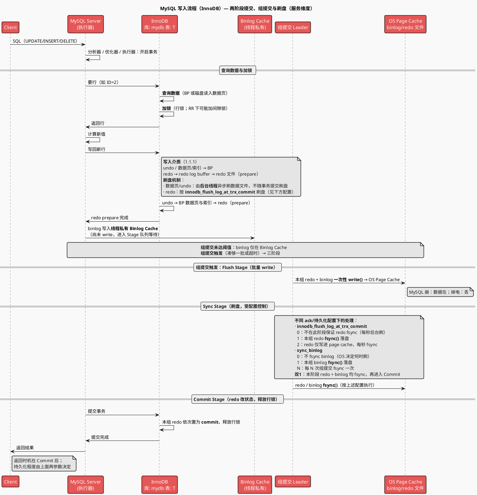
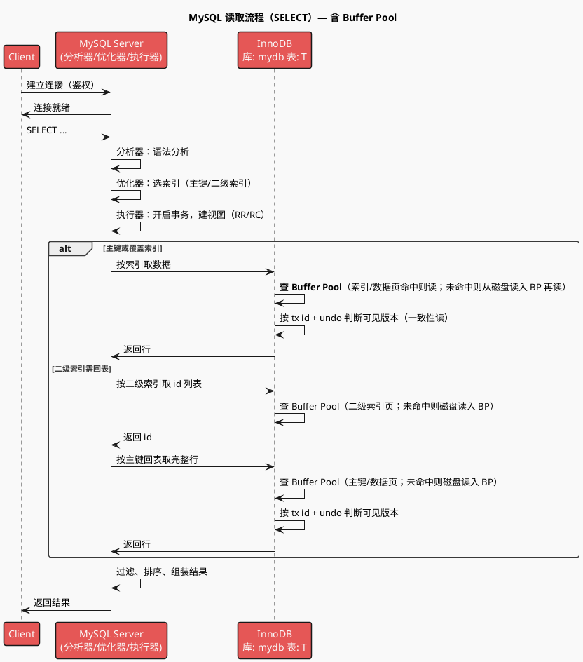
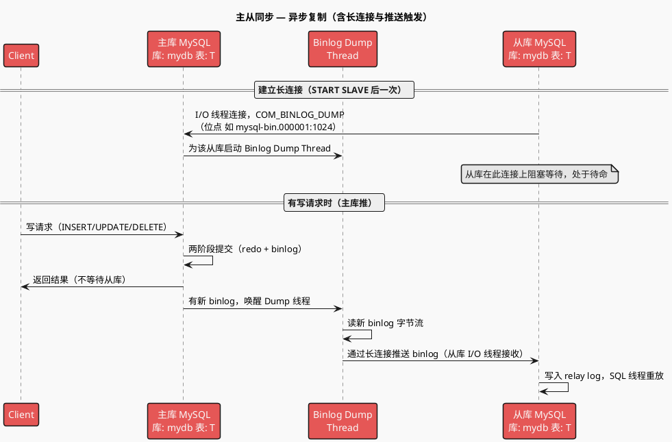
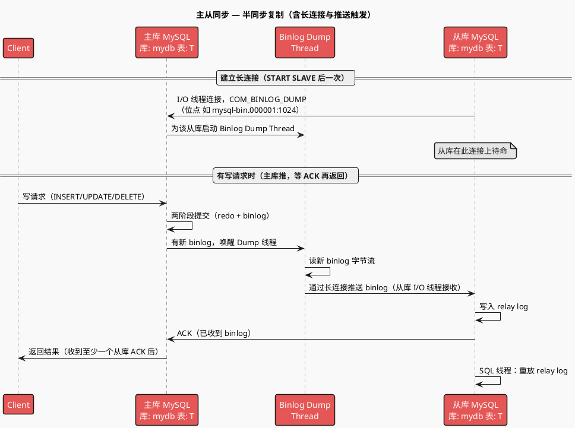
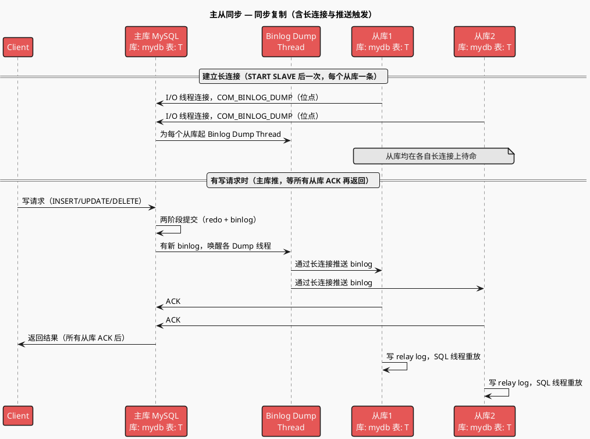
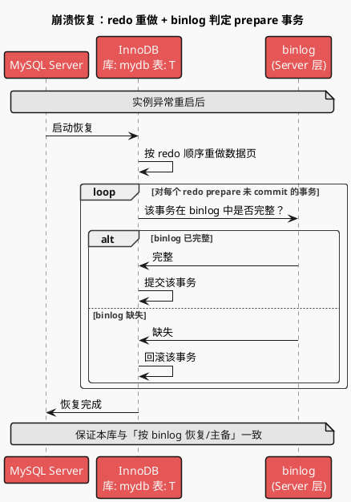
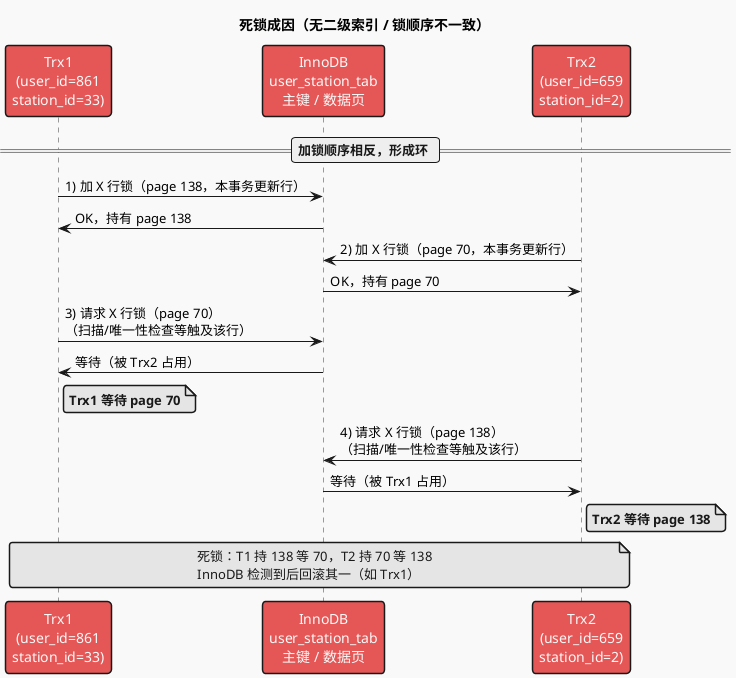
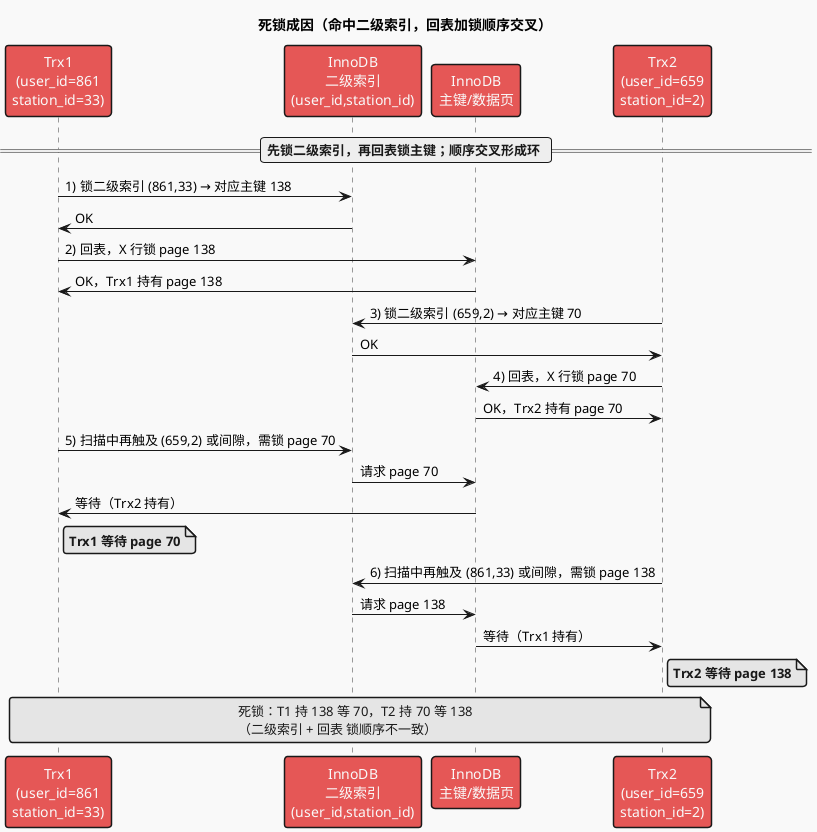

# MySQL 流程分析

本文档在 [[一条SQL的更新流程]]、[[两阶段提交]]、[[主备复制]] 基础上整理，按「写入 → 读取 → 高可用 → 故障恢复」串联，每章配时序图概括。

---

## 1. 写入流程（InnoDB）

更新语句与查询走同一套 Server 层（连接器→分析器→优化器→执行器），区别在于执行器与引擎配合写数据时，会涉及 **redo log**（InnoDB）与 **binlog**（Server），并通过 **两阶段提交** 保证两份日志逻辑一致，从而支持崩溃恢复与按时间点恢复（[[一条SQL的更新流程]]、[[两阶段提交]]）。

### 1.1 步骤概览（以 update T set c=c+1 where ID=2 为例）

1. **Client 与 Server 建立连接**：连接器鉴权、建立连接。
2. **发送 SQL**。
3. **Server 接收 SQL**：
   - **分析器**：语法分析。
   - **优化器**：生成执行计划。
   - **执行器**：
     1. 开启事务。
     2. **向引擎要行**：执行器向引擎要 ID=2 的那一行；引擎从内存或磁盘读入后返回（此处涉及行锁，见 [1.3 待确认项](#13-待确认项)）。
     3. **改行并写回**：执行器把 c 加 1 得到新行，再调引擎写回。
     4. **引擎写内存 + redo prepare**：引擎把新数据写入 Buffer Pool（数据页与索引一并更新），写 **undo log**（在改数据页之前），再把本次更新写入 **redo log** 并置为 **prepare**，通知执行器可提交。
     5. **执行器写 binlog**：Server 层追加写入 binlog 并落盘。
     6. **引擎 redo commit**：执行器调引擎提交；引擎把 redo log 从 prepare 改为 **commit**，事务提交完成。
     7. 上述各类写入的**介质与刷盘**见 [1.1.1 写入介质与刷盘](#111-写入介质与刷盘)。
     8. **主从同步**：异步 / 半同步 / 同步（见 [3.3 复制模式](#33-复制模式)）。
     9. 返回结果。

**两阶段提交的必要性**（[[两阶段提交]]）：若先写 redo 再写 binlog，崩溃恢复后本库有该更新但 binlog 未记，用 binlog 恢复/主备会丢；若先写 binlog 再写 redo，崩溃后本库无该更新但 binlog 有，用 binlog 恢复会多出。两阶段提交使「本库恢复结果」与「用 binlog 恢复/主备同步结果」一致。

#### 1.1.1 写入介质与刷盘

写入过程中涉及的数据页、undo、redo 的落点与是否刷盘如下（**并非都经 page cache，也并非都立即刷盘**）：

| 写入内容                 | 首先落到的位置                                          | 是否经 OS page cache                                          | 是否立即刷盘                                                                                                           |
| ------------------------ | ------------------------------------------------------- | ------------------------------------------------------------- | ---------------------------------------------------------------------------------------------------------------------- |
| **数据页、索引页** | InnoDB**Buffer Pool**（内存）                     | 否，BP 由 InnoDB 管理                                         | 否。变更已记入 redo；脏页由**后台线程**异步刷入数据文件，崩溃用 redo 恢复。                                      |
| **undo 页**        | InnoDB**Buffer Pool**（undo 段所在页）            | 否                                                            | 否。undo 修改也记入 redo；脏页同样异步刷盘，崩溃用 redo 恢复。                                                         |
| **redo log**       | 先写**redo log buffer**（内存），再刷到 redo 文件 | 是。刷到 redo**文件**时通常先到 **OS page cache** | 由**innodb_flush_log_at_trx_commit** 决定：0 不保证立即刷盘；1 每次提交都 fsync；2 写进 page cache，每秒 fsync。 |
| **binlog**         | Server 层写 binlog 文件                                 | 是，先到 OS page cache                                        | 由**sync_binlog** 等控制，可配置每次提交 fsync 或批量刷盘。                                                      |

**结论**：数据页与 undo 的写入都在 **Buffer Pool**，不经过 OS page cache，且**不保证事务提交时刷盘**，依赖 redo 保证持久化；**redo / binlog 文件**的写入会经 OS page cache，是否、何时刷盘由上述参数控制。

#### 宕机场景：只写入 BP / 只写入 page cache 会怎样？

- **如果只写入了 BP（数据页、undo 在内存），此时宕机**

  - BP 在内存，宕机后丢失。
  - 正常流程下，**先写 undo/改 BP，再写 redo**；若宕机发生在 redo 还未持久化之前，则磁盘上既没有新数据页也没有对应 redo，恢复时没有任何“新修改”可重做，**该事务的修改相当于没发生过**（未提交或视为回滚）。
  - 若此时事务尚未向客户端返回“提交成功”，则语义正确（事务未持久化）；若因某种原因已返回提交成功而 redo 尚未落盘就宕机，则可能**丢数据**（客户端以为成功，恢复后数据没了）。因此持久化依赖 **redo 落盘**，而不是 BP 落盘。
- **如果 redo、binlog 只写入了 page cache（未 fsync），此时宕机**

  - **Page cache 在内存**（内核缓冲区），掉电/宕机后丢失。
  - **redo 只在 page cache**：未 fsync 的 redo 丢失 → 恢复时无法重做这部分修改 → 若事务已向客户端返回提交成功，会**丢数据**（本库）。所以生产常设 `innodb_flush_log_at_trx_commit=1`，保证每次提交都把 redo fsync 到磁盘。
  - **binlog 只在 page cache**：未 fsync 的 binlog 丢失 → 从库拉不到这段、按时间点恢复也缺这段 → **主从不一致或备份恢复缺数据**。所以生产常设 `sync_binlog=1`（或等价策略），保证 binlog 提交时落盘。

**小结**：BP 不落盘、只靠 redo 恢复；redo/binlog 若只到 page cache 未 fsync，宕机即丢，需靠刷盘参数保证持久化。

#### 1.1.2 组提交（BLGC）与 write/fsync 时机

为减少锁等待，**write** 与 **fsync** 在组提交（Binary Log Group Commit, BLGC）中拆成不同阶段，并非“每个事务立刻 write + fsync”。

- **未达阈值（例如仅 20 个事务）**Binlog 仍在各线程私有的 **Binlog Cache**，或刚进入 Stage 队列；**尚未执行 write**。MySQL 会等凑够一批（或超时）再统一批量 write，以保证“成组”的原子性。
- **凑够一批触发（例如 50 个事务）**
  由 **Leader** 带领，分三阶段流水线执行：

| 阶段                   | 动作                                                                                       | 数据状态                                                 |
| ---------------------- | ------------------------------------------------------------------------------------------ | -------------------------------------------------------- |
| **Flush Stage**  | Leader 把这批事务的redo、 binlog 从内存**一次性 write()** 进 **OS Page Cache** | 数据在内核内存。MySQL 崩了数据还在；**掉电则丢**。 |
| **Sync Stage**   | Leader 对 redo、 binlog 文件执行**fsync()**                                         | 这批事务的 binlog**落盘**，最耗时。                |
| **Commit Stage** | InnoDB 把这批事务在磁盘上的**redo 状态依次改为 Commit**                              | redo 持久化完成，与 binlog 一致。                        |

**双 1 配置**（`sync_binlog=1` + `innodb_flush_log_at_trx_commit=1`）下，组提交不同情况的数据写入状态见下图说明。

### 1.2 写入流程时序图（含写入介质、刷盘与组提交，服务维度）

**按事务数量与组提交阶段的详细状态（双 1 配置）**：

| 事务数量 | 组提交阶段          | Redo Log 物理状态 (Disk)  | Binlog 物理状态 (Disk) | 释放行锁？ | 崩溃恢复表现               |
| -------- | ------------------- | ------------------------- | ---------------------- | ---------- | -------------------------- |
| 20 个    | Waiting（等待凑数） | 不存在（仅在 Log Buffer） | 不存在（仅在缓存）     | 否         | 事务彻底消失               |
| 50 个    | Flush（批量 Write） | Prepare（在 Page Cache）  | 存在（在 Page Cache）  | 否         | 掉电后事务消失             |
| 50 个    | Sync（执行 fsync）  | Prepare（已落盘）         | 已落盘                 | 否         | 自动提交（因 Binlog 完整） |
| 50 个    | Commit（最终阶段）  | Commit（已落盘/Cache）    | 已落盘                 | 是         | 正常读取                   |

### 1.3 待确认项

| 待确认项                    | 说明                                                                                                                                                                                             |
| --------------------------- | ------------------------------------------------------------------------------------------------------------------------------------------------------------------------------------------------ |
| **锁机制**            | 执行器调用引擎「取行/写行」时，引擎对涉及行加**行锁**（及 RR 下必要的 **间隙锁**）。加锁发生在「要行→改行→写 redo」链路中，与 redo prepare 同属引擎层。详见 [[行锁]]、[[间隙锁]]。 |
| **undo log 何时写入** | 在**修改数据页之前** 写入。顺序：写 **undo log**（回滚 + MVCC）→ 更新 Buffer Pool 中数据页与索引 → 写 **redo log**。undo/redo 均在引擎层、同一事务内完成。                   |
| **索引何时写入**      | 与数据页一起在内存中更新。引擎在写 redo 前，将「数据 + 索引」变更写入 Buffer Pool 的页中；redo 记录页的物理变更，binlog 记录行级逻辑变更，从库重放时再更新从库索引。                             |

---

## 2. 读取流程

与写入共用 Server 层（连接器→分析器→优化器→执行器）；执行器通过引擎接口按「取满足条件的第一行/下一行」循环取数，根据隔离级别与索引类型决定是否回表、以及用一致性读还是当前读（[[一致性读与当前读]]）。

### 2.1 步骤概览

1. **Client 与 Server 建立连接**：连接器鉴权、建立连接。
2. **发送 SQL**（SELECT）。
3. **Server 接收 SQL**：
   - **分析器**：语法分析。
   - **优化器**：根据索引类型、扫描行数等选择索引。
   - **执行器**：
     1. 开启事务。
        - **RR**：整个事务共用一个一致性视图。
        - **RC**：每个 SELECT 可视为新视图。
     2. **查询类型**：
        - **主键/一级索引**：直接查引擎并返回数据。
        - **二级索引**：若查询字段、过滤、排序被当前索引完全覆盖 → 仅从二级索引返回（覆盖索引）；否则 → 从二级索引取满足条件的 id，再按 id **回表**查主键索引拿完整行，再过滤、排序。
     3. 按 **事务 id** 与视图版本，通过 **undo log** 得到可见版本数据（一致性读）；若为当前读则读最新并可能加锁。
     4. 返回数据。

### 2.2 读取流程时序图

---

## 3. 高可用：主从模式

主库将 **binlog** 传给备库，备库重放 binlog 以保持与主库数据一致，是 MySQL 高可用、读写分离、备份恢复的基础（[[主备复制]]）。binlog 格式（statement/row/mixed）会影响主备一致性与延迟。

### 3.1 读写分离

- **主库**：提供读写。
- **从库**：仅提供读；数据由主库同步而来。

**从库同步机制**：主库写 binlog；备库 **IO 线程** 拉取 binlog 写入本机 **relay log**，**SQL 线程** 重放 relay log，在从库上执行，完成数据同步。

### 3.2 主从同步时序图（按复制模式）

以下三图分别对应异步、半同步、同步复制，体现主库何时返回客户端与从库拉取/确认的先后关系。

**异步复制**：主库提交后即返回，不等待从库。

**半同步复制**：binlog 同步到**至少一个**从库成功后，主库才返回。

**同步复制**：binlog 同步到**所有**从库成功后，主库才返回。

#### 主库推的「触发」机制：从库何时、如何收到 binlog？（异步/半同步/同步通用）

**结论**：从库不需要「定时轮询」去拉；建立长连接后，从库处于**待命**状态，等主库通过该连接**投喂**。数据流是主库推。

1. **建立长连接（从库待命）**从库执行 `START SLAVE` 后，其 **I/O 线程** 连接主库，发送一次「从某位点开始读」的指令（如 `COM_BINLOG_DUMP`），例如：“我是从库 B，要从 mysql-bin.000001 第 1024 字节开始读。” 从这一刻起，从库就在这条连接上**阻塞等待**，处于待命状态。
2. **主库的 Binlog Dump 线程**主库为**每个连接的从库**起一个 **Binlog Dump Thread**，专门服务该从库。该线程会：

   - **有新 binlog**：立刻从 binlog 读字节流，通过这条 TCP 连接**主动推**给从库；
   - **没有新 binlog**：进入**睡眠**（在条件变量/信号上 wait），等待主库上有新事务产生。
3. **唤醒机制**主库上有事务 **Commit** 并写入新 binlog 后，**主库内部**会唤醒对应的 Binlog Dump 线程（例如通过条件变量 signal/broadcast），而不是由操作系统直接通知。Dump 线程被唤醒后读取新产生的 binlog 字节流，通过 TCP 发给从库。从库 I/O 线程在连接上收到数据后写入 relay log。
4. **半同步/同步**
   只在这条长连接上增加「主库等从库 ACK 再返回客户端」的语义，不改变「主库有则推、从库长连待命」的机制。

**小结**：常说「从库拉取」多指从库**发起连接并请求位点**；建立后实际是**主库推、从库在长连接上等主库投喂**，从库无需轮询「何时该拉」。

### 3.3 复制模式

| 模式                 | 行为                                                    | 时序图     |
| -------------------- | ------------------------------------------------------- | ---------- |
| **异步复制**   | 主库提交后即返回，不等待从库。                          | 见上文 3.2 |
| **半同步复制** | binlog 同步到**至少一个**从库成功后，主库才返回。 | 见上文 3.2 |
| **同步复制**   | binlog 同步到**所有**从库成功后，主库才返回。     | 见上文 3.2 |

---

## 4. 故障恢复

异常重启后，InnoDB 利用 redo log 把已提交但尚未刷入数据文件的操作重做，并结合两阶段提交与 binlog 判断 redo 中 prepare 状态的事务应提交还是回滚（[[崩溃恢复]]）。

### 4.1 恢复规则（与两阶段提交一致）

- **redo 重做**：按 redo log 顺序重放「在数据页上的修改」，把未落盘的数据页恢复到崩溃前状态。
- **prepare 事务判定**：
  - **redo（prepare）+ binlog 完整** → 提交该事务（与主备/按时间点恢复一致）。
  - **redo（prepare）但 binlog 缺失** → 回滚该事务。若在本库提交则本库有该数据而 binlog 无，从库重放会少这条数据，主从不一致；故只能回滚。

### 4.2 主从切换

主库故障时，将流量切到从库（需配合选主、数据一致性校验等）。

### 4.3 故障恢复时序图

---

## 5. 与现有笔记的关联

| 主题                 | 笔记                                       |
| -------------------- | ------------------------------------------ |
| 更新步骤与两阶段提交 | [[一条SQL的更新流程]]、[[两阶段提交]]      |
| 主备与 binlog        | [[主备复制]]、[[binlog]]、[[binlog 格式]]  |
| 引擎日志与恢复       | [[redo log]]、[[崩溃恢复]]                 |
| 读与锁               | [[一致性读与当前读]]、[[行锁]]、[[间隙锁]] |

---

## 6. 问题排查案例：死锁

### 6.1 案例：user_station_tab 更新导致死锁

**日志摘要**（InnoDB deadlock dump）：

| 事务 | 行为 | 表 / 索引 | 锁状态 |
|------|------|-----------|--------|
| **(1) trx 18392660042** | `UPDATE user_station_tab SET type=1, mtime=... WHERE status=0 AND user_id=861 AND station_id=33` | shopee_fms_db.user_station_tab | **等待** PRIMARY 上 space 357 **page 70** 的 X 行锁（locks rec but not gap） |
| **(2) trx 18392660037** | `UPDATE user_station_tab SET type=1, mtime=... WHERE status=0 AND user_id=659 AND station_id=2` | 同上 | **持有** PRIMARY **page 70** 的 X 行锁；**等待** PRIMARY **page 138** 的 X 行锁 |

**死锁环**：Trx1 持有 page 138（其更新行）、等待 page 70 ← Trx2 持有 page 70、等待 page 138 → 形成环，InnoDB 回滚 Trx(1)。

**结论**：两事务对同一表不同行做 UPDATE，加锁顺序相反（一先 138 再 70，一先 70 再 138），导致互相等待，产生死锁。

---

### 6.2 产生死锁的关键步骤（时序图）

以下分「无二级索引」与「命中二级索引」两种典型情况，用时序图表达加锁顺序如何形成死锁。

#### 6.2.1 无二级索引（或未走二级索引）：按主键/全表扫描，加锁顺序不一致

无二级索引或 WHERE 未命中二级索引时，可能按**主键顺序**或**物理扫描顺序**加锁；两事务若访问行顺序不同（如一为 138→70，一为 70→138），就会形成死锁。

#### 6.2.2 命中二级索引：先锁二级索引再回表锁主键，顺序易交叉

若存在并命中二级索引（如 `(user_id, station_id)` 或 `(status, user_id, station_id)`），加锁顺序一般为：**先锁二级索引上的记录（及可能间隙）→ 再回表锁主键**。两事务若一个先锁索引 A 再锁主键 138、另一个先锁索引 B 再锁主键 70，且后续又去锁对方已持有的主键行，就会形成死锁。

---

### 6.3 小结与规避建议

| 情况 | 死锁成因 | 规避思路 |
|------|----------|----------|
| **无二级索引** | 两事务按不同物理/主键顺序加锁（如 70↔138 顺序相反） | 尽量按**同一顺序**更新（如按主键或业务键排序后批量更新）；控制并发度 |
| **命中二级索引** | 先锁二级索引再回表锁主键，两事务锁索引/主键顺序交叉 | 同上；可考虑减少范围更新、或拆成按主键逐行更新并固定顺序 |
| **通用** | 互相等待对方已持有的行锁 | 避免大事务、长事务；重试被回滚的事务；必要时使用 `SELECT ... FOR UPDATE` 固定锁顺序（按主键等排序） |

与锁相关的笔记：[[行锁]]、[[间隙锁]]、[[死锁]]。
