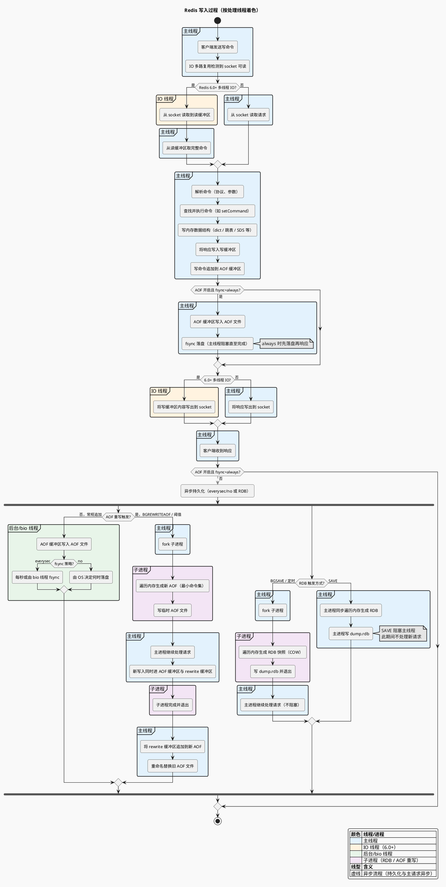
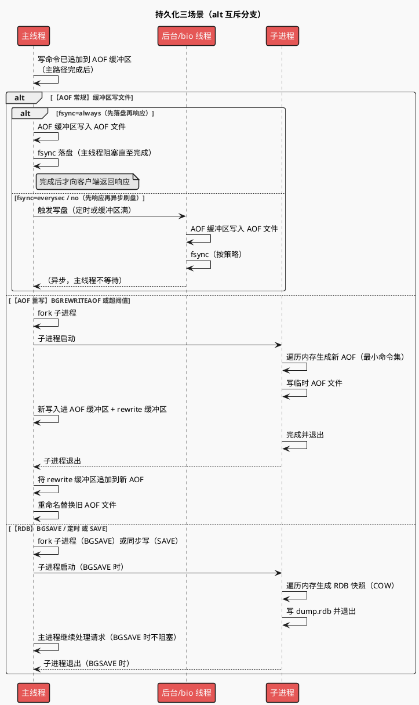

# Redis 写入过程流程图

> 从**网络 IO**（接收写请求）→ **数据写入**（命令执行、写内存）→ **数据持久化**（AOF / RDB）的完整流程。与 [[20250303_02_Redis单线程模型_3W1H解剖]]、[[20250303_Atomic_持久化RDB与AOF]] 配合阅读。

---

## 一、写入过程总览（活动图）

采用**活动图**表达阶段划分与数据流（符合 [plantuml_use](https://plantuml.com/zh/activity-diagram-beta) 中「阶段划分、数据流、分支流程 → 活动图」）。

**图中颜色与线程对应**：主线程（浅蓝）、IO 线程 6.0+（浅橙）、后台/bio 线程（浅绿）、子进程 RDB（浅紫）。同一颜色块内的活动由该线程/进程执行。

**AOF fsync=always 时的流程**：配置为 **always** 时，主线程在**返回响应之前**会先把 AOF 缓冲区写入文件并 **fsync 落盘**，阻塞直至完成后再写响应到 socket，因此图中在「写响应」前增加了「AOF 开启且 fsync=always → 主线程写文件 + fsync」分支；**everysec / no** 时仍为先响应、再异步由后台/bio 写文件与 fsync。

AOF 写入：刷盘配置，sync + per second + no

bgrewrite 配置：开启后，触发阈值会fork 子进程：遍历内存生成最小的AOF2 

主进程：rewrite 缓冲区写入AOF2， 用AOF2 替换 AOF文件。

RDB 写入：取决于redis.conf中的 save xx xx配置

1. 如果存在该配置，则默认启用bgsave
2. 不存在：则不会自动生成rdb文件，除非手动触发save命令，或者redis退出前+主从初始化同步+清空redis

---

## 二、持久化（按线程/进程划分）

### 2.1 持久化三场景时序图（alt）

用时序图的 **alt / else** 表示三种持久化场景的互斥分支（符合 [plantuml_use](https://plantuml.com/zh/sequence-diagram) 中「正常/异常调用顺序、交互 → 时序图」）。

**说明**：最外层 alt 表示三种持久化场景（可组合）；**【AOF 常规】** 内再用 alt 区分 **always**（主线程先写文件+fsync 再响应）与 **everysec/no**（后台/bio 异步写与 fsync），与主活动图中 always 的流程一致。

---

## 三、阶段说明

| 阶段                      | 说明                                                                                                                                                                                                                                                                                                                       |
| ------------------------- | -------------------------------------------------------------------------------------------------------------------------------------------------------------------------------------------------------------------------------------------------------------------------------------------------------------------------- |
| **网络 IO（请求）** | 客户端发写命令；epoll/kqueue 等检测到可读；6.0 起可由 IO 线程读入读缓冲区，主线程再取命令；否则主线程直接读 socket。                                                                                                                                                                                                       |
| **数据写入**        | 主线程**单线程**解析命令、查表执行、更新内存（dict、跳表等）、写响应到写缓冲区。写内存是纯内存操作，无磁盘 IO。                                                                                                                                                                                                      |
| **网络 IO（响应）** | 将写缓冲区内容发回客户端；6.0 可由 IO 线程写出，主线程继续处理下一条。                                                                                                                                                                                                                                                     |
| **数据持久化**      | **AOF**：主线程追加到 AOF 缓冲区；**fsync=always** 时主线程在**响应前**写文件并 fsync（阻塞），everysec/no 时由后台/bio 异步写文件与 fsync。**AOF 重写**（BGREWRITEAOF 或超阈值）fork 子进程生成新 AOF，主进程追加 rewrite 并替换。**RDB**：BGSAVE/定时 fork 子进程不阻塞，SAVE 同步写阻塞。 |

---

## 四、要点小结

- **单线程执行**：命令解析与执行、内存写入、AOF 缓冲区追加均在**主线程**顺序完成；网络 IO 在 6.0 可多线程，但命令执行仍单线程。
- **持久化不阻塞主路径**：everysec/no 时 AOF 写文件与 fsync 由 bio 或定时做，RDB 由子进程做；**fsync=always 时例外**，主线程在响应前同步写 AOF 并 fsync，会阻塞、拉高延迟。
- **顺序**：**everysec/no** 时为先写内存再响应、再异步持久化；**always** 时为先写内存、再主线程写 AOF+fsync（阻塞）、再响应，图中已用「AOF 开启且 fsync=always」分支体现。
- **SAVE vs BGSAVE**：图中 RDB 分支已区分——**BGSAVE**（或定时触发）fork 子进程做快照，主进程不阻塞；**SAVE** 由主线程同步写 RDB，会阻塞直至写完，生产环境通常用 BGSAVE 或定时规则。
- **AOF 重写**：图中 AOF 分支已区分——**常规追加**：缓冲区写文件 + fsync；**重写触发**（BGREWRITEAOF 或体积超阈值）时 fork 子进程遍历内存生成新 AOF，主进程新写入同时写 rewrite 缓冲区，子进程完成后主进程将 rewrite 缓冲区追加到新文件并替换旧 AOF，主进程不阻塞。
