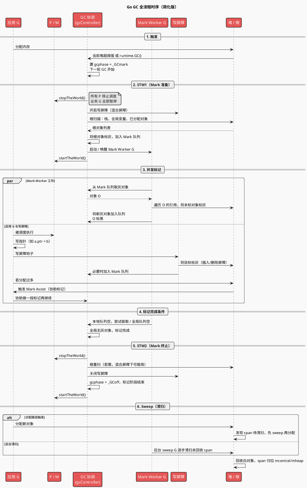
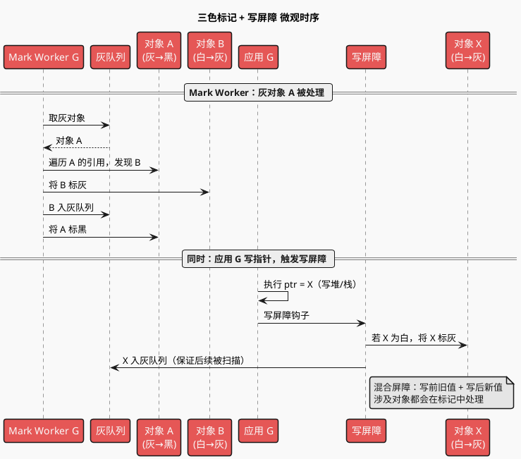
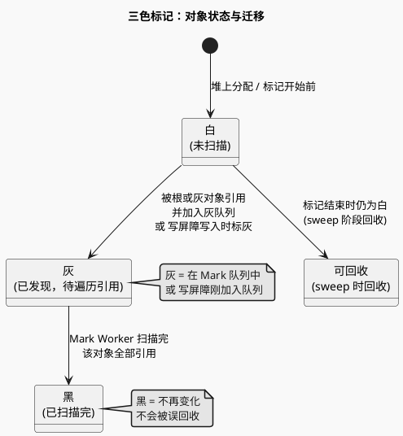

# Go GC 学习提纲

与 [GMP.md](./GMP.md) 的费曼类比一致：**GC 由同一套 GMP 执行**，没有单独的「清理团队」。内存 = 产出的代码/需求，GC = 同一批人在协议时段内做「废弃代码归档/清理」。Go 堆内存是如何组织的（栈/堆、mheap-mcentral-mcache、span）见 [内存设计.md](./内存设计.md)。

---

## 一、整体流程（与类比的对应）

| 阶段                          | 类比                       | 说明                                                                           |
| ----------------------------- | -------------------------- | ------------------------------------------------------------------------------ |
| **Mark 准备 / STW1**    | 宣布「开始盘点」的短暂广播 | 暂停所有业务 G，扫描栈、全局变量等**根**，确定从哪几份「代码」开始追踪。 |
| **Marking（并发标记）** | 各组员边接需求边做盘点     | 同一批 M 在跑 G 的同时，按「三色」规则遍历对象图，标出还在用的内存。           |
| **Mark 终止 / STW2**    | 再次短暂广播「盘点收尾」   | 极短暂停，做根重扫、关闭写屏障等收尾。                                         |
| **Sweeping（清扫）**    | 顺带清理废弃代码           | 不单独占人：分配新内存的 G 顺带清扫，或后台 sweep 协程慢慢清。                 |

---

## 二、GC 详细时序图

下图覆盖从触发、STW1、并发标记、STW2 到清扫的完整流程；参与方包括应用 G、P/M、GC 协调、Mark Worker、写屏障与堆。

**参与方说明**：

| 参与方                  | 说明                                                                              |
| ----------------------- | --------------------------------------------------------------------------------- |
| **应用 G**        | 业务 goroutine；STW 时被暂停，并发标记阶段可能触发写屏障、Mark Assist。           |
| **P / M**         | 同一套 GMP；STW 时所有 P 停止取 G，startTheWorld 后恢复调度。                     |
| **GC 协调**       | `gcController` / GC 状态机；维护 gcphase、Mark 队列、触发 STW。                 |
| **Mark Worker G** | 专职做标记的 G，由同一批 P/M 调度；从灰队列取对象、标黑、把引用标灰入队。         |
| **写屏障**        | 应用 G 写指针时插入的钩子；混合屏障下把涉及对象标灰，保证不丢对象。               |
| **堆 / 根**       | 堆上对象、栈/全局等根；根扫描产出初始灰对象，标记阶段遍历堆图，Sweep 回收白对象。 |

**关键点**：

- **STW1**：只做「根扫描 + 开启写屏障 + 启动 Mark Worker」，时间极短。
- **并发标记**：Mark Worker 与应用 G 并行；应用写指针走写屏障，分配过多会做 **Mark Assist**，避免标记跟不上分配。
- **STW2**：关写屏障、收尾状态；混合写屏障下通常无需长时栈重扫。
- **Sweep**：与分配联动（分配时顺带 sweep）或后台 sweep，不单独占满 CPU。

**其他细节**：

- **根（Root）**：标记的起点，包括所有栈上局部变量/参数、全局变量、以及已分配但尚未被栈/全局引用的对象（如小对象在栈上分配前会先被扫描）。
- **gcphase**：`_GCoff`（未在 GC）、`_GCmark`（标记中）、`_GCmarktermination`（标记收尾）；写屏障只在 `_GCmark` 阶段生效。
- **Mark Assist**：当某 G 在标记阶段分配的内存超过一定量，会被要求先协助做一段标记（从全局/本地 Mark 队列取灰对象并处理），再继续分配，从而避免分配速度远快于标记导致标记迟迟无法结束。

### 2.1 三色与写屏障微观时序

下面这张图展示「单次灰→黑」与「一次写指针触发写屏障」在时间上的关系，便于理解并发标记时三色如何变化、写屏障如何介入。

**要点**：标黑 = 该对象及其直接引用都已交给灰队列处理；写屏障 = 任何「写指针」都会让被写到的对象（以及混合屏障下可能还有被覆盖的旧对象）被标灰并入队，从而在并发写的情况下也不会漏标。

---

## 三、三色标记（谁在用、谁可回收）

三色是**对象在标记过程中的有限状态**，用状态图描述迁移条件更直观（符合 [plantuml_use](../../.agents/rules/plantuml_use.md) 中「业务流程/阶段状态流转 → 状态图」的选用建议）。

**状态含义**：

- **白**：还没扫描到的对象。
- **灰**：已扫描到、但其引用的对象还没扫完（在灰队列中待遍历）。
- **黑**：已扫描完，其直接引用也都已处理，不再变化。
- **可回收**：标记结束时仍为白，sweep 阶段回收。

**目标**：从根出发，把所有能走到的对象标成黑，剩下的白就是「废弃代码」可回收。

**三色标记流程（易错点）**：

1. **开始**：标记前堆上对象均视为**白**。
2. **根扫描**：扫描栈、全局等**根**（指针）；根**指向**的堆对象标**灰**并加入灰队列，即「根指向的对象」是第一批灰对象（根本身是指针，不是堆对象）。
3. **遍历灰对象**：从灰队列取出对象 O，遍历 O 引用的每个对象 X：若 X 当前为**白**，则把 X 标**灰**并加入灰队列；然后把 O 标**黑**。
4. **结束**：灰队列为空时标记完成，此时堆上只有**白**（不可达，待回收）和**黑**（可达，保留）。

**并发带来的问题**：业务 G 在跑时会**改引用**（例如 A 不再指向 B，改为指向 C）。若没有约束，可能出现：已标黑的 A 删掉对 B 的引用，B 变白，但 B 实际仍被其他灰对象引用——若此时不把 B 再标回来，会被误回收（**对象丢失**）。所以需要 **写屏障**（写屏障保证白→灰的迁移不会漏掉被写到的对象）。

---

## 四、写屏障（保证并发下不丢对象）

- **插入写屏障**：当代码执行「把指针写进某对象」时，屏障逻辑保证被写入的**目标**会被标记到（不丢）。
- **删除写屏障**：当代码执行「从某对象里删掉一个指针」时，屏障逻辑保证被删的**原对象**会被标记到（不丢）。
- **混合写屏障（Go 1.8+）**：插入 + 删除一起做，且**不需要在 Mark 结束时再 STW 做栈重扫**，把 STW 压到亚毫秒级。

**本质**：写屏障就是把「写指针时涉及到的对象」（被覆盖的旧值、写入的新值）重新标灰并加入灰队列，保证它们会被（再次）遍历，从而在并发修改引用的情况下也不漏标。

**类比**：盘点期间有人搬桌子（改引用），写屏障 = 规定「搬动时必须登记」，这样最后清掉的「废弃代码」不会误包含还在用的。

### 写屏障具体 Case：A.B = nil、A.C = D

假设标记阶段中，**A 已被扫描完（黑色）**，B、C、D 当前均为**白色**；且写前 A 的字段为 `A.B → B`，`A.C → C`。应用依次执行：

1. **A.B = nil**（删除 A 对 B 的引用）  
2. **A.C = D**（把 A 的 C 字段改为指向 D）

混合写屏障在**每次写指针**时会对「被覆盖的旧值」和「写入的新值」分别做一次标灰（若为指针且指向堆对象）。

| 时刻 | 操作 | 屏障行为 | A | B | C | D |
|------|------|----------|---|---|---|---|
| 初始 | — | — | 黑 | 白 | 白 | 白 |
| 写后 1 | A.B = nil | 旧值 = 指向 B → 把 **B** 标灰 | 黑 | **灰** | 白 | 白 |
| 写后 2 | A.C = D | 旧值 = 指向 C → 把 **C** 标灰；新值 = 指向 D → 把 **D** 标灰 | 黑 | 灰 | **灰** | **灰** |

**含义**：

- **A.B = nil**：若不标灰 B，B 可能只剩 A 引用且 A 已标黑不会再扫，B 会被误判为白而回收。对「旧值」标灰后，B 进入灰队列，本轮不会丢。
- **A.C = D**：对新值 D 标灰，D 不会因为「只被已标黑的 A 引用」而漏标；对旧值 C 标灰，C 不会因为从 A 上被覆盖掉而漏标。
- **A** 始终为黑，写屏障只改变**被写涉及的对象**（B/C/D）的颜色，不改变写操作发生的对象 A。

---

## 五、STW 的演进（为何能压到亚毫秒）

- 早期：Mark 结束时要 STW 做栈重扫，STW 较长。
- 引入混合写屏障后：栈上引用也由写屏障覆盖，不再需要为栈做第二次全局 STW，STW 主要只剩「根扫描」和「Mark 终止」两小段。

---

## 六、Sweep 与分配的联动

- 分配新对象时，若发现当前 span 需要清扫，会**先顺带 sweep** 再分配（allocation-driven sweep）。
- 另有后台 sweep 协程在标记结束后慢慢清扫未在分配路径上触发的 span。

**类比**：没有专职「清理小组」；谁要领新桌子（分配），谁顺带把旁边废弃的桌子清掉，或由后台慢慢收。

---

## 七、可深入阅读的源码/文档入口

| 主题         | 建议                                                                                                 |
| ------------ | ---------------------------------------------------------------------------------------------------- |
| 三色与写屏障 | `runtime/mbitmap.go`、`runtime/mbarrier.go`，以及 GC 设计文档（golang 官方 blog / design doc）。 |
| STW          | `runtime/proc.go` 里 `stopTheWorld` / `startTheWorld`，以及 `runtime/mgc.go` 的 GC 状态机。  |
| Sweep        | `runtime/mgcsweep.go`，分配路径在 `runtime/malloc.go`。                                          |
| 调优         | `GOGC`、`GOMEMLIMIT`（Go 1.19+），以及 `runtime/debug.SetGCPercent`。                          |

---

## 八、与 GMP 的衔接（复习）

- GC 的 **mark  worker** 也是普通 G，由同一批 P/M 执行。
- 触发 GC 的可以是分配量达到阈值、或 `runtime.GC()`，触发后由调度器在正常调度中穿插执行 mark/sweep，而不是另起一套线程池。
