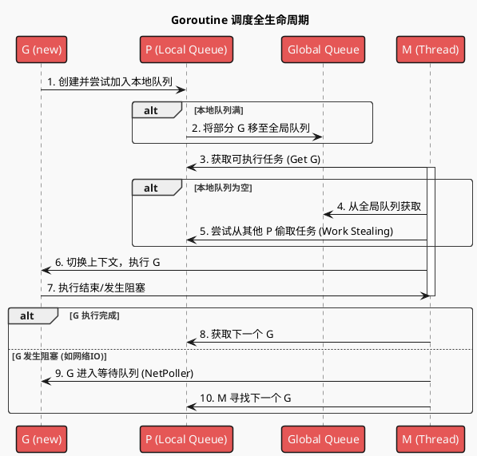
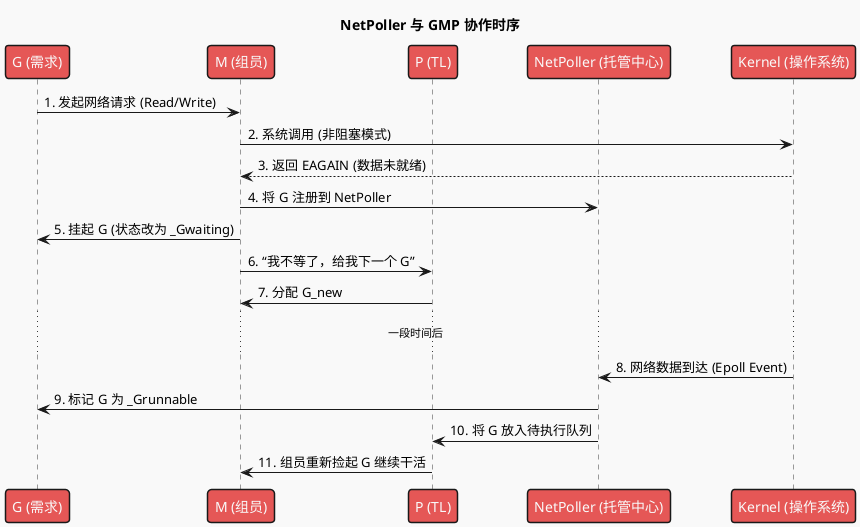

# Go 运行时：GMP + GC + 并发 · 费曼类比与补全

## 一、费曼类比总览（软件公司模型）

| 概念 | 类比 | 说明 |
|------|------|------|
| **P** | Team Leader（组长） | 手里有「待办队列」和「资源配额」；公司里组长数量固定（≈ `GOMAXPROCS`），代表真正并行干活的小组数。 |
| **M** | 组员（线程） | 真正干活的「人」，对应 OS 线程；人数可以比组长多（阻塞、syscall 时会多借调 M）。 |
| **G** | 需求/任务（goroutine） | 提交过来的需求单；一个 G 被某个 M 执行，执行完或阻塞时会让出 M。 |
| **本地队列** | 组长手里的待办列表 | 每个 P 有一个本地 runq，优先从自己队列拿 G，减少竞争。 |
| **全局队列** | 公司总需求池 | 新建 G 时若本地满了会丢到这里；其他组的 M 偷不到本地任务时也会来全局取。 |
| **Work Stealing** | 组员抢别组的活 | 本组没活时，M 会去别的 P 那里「偷」一半任务，提高整体利用率。 |

- **IO 等待（网络等）**：需求依赖「下游接口文档」（如网络 IO）时，当前 G 会挂起、注册到 **NetPoller（托管中心）**，M 不傻等，而是从 P 再领一个 G 干活；等内核通知「数据到了」，NetPoller 再把该 G 放回可执行队列，由任意 M 继续执行。（你下图中的 NetPoller 时序已准确描述这一点。）
- **Syscall 阻塞（如读磁盘）**：若 G 发起的系统调用会阻塞（例如同步读文件），当前 **M 会带着 G 一起「离队」**，与 P 解绑；P 不会傻等，会去找或新建一个 M 继续跑本组其他 G。等 syscall 返回后，该 M 再尝试绑回某个 P，把 G 放回可执行队列。这样「一个组员去等外包」不会拖死整个组。

---

## 二、GC 的类比纠正与补全

**纠正**：GC **不是**「单独的清理团队」对应另一套 GMP。  
**实际**：**同一批** P/M 在执行「GC 协议」时兼职做标记与清扫，没有独立的 GC 专用线程池。

- **内存** ≈ 产出的代码/需求：有在用（被引用）的，也有废弃的（可回收）。
- **清理（GC）** ≈ 公司同一批人在**不接新需求**或**专门时段**按流程做「废弃代码归档/清理」：
  - **标记阶段**：同一批 M 在跑 goroutine 的同时，执行「三色标记」等逻辑，找出哪些内存还在用、哪些可以回收（通过写屏障保证正确性）。
  - **清扫阶段**：通常由分配内存的 G 顺带清扫，或少量后台 sweep；不是单独一支「清理小组」。
- **STW（Stop The World）**：只在极短瞬间暂停所有业务 G，用来做根扫描等，现代 Go 已把 STW 压到亚毫秒级。

所以：**GC 对应的是「同一套 GMP 在执行的一套清理协议」，而不是「GC 专用的 GMP 小组」。**

---

## 三、并发模块在类比中的位置

- **Channel** ≈ 需求交接单 / 接口合同：G 之间通过 channel 传递「需求结果」或「协作信号」，有缓冲 ≈ 临时堆放单子的格子，无缓冲 ≈ 必须当面交接。
- **sync.Mutex / sync.WaitGroup 等** ≈ 协调机制：锁 = 同一时刻只能一个人改某块白板；WaitGroup = 等所有子任务交差后再汇总。

---

## 四、后续可展开的学习要点

面试中特别值得吃透的几块：**Slice/Map**（底层与扩容、并发安全）、**Channel 与并发**（收发过程、select、锁）、**GMP**（P 的角色、work-stealing、调度时机）、**GC**（三色标记、写屏障、STW，理解原理比背结论重要）。建议先扎实掌握基础与核心数据结构 Slice/Map/Channel，以及并发与 GMP，再深入 GC 与内存。

| 模块 | 可深入点 |
|------|----------|
| **Slice / Map** | 底层结构（slice 三元组与底层数组、map 的 bucket 与 hash）、扩容机制、并发安全。 |
| **GMP** | P 的数量与 `GOMAXPROCS`、M 与 P 的解绑（syscall 阻塞）、NetPoller、Timer 与 G 的唤醒。 |
| **GC** | 三色标记、写屏障（混合/插入）、STW 的演进、sweep 与分配的联动。 |
| **并发** | channel 底层（hchan）、select 与多个 channel、sync 包（Mutex、RWMutex、WaitGroup、Once、Pool）。 |

延伸提纲：[Slice与Map.md](./Slice与Map.md)（底层、扩容、并发安全）、[GC.md](./GC.md)（三色标记、写屏障、STW、sweep）、[内存设计.md](./内存设计.md)（栈/堆、mheap-mcentral-mcache、span）、[并发.md](./并发.md)（channel、select、sync）。

---

# GMP 调度

## Goroutine 调度全生命周期

NetPoller 与 GMP 协作时序

