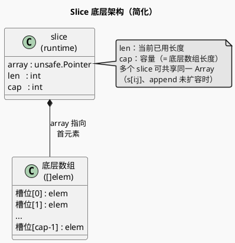
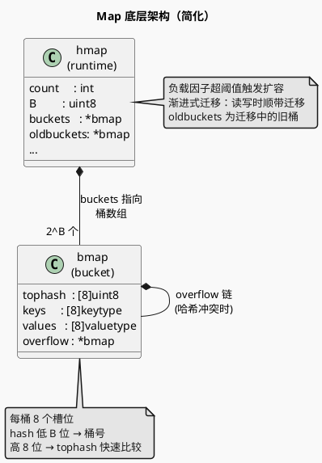

# Slice 与 Map：底层结构与并发安全

> 不只停留在「会用」，要搞清楚**底层结构、扩容机制、并发安全**，这两块在 Go 面试里几乎必问。可与 [内存设计.md](./内存设计.md)（堆分配、slice 背后数组的分配）和 [并发.md](./并发.md)（多 G 共享时的锁与安全）结合看。

---

## 一、Slice

### 1.1 底层结构

Slice 在运行时是**三元组**（指针 + 长度 + 容量），底层是一段**连续数组**（在堆或栈上）。

```go
// runtime 中的表示（简化理解）
type slice struct {
    array unsafe.Pointer  // 指向底层数组首元素
    len   int            // 当前已用长度
    cap   int            // 容量（可扩展到的最大长度，不重新分配前提下）
}
```

- **指针**：指向底层数组的起始位置；多个 slice 可共享同一底层数组（通过 `s[i:j]` 切片、或 `append` 未触发扩容时）。
- **len / cap**：`len` 是逻辑长度，`cap` 是当前底层数组的长度；`append` 若 `len < cap` 则只改 `len` 和底层内容，不重新分配；若 `len == cap` 则触发扩容并可能换底层数组。

#### Slice 架构图（类图）

用**类图**表达 Slice 与底层数组的结构与组合关系（符合 [plantuml_use](../../.agents/rules/plantuml_use.md) 中「领域模型、类/属性/关系 → 类图」）。



### 1.2 扩容机制

- **规则（Go 1.18+）**：  
  - 新容量 < 256：约 **2 倍**（旧 cap 翻倍）。  
  - 新容量 ≥ 256：按 **旧 cap + 256 的若干倍** 增长，避免大 slice 每次翻倍占用过多。  
- **结果**：分配新底层数组、拷贝旧数据、`slice.array` 指向新数组，旧数组由 GC 回收（若无其他引用）。  
- **注意**：`append` 后若发生扩容，返回的 slice 指向**新**底层数组，与原来的 slice 不再共享底层数组；未扩容时仍共享，对底层数组的修改会互相影响。

### 1.3 并发安全

- Slice 本身**非并发安全**：多 G 同时 `append` 或同时读写同一 slice，会存在数据竞争和未定义行为（写 len/cap、写底层数组同一元素等）。
- **做法**：加锁（如 `sync.Mutex`）、用 channel 串行化、或每个 G 用独立 slice 再合并；不要无保护地多 G 写同一 slice。

### 1.4 常见坑与面试点

- **共享底层数组**：`s1 := s0[i:j]` 与 `s0` 共享底层数组；对 `s1` 的修改会影响 `s0` 可见范围；`append` 导致扩容后则不再共享。
- **传 slice 被 append**：函数内 `append` 若触发扩容，会改的是**副本**的指针，调用方拿到的 slice 仍指向旧数组；若要在函数内「扩展」并让调用方看到，需返回新 slice 或传 `*[]T`。
- **大 slice 复用**：想复用底层数组时，用 `s = s[:0]` 等缩 len 不缩 cap，避免反复扩容；注意并发时仍要加锁或隔离。

---

## 二、Map

### 2.1 底层结构（简化）

Go 的 map 是**哈希表**实现，运行时大致是：一组 **bucket**（桶），每个桶里若干 key/value 对；通过 key 的 hash 定位到桶，再在桶内线性查/写。

- **桶**：存 8 个 key/value 对（及 overflow 链），hash 低几位决定桶号，高几位用于桶内 tophash 快速比较。
- **渐进式扩容**：当负载因子超阈值时触发扩容（2 倍 bucket 或等量迁移），迁移是**渐进**的，在每次读写时顺带迁移一部分，避免一次性 STW。

#### Map 架构图（类图）

用**类图**表达 Map（hmap）与 bucket 的结构与聚合关系（符合 [plantuml_use](../../.agents/rules/plantuml_use.md) 中「类/属性/关系 → 类图」）。



### 2.2 扩容机制

- **触发条件**：负载因子（元素个数 / bucket 数）超过约 6.5，或 overflow 桶过多，会触发扩容。
- **方式**：**2 倍扩容**（更多桶）或**等量扩容**（整理 overflow，桶数不变）；新 bucket 逐步迁移，读写时若命中旧 bucket 会协助迁移。

### 2.3 并发安全

- Map **非并发安全**：多 G 同时读写同一 map 会 **panic**（并发写检测）或数据竞争。
- **做法**：用 `sync.RWMutex` 保护、或用 **`sync.Map`**（适合读多写少、key 相对稳定）；不要无保护地多 G 读写同一 map。

### 2.4 常见坑与面试点

- **未初始化**：`var m map[K]V` 为 nil，不能写（会 panic），可读（返回零值）；使用前需 `m = make(map[K]V)` 或字面量初始化。
- **遍历顺序随机**：故意不保证顺序，不要依赖遍历次序。
- **并发写/读写**：必须用锁或 `sync.Map`，否则 panic 或 race。

---

## 三、与其它模块的衔接

- **内存**：Slice 的底层数组、map 的 bucket 都在**堆**上分配，见 [内存设计.md](./内存设计.md)；扩容会触发分配与可能的 GC。
- **并发**：多 G 共享 slice/map 时的锁、channel、`sync.Map` 见 [并发.md](./并发.md)。
- **GC**：对 slice/map 的引用会影响三色标记与回收，见 [GC.md](./GC.md)。

---

## 四、可深入阅读的源码入口

| 主题 | 建议 |
|------|------|
| Slice 扩容 | `runtime/slice.go`（`growslice`） |
| Map 实现 | `runtime/map.go`（bucket、hash、扩容、迁移） |
| 并发安全 | 标准库 `sync.Map`；自己用 `sync.RWMutex` 包一层 map |
