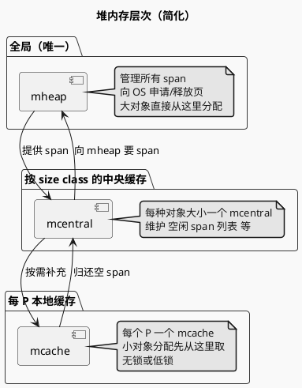

# Go 内存设计提纲

GC 负责清理「不再用的堆内存」；这些内存在分配时是如何组织的？本文档概括 Go 的**栈/堆划分**与**堆内部分配结构**（mheap → mcentral → mcache），以及与 [GC.md](./GC.md) 的衔接。

---

## 一、栈 vs 堆

| 区域 | 谁用 | 生命周期 | 谁清理 |
|------|------|----------|--------|
| **栈** | 每个 G 有自己的栈；局部变量、函数参数、返回值（若未逃逸） | 随 G 结束回收 | 栈收缩/销毁时由运行时回收 |
| **堆** | 逃逸到堆的对象、全局变量、被多 G 共享的数据等 | 由 GC 判定何时可回收 | **GC**（标记 + sweep） |

- **逃逸分析**：编译器在编译期判断变量是否「逃出」当前函数（如被返回、写入全局、被闭包捕获、过大等）；若逃逸则分配在堆上，否则可在栈上分配。栈上分配无 GC 压力。
- **GC 只管理堆**：标记阶段遍历的是堆上对象及从栈/全局指向堆的引用；sweep 回收的也是堆上的 span。

---

## 二、堆的层次结构（三层）

Go 堆内存由三层结构组织，**小对象**从本地缓存快速取，缺了再向中央/全局要；**大对象**直接向全局要。

| 层级 | 说明 |
|------|------|
| **mheap** | 全局唯一；向操作系统申请/释放**页**（page），管理所有 **span**；大对象（超过某阈值）直接在这里分配。 |
| **mcentral** | 按 **size class** 分；每种「对象大小档位」有一个 mcentral，维护该档位的空闲 span 列表等；多个 P 共享，需要加锁。 |
| **mcache** | **每个 P 一个**；缓存当前 P 常用的空闲 span（按 size class），小对象分配先从这里取，**无锁**，分配快。 |

---

## 三、Span 与 Size Class

- **Span**：一块连续**页**（若干 page）的集合，是 mheap 向 OS 申请、再交给 mcentral/mcache 管理的基本单位。一个 span 通常只放**同一 size class** 的对象。
- **Size class**：把「小对象」按大小分成若干档位（如 8B、16B、24B、…、32KB）；同一 span 里每个「格子」大小相同，分配时从 span 里拿一个空闲格子即可，避免碎片。

**小对象分配**：根据请求大小找到对应 size class → 从当前 P 的 mcache 里拿该 size class 的空闲 span → 从 span 里取一个空闲 slot；若 mcache 没有，向 mcentral 要 span，再向 mheap 要（若 mcentral 也没有）。

**大对象**：超过 size class 上限（如 32KB）直接从 mheap 分配，不经过 mcache/mcentral，通常单独一个或多个 span。

---

## 四、分配路径与 GC 的衔接

- **分配触发 GC**：堆上分配会更新已分配量；达到阈值（或 `runtime.GC()`）时触发一轮 GC（见 [GC.md](./GC.md)）。
- **Sweep 与 span**：标记结束后，堆上被标为「白」的对象所在的内存格子可以被复用。Sweep 阶段会按 **span** 为单位处理：把该 span 里已回收的 slot 标记为空闲，span 若整块都可回收则归还 mcentral/mheap；**分配时**若发现要用的 span 还在「待 sweep」状态，会先顺带 sweep 再分配（allocation-driven sweep）。
- **mcache 与 sweep**：sweep 后空闲的 span 会回到 mcentral，再被 mcache 申请走，供后续分配使用。

因此：**内存设计**提供「从哪里拿一块内存、按什么粒度管理」；**GC** 负责「哪些块可以还回去、何时还」，二者通过 **span** 和 **size class** 对齐。

---

## 五、可深入阅读的源码入口

| 主题 | 建议 |
|------|------|
| 栈/逃逸 | 编译期逃逸分析；`runtime` 里栈增长/收缩。 |
| mheap / span | `runtime/mheap.go`、`runtime/malloc.go`（大对象、小对象入口）。 |
| mcentral / mcache | `runtime/mcentral.go`、`runtime/mcache.go`。 |
| size class | `runtime/sizeclasses.go` 或 `runtime/mksizeclasses.go` 生成的大小档位。 |
| 与 GC 联动 | sweep 在 `runtime/mgcsweep.go`；分配路径里对「待 sweep」span 的处理在 `malloc.go`。 |

---

## 六、与 GMP 的衔接（复习）

- 每个 **P** 绑有一个 **mcache**，所以小对象分配是「当前 G 所在 P 的 mcache」取内存，无全局锁，和 GMP 的「本地队列」思路一致。
- 分配、sweep 都在**普通 G** 里执行，由同一套 P/M 调度，没有独立的内存管理线程池。
