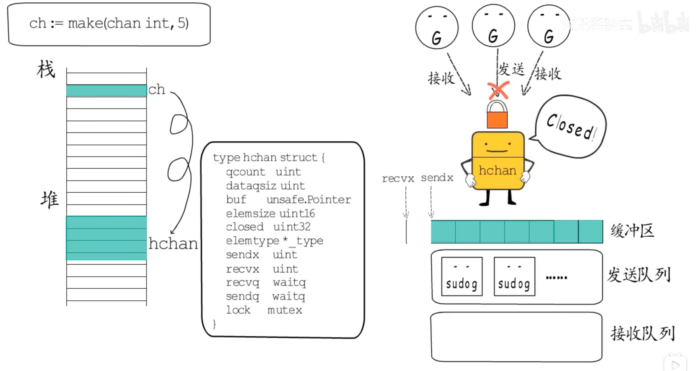
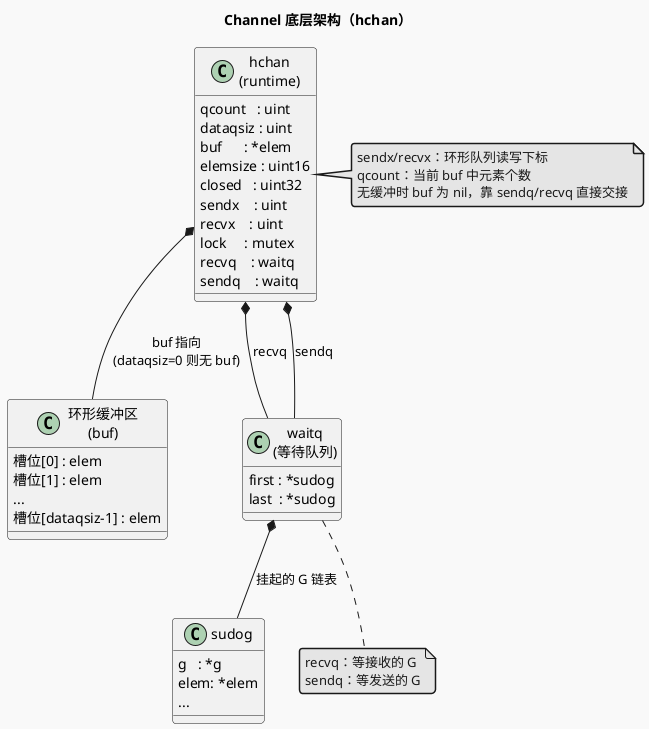
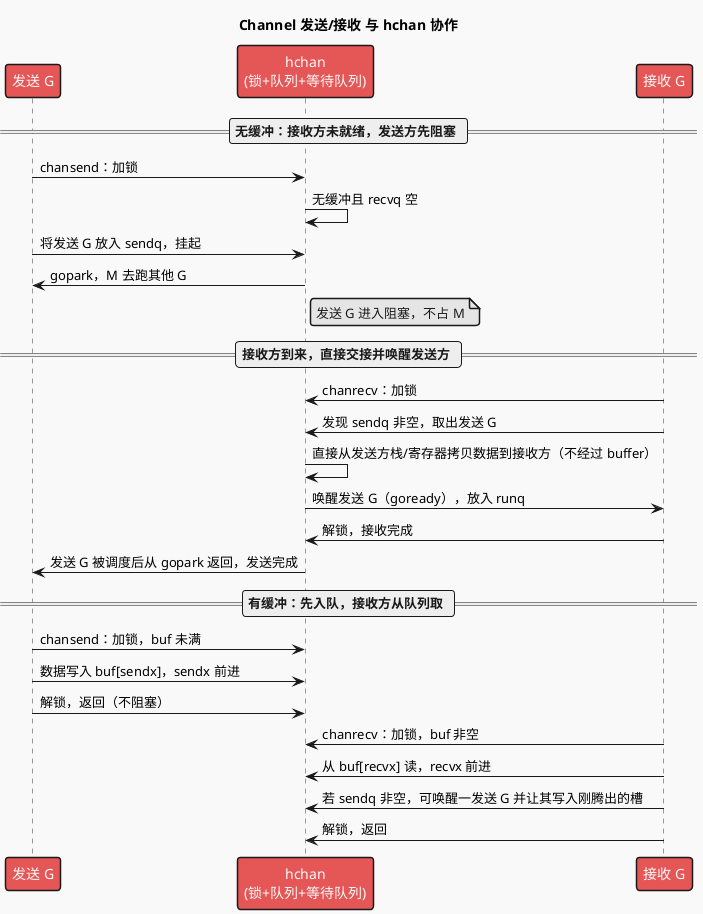
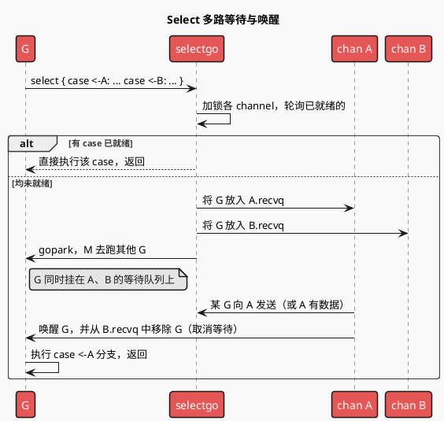
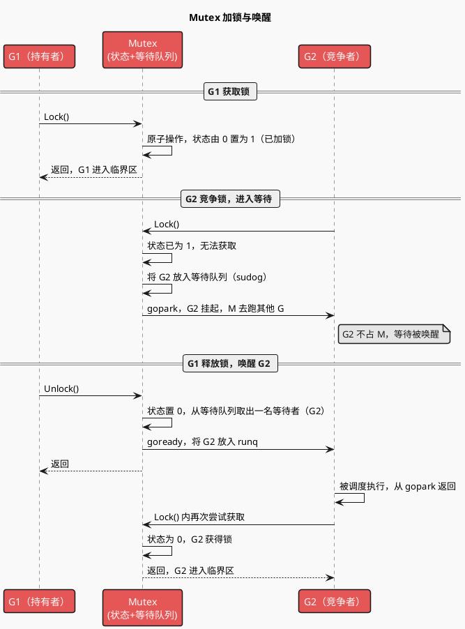
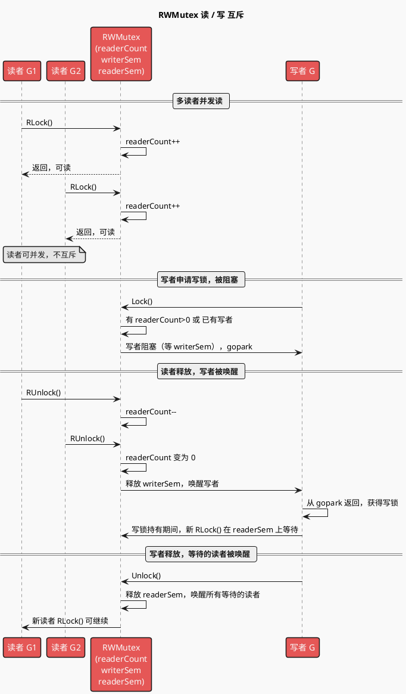
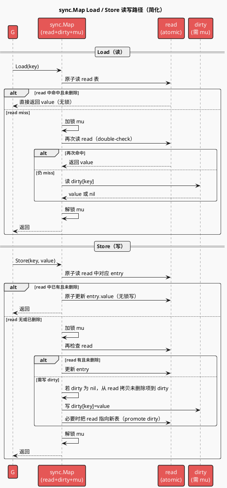

# Go 并发学习提纲

与 [GMP.md](./GMP.md) 的费曼类比一致：**Channel** = 需求交接单/接口合同，**sync** = 协调机制（锁、等所有人交差等）。G 之间通过 channel 和 sync 协作，仍由同一套 GMP 调度执行。

---

## 一、Channel（需求交接单）

### 1.1 类比回顾

| 概念           | 类比                                                                                     |
| -------------- | ---------------------------------------------------------------------------------------- |
| 无缓冲 channel | 必须「当面交接」：发送方和接收方同时就绪才完成一次传递。                                 |
| 有缓冲 channel | 临时格子：发送方可先往格子里放，放满才阻塞；接收方从格子取，取空才阻塞。                 |
| 关闭 channel   | 不再往这条「交接线」上放新单子；接收方可继续取完已有数据，取完后得到零值 +`ok=false`。 |

### 1.2 底层结构（hchan）

- **队列**：存待传递的**元素**（或指针），环形队列实现。
- **发送/接收等待队列**：当无缓冲或缓冲满/空时，阻塞的 G 会挂到对应队列，等对方或缓冲区满足条件时被唤醒。
- **锁**：保护 hchan 内部状态（队列、等待队列等），一次只允许一个 G 修改。

#### Channel 架构图（类图）

用**类图**表达 hchan 与环形缓冲区、等待队列的结构与关系（符合 [plantuml_use](../../.agents/rules/plantuml_use.md) 中「类/属性/关系 → 类图」）。

**学习入口**：`runtime/chan.go`（`makechan`、`chansend`、`chanrecv`、`closechan`）。

### 1.3 Channel 通信详细时序

下图展示一次发送、一次接收在 **hchan** 内部的协作方式；无缓冲时依赖「直接交接」，有缓冲时先写环形队列，接收方再从队列取。

**要点**：无缓冲 = 数据不经过 buffer，由运行时在 sendq/recvq 间做**直接拷贝**并唤醒对方；有缓冲 = 发送写 buf、接收读 buf，若发送时 buf 满则入 sendq 阻塞，接收时 buf 空则入 recvq 阻塞。

### 1.4 使用要点

- **谁创建谁关**：通常由发送方关闭，避免向已关闭 channel 发送导致 panic。
- **多接收方**：关闭后多个接收方都会收到「关闭」信号，适合做广播/退出通知。
- **select**：见下节。

---

## 二、Select（多路交接）

- **语义**：同时监听多个 channel 的发送/接收，**哪个先就绪就执行哪一分支**；若都未就绪可阻塞或走 default。
- **实现要点**：将当前 G 挂到所有涉及 channel 的等待队列上，任一 channel 就绪时唤醒，其它 channel 上会做「取消等待」。
- **类比**：多条交接线，谁先有人来交接就先处理哪条；没有就等或直接走「默认事项」（default）。

### 2.1 Select 多路就绪时序

**要点**：未就绪时 G 会依次挂到多个 channel 的 recvq/sendq；**先就绪的那个** channel 在完成数据传递时会唤醒该 G，并负责把 G 从**其它** channel 的等待队列里摘掉，避免被重复唤醒。

**学习入口**：`runtime/select.go`（`selectgo`）。

---

## 三、sync 包（协调机制）

### 3.1 类比回顾

| 原语                | 类比                                                                         |
| ------------------- | ---------------------------------------------------------------------------- |
| **Mutex**     | 一块白板同一时刻只能一个人改；拿锁 = 拿笔，放锁 = 放笔。                     |
| **RWMutex**   | 多人可同时读白板，但写时必须独占。                                           |
| **WaitGroup** | 等所有子任务交差后再汇总：`Add` 登记人数，`Done` 交差，`Wait` 等人齐。 |
| **Once**      | 某件事只允许被「交差」一次，后续再调用直接视为已完成。                       |
| **Pool**      | 临时对象池：用完后还回池子复用，减轻 GC；不保证池里一定还有对象。            |

### 3.2 使用要点

- **Mutex**：锁内尽量少做耗时/阻塞操作，避免拖慢其他 G。
- **WaitGroup**：`Add` 要在启动 goroutine **之前**调用，且数量与 `Done` 次数一致；不要在子 G 里 `Add` 再 `Wait` 容易竞态。
- **Once**：适合初始化单例、只执行一次的配置加载等。
- **Pool**：适合短生命周期、高分配量的临时对象（如 buffer、临时 struct）；池内对象可能被 GC 清掉，取不到就 `New`。

### 3.3 与 GMP 的关系

- 抢锁失败的 G 会**阻塞**，M 会去跑别的 G；锁释放后，等待的 G 被唤醒，重新进入可执行队列。
- 不引入额外线程：仍是同一套 P/M 在调度这些 G。

### 3.4 Mutex / RWMutex / sync.Map 读写过程时序图

以下用时序图展示**加锁与唤醒**、**读写锁互斥**、**sync.Map 读写的内部协作**，符合 [plantuml_use](../../.agents/rules/plantuml_use.md) 中「正常/异常调用顺序、交互 → 时序图」。

#### 3.4.1 Mutex：Lock / Unlock 与等待队列

**要点**：Mutex 内部维护**状态**（0 未锁 / 1 已锁）与**等待队列**；Lock 时若已被占用则当前 G 入队并 gopark，Unlock 时从队中取一 G 并 goready，被唤醒的 G 再次竞争并通常能拿到锁。

**与 Java AQS 的类比**：思路与 Java 的 **AQS（AbstractQueuedSynchronizer）** 类似，都是「**挂起 + 队列**」：

| 维度 | Go Mutex | Java AQS |
|------|----------|----------|
| **挂起** | **gopark**：当前 G 挂起，M 去跑其他 G（不占 OS 线程） | **LockSupport.park**：当前线程挂起（占 OS 线程） |
| **唤醒** | **goready**：将 G 放回 runq，由调度器再次调度 | **LockSupport.unpark**：唤醒指定线程 |
| **等待队列** | Mutex 内部维护等待该锁的 **G 队列**（如 sudog 链表） | AQS 内部维护 **CLH 队列**，节点包装等待的线程 |
| **状态** | 简单 0/1（或加若干 bit 表示饥饿/唤醒等） | state 由子类定义（如 ReentrantLock 的 hold count） |

共同点：抢不到锁时**入队并挂起**，释放锁时**从队列取出一名并唤醒**，避免忙等。差异：Go 挂起的是 **goroutine**，M 可继续跑其他 G；Java 挂起的是 **OS 线程**。AQS 还是「抽象基类」，ReentrantLock、Semaphore 等在此基础上实现；Go 的 Mutex/RWMutex 是独立实现，不共享一套 AQS 框架。

---

#### 3.4.2 RWMutex：读者与写者互斥

**要点**：**readerCount** 记录读者数，**writerSem** 供写者等待（读者为 0 时释放），**readerSem** 供新读者在「有写者等待或持有写锁」时等待；读与读不互斥，写与读、写与写互斥。

---

#### 3.4.3 sync.Map：Load / Store 读写路径

**要点**：**read** 为原子指针，读多时无锁命中；**dirty** 含完整数据，写与 miss 时在 **mu** 下访问；Store 能只改 read 中已存在的 entry 时只做原子更新，否则加锁并可能提升 dirty 为 read，保证读多写少场景下读路径几乎无锁。

**学习入口**：`sync/mutex.go`（Mutex Lock/Unlock）、`sync/rwmutex.go`（RWMutex）、`sync/map.go`（sync.Map Load/Store/LoadOrStore 及 read/dirty 结构）。

---

## 四、学习顺序建议

1. **Channel**：无缓冲 → 有缓冲 → 关闭与 `ok` → 用 channel 做「退出信号」「工作池」。
2. **Select**：多 case → `default` 非阻塞 → 超时模式（`time.After` / `context`）。
3. **sync**：WaitGroup → Mutex → RWMutex → Once → Pool；再结合 channel 做「多 G 协作」小练习。

---

## 五、与 GMP / GC 的衔接（复习）

- 所有并发原语都是在 **G** 上用的，G 由同一套 **P/M** 执行；阻塞时 G 挂起，M 不闲。
- Channel 的等待队列、Mutex 的等待队列，本质都是「等条件的 G 队列」，由运行时在条件满足时唤醒并重新参与调度。
- 大量分配临时对象会提高 GC 压力，**sync.Pool** 可减少分配、减轻 GC，与 [GC.md](./GC.md) 中的「内存/清扫」形成呼应。
