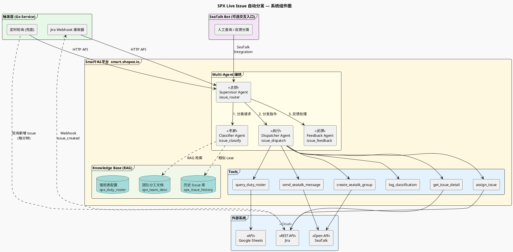
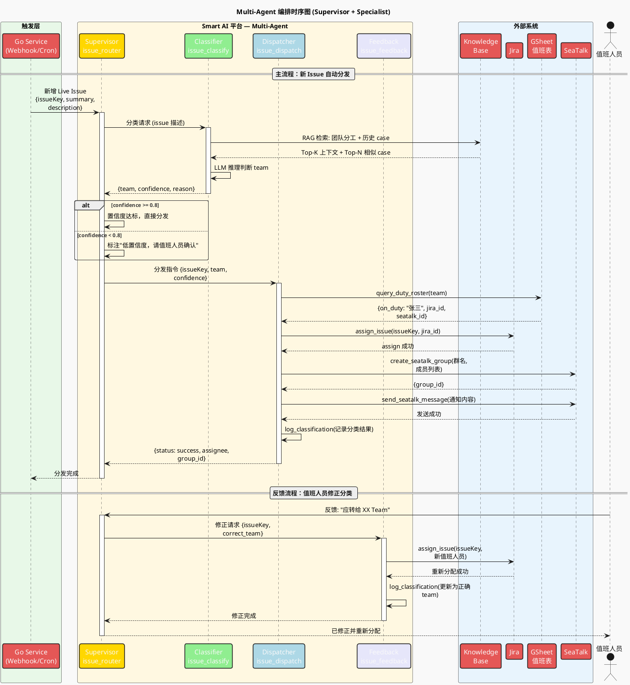

# SPX Live Issue 自动分发 — AI Agent 实践方案

> 基于公司 Smart AI 平台的可落地设计方案与实施 SOP
>
> 创建时间：2025-06-14
>
> 参考资料：
>
> - [AI应用案例分享 PPT](./../resource/AI应用案例分享：%20SPX%20Live%20Issue自动分发.pptx)
> - [基于Smart平台搭建SeaTalk AI Bot实战经验分享](https://confluence.shopee.io/pages/viewpage.action?pageId=3115294177)

---

## 一、业务场景分析

### 1.1 现状与痛点

SPX 团队每天有一名研发值班，手动完成以下工作：

1. 每隔 5-10 分钟查看 live issue 群是否有新增问题
2. 根据问题描述判断归属哪个 team
3. 查找该 team 值班人员，Jira assign 并通知

| 痛点       | 量化                                   |
| ---------- | -------------------------------------- |
| 人力消耗   | 每周 0.5~1 人天                        |
| 响应延迟   | 人工处理延迟 5-30 分钟                 |
| 新人上手难 | 不熟悉组织架构，难以判断 team 归属     |
| 可能超时   | Seatalk 关注不及时导致问题超出处理时效 |

### 1.2 目标方案

引入 LLM 大模型，实现：

- **自动监控**：实时发现新增 live issue
- **自动分类**：通过 issue 描述文本判断归属 team
- **自动分发**：查值班表、Jira assign、创建 Seatalk 群通知

### 1.3 预期效果

| 指标       | 目标值                           |
| ---------- | -------------------------------- |
| 人力节省   | 每周 0.5-1 人天                  |
| 分发延迟   | 0 延迟（自动化）                 |
| 分类准确率 | 90% 以上                         |
| Token 成本 | ~2.3 美元/年（按 1000 issue 计） |

---

## 二、技术选型：为什么选 Smart 平台

### 2.1 Smart 平台简介

**Smart = Sea Multi-agent Realization Technology**，公司内部 AI Agent 平台。

- 平台入口：[https://smart.shopee.io](https://smart.shopee.io)
- Agent Gallery：[https://smart.shopee.io/gallery](https://smart.shopee.io/gallery)
- 官方文档：[https://confluence.shopee.io/display/SMAR/Smart+User+Guide](https://confluence.shopee.io/display/SMAR/Smart+User+Guide)

### 2.2 Smart 平台能力与本项目的映射

| Smart 能力           | 本项目用途                         | 替代方案（不选的原因）             |
| -------------------- | ---------------------------------- | ---------------------------------- |
| **Knowledge Base**   | 托管团队分工文档，自动向量化 + RAG | 自建向量数据库（维护成本高）       |
| **Multi-Agent 编排** | Supervisor + Specialist 模式       | 自研编排框架（重复造轮子）         |
| **Tools 集成**       | 接入 Jira / GSheet / Seatalk API   | 硬编码 API 调用（不灵活）          |
| **多模型选择**       | Claude / GPT-4 / DeepSeek 可切换   | 绑定单一模型（风险高）             |
| **SeaTalk 集成**     | 原生 Bot 部署，一键上线            | 自建 Seatalk Open 对接（工作量大） |
| **Debug 面板**       | Tool Calls / Token / 耗时可视化    | 自建日志系统（额外成本）           |

### 2.3 关键判断

PPT 原方案是**主动轮询式自动化**（每分钟检测新 issue），Smart 平台原生模式是**被动响应式**（SeaTalk Bot 接收消息触发）。

因此采用 **Smart 平台 + 轻量触发服务** 的混合架构。

---

## 三、整体架构



---

## 四、各层详细设计

### 4.1 Knowledge Base（知识库）

> 在 Smart 平台创建，无需自建向量数据库。

#### 知识库清单

| 知识库名称          | 数据源类型          | 内容                                | 更新策略        |
| ------------------- | ------------------- | ----------------------------------- | --------------- |
| `spx_team_desc`     | Confluence 链接     | SPX 各 team 职责、负责模块、技术栈  | Weekly 自动同步 |
| `spx_issue_history` | 手动输入 / 本地文件 | 已正确分类的历史 issue（描述→team） | 每次分类后追加  |
| `spx_duty_roster`   | Google Drive        | team → 本周值班人员映射表           | Daily 自动同步  |

#### 配置要点

- 开启「Scrape All Inline Links」，自动抓取团队分工文档中的引用链接
- Confluence 数据源设置 Daily 自动同步
- 上传历史 issue 分类记录（描述 + 正确 team），作为 RAG 检索的 few-shot 参考
- 上传后使用 Smart 的 Test 功能验证检索效果

#### RAG 检索流程

```plantuml
@startuml
!theme mars
skinparam activityFontSize 13

title RAG 检索流程 (Smart Knowledge Base)

start

:接收 Issue 描述文本;

:文本向量化
(平台内置 Embedding 模型);

fork
    :在 **团队分工库** 检索
    Top-K 相关段落;
    note right
        spx_team_desc
        来源: Confluence
    end note
fork again
    :在 **历史 Issue 库** 检索
    Top-N 相似 case (Few-shot);
    note left
        spx_issue_history
        来源: 历史分类记录
    end note
end fork

:Prompt 组装
----
· 团队分工上下文 (Top-K)
· 相似 case 示例 (Top-N)
· 原始 issue 描述;

:调用 LLM (GPT-4 / Claude)
推理判断 team 归属;

:输出结果
note right
  {
    "team": "Payment Team",
    "confidence": 0.92,
    "reason": "..."
  }
end note

stop

@enduml
```

---

### 4.2 Tools（工具）

> 在 Smart 平台注册为 API 工具 / Python 工具。

#### 工具清单

| 工具名                 | 类型        | 功能                                | 对接系统         |
| ---------------------- | ----------- | ----------------------------------- | ---------------- |
| `get_issue_detail`     | API 工具    | 获取 issue 详情（标题、描述、评论） | Jira REST API    |
| `assign_issue`         | API 工具    | 将 issue assign 给指定人员          | Jira REST API    |
| `query_duty_roster`    | API 工具    | 查值班表获取本周值班人员            | GSheet API       |
| `create_seatalk_group` | API 工具    | 创建问题跟进 Seatalk 群             | Seatalk Open API |
| `send_seatalk_message` | API 工具    | 向指定群发送通知消息                | Seatalk Open API |
| `log_classification`   | Python 工具 | 记录分类结果（反哺知识库）          | 本地存储 / Hive  |

#### 各工具配置示例

**`get_issue_detail`**

```
Tool Name:    get_issue_detail
Description:  获取Jira issue的详细信息，包括标题、描述、评论。
              当需要了解一个live issue的具体内容时调用此工具。
HTTP Method:  GET
Endpoint:     https://jira.shopee.io/rest/api/2/issue/{issueKey}
Parameters:
  - issueKey (string, required): Jira issue编号，如 SPX-1234
```

**`assign_issue`**

```
Tool Name:    assign_issue
Description:  将Jira issue分配给指定人员。
              当已确定问题归属team和值班人员后，调用此工具完成分配。
HTTP Method:  PUT
Endpoint:     https://jira.shopee.io/rest/api/2/issue/{issueKey}/assignee
Parameters:
  - issueKey (string, required): Jira issue编号
  - accountId (string, required): 被分配人的Jira账号ID
```

**`query_duty_roster`**

```
Tool Name:    query_duty_roster
Description:  查询指定团队本周的值班人员信息。
              当已确定问题归属team后，调用此工具获取该team当前值班人员。
HTTP Method:  GET
Endpoint:     https://sheets.googleapis.com/v4/spreadsheets/{sheetId}/values/{range}
Parameters:
  - teamName (string, required): 团队名称，如 "Payment Team"
```

**`create_seatalk_group`**

```
Tool Name:    create_seatalk_group
Description:  创建Seatalk问题跟进群，并拉入相关人员。
              当issue已分配后，创建群用于后续问题跟进。
HTTP Method:  POST
Endpoint:     https://openapi.seatalk.io/webhook/group/create
Parameters:
  - groupName (string, required): 群名称，如 "[Live Issue] SPX-1234 checkout报错"
  - memberIds (array, required): 需要拉入群的Seatalk用户ID列表
```

> **重要提示**：工具描述要精准，LLM 根据描述决定是否调用。描述不清会导致调用错误。

---

### 4.3 Agent 编排

> 采用 Smart 平台 Multi-Agent 的 **Supervisor + Specialist** 架构。

#### 架构图



#### 各 Agent Prompt

##### Supervisor Agent (`issue_router`)

```markdown
# Role
你是SPX Live Issue自动分发系统的主控Agent。

# Skills
- 接收新的live issue信息，协调Classifier和Dispatcher完成自动分发
- 接收值班人员反馈，协调Feedback Agent修正记录

# Constraints
- 如果Classifier返回置信度 < 0.8，在分发的同时标注"低置信度，请值班人员确认"
- 所有操作必须记录日志
- 不允许跳过任何步骤

# Workflow
1. 收到新issue → 调用 Classifier Agent 获取team归属
2. 收到分类结果 → 调用 Dispatcher Agent 执行分发
3. 收到人工反馈 → 调用 Feedback Agent 修正记录

# Output Format
每次处理完成后输出：
- Issue编号
- 分类结果（team + 置信度）
- 分发状态（成功/失败）
- 耗时
```

##### Classifier Agent (`issue_classify`)

```markdown
# Role
你是一个线上问题分类专家，根据issue描述判断问题归属的SPX团队。

# Skills
- 结合知识库中的团队分工说明，准确判断问题归属
- 参考历史Issue分类记录，提高分类准确率
- 对于模糊问题，给出多个可能的team并标注置信度

# Output Format
严格按以下JSON格式输出：
{
  "team": "团队名称",
  "confidence": 0.0-1.0,
  "reason": "判断依据（一句话）",
  "alternatives": [{"team": "备选团队", "confidence": 0.3}]
}

# Constraints
- 只能输出知识库中存在的team名称
- 如果无法判断，confidence设为0，team设为"Unknown"
- 不要编造不存在的团队名称

# Examples
输入: "用户反馈在checkout页面点击支付后一直loading，订单无法完成"
输出: {"team": "Payment Team", "confidence": 0.92, "reason": "checkout支付流程属于Payment Team职责范围", "alternatives": []}

输入: "商品详情页图片加载失败，显示404"
输出: {"team": "Product Team", "confidence": 0.85, "reason": "商品详情页属于Product Team负责模块", "alternatives": [{"team": "CDN Team", "confidence": 0.4}]}
```

##### Dispatcher Agent (`issue_dispatch`)

```markdown
# Role
你是问题分发执行Agent，负责将已分类的issue分配给对应值班人员并通知。

# Workflow
1. 调用 query_duty_roster 获取对应team本周值班人员
2. 调用 assign_issue 将Jira issue分配给值班人员
3. 调用 create_seatalk_group 创建问题跟进群（群名格式: "[Live Issue] {issueKey} {摘要}"）
4. 调用 send_seatalk_message 发送通知消息（包含issue链接、问题摘要、分类结果）
5. 调用 log_classification 记录本次分类和分发结果

# Constraints
- 如果值班表查不到值班人员，通知Supervisor并标记为需人工处理
- Seatalk群必须拉入：值班人员 + issue报告人 + SPX值班群管理员
- 通知消息必须包含：issue链接、问题摘要、归属team、置信度

# Output Format
{
  "status": "success/failed",
  "assignee": "值班人员姓名",
  "seatalk_group_id": "群ID",
  "actions_taken": ["jira_assigned", "group_created", "notification_sent"]
}
```

##### Feedback Agent (`issue_feedback`)

```markdown
# Role
你是分类反馈处理Agent，负责接收值班人员的分类反馈并修正记录。

# Workflow
1. 接收值班人员反馈（确认正确 / 指出正确team）
2. 如果分类错误：
   a. 调用 log_classification 更新分类记录为正确的team
   b. 调用 assign_issue 重新分配给正确team的值班人员
   c. 通知新的值班人员
3. 如果分类正确：确认记录

# Constraints
- 每次修正都必须记录，用于后续提升分类准确率
- 修正后的记录自动进入历史Issue知识库
```

---

### 4.4 触发层（轻量 Go 服务）

Smart 平台是被动响应式，live issue 分发需要主动检测。需要一个轻量触发器。

#### 方案 A（推荐）：Jira Webhook

```
Jira Webhook 配置：
  事件:   issue_created
  过滤:   project = SPX AND type = "Live Issue"
  URL:    https://your-service.shopee.io/webhook/jira

触发器 Go 服务：
  1. 接收 Jira Webhook 回调
  2. 提取 issue key + 描述
  3. 调用 Smart Agent API: POST /api/v1/agent/{agent_id}/chat
  4. 传入消息: "新增Live Issue: {issueKey}\n标题: {summary}\n描述: {description}"
```

#### 方案 B（兜底）：定时轮询

```
Go 定时任务（每分钟运行）：
  1. 调用 Jira API 查询最近1分钟新增的 live issue
  2. 对每个新 issue，调用 Smart Agent API
  3. 适用于 Jira Webhook 不可用的场景
```

> Go 服务极其轻量，核心职责仅是「接收事件 → 调用 Smart API」，所有 AI 逻辑都在 Smart 平台完成。

---

## 五、实施 SOP

### Phase 1：知识库搭建（0.5 天）

- [ ] **1.1** 登录 Smart 平台 [https://smart.shopee.io](https://smart.shopee.io)，进入 Team 空间
- [ ] **1.2** 创建 Knowledge Base `spx_team_desc`
  - 数据源：Confluence 链接（SPX团队分工说明文档 URL）
  - 开启「Scrape All Inline Links」
  - 设置更新频率：Weekly
- [ ] **1.3** 创建 Knowledge Base `spx_issue_history`
  - 数据源：本地文件（导出历史 issue 分类记录，CSV/JSON 格式）
  - 格式：每条记录包含 `issue_key`, `description`, `team`
- [ ] **1.4** 创建 Knowledge Base `spx_duty_roster`
  - 数据源：Google Drive（值班表 GSheet 链接）
  - 设置更新频率：Daily
- [ ] **1.5** 使用 Test 功能验证检索效果
  - 输入几个典型 issue 描述，检查是否能检索到正确的 team 信息

### Phase 2：工具注册（1 天）

- [ ] **2.1** 注册 `get_issue_detail` 工具
  - 类型：API 工具
  - 方法：GET
  - 配置 Jira API 认证信息
  - 测试：输入一个已知 issue key，验证返回
- [ ] **2.2** 注册 `assign_issue` 工具
  - 类型：API 工具
  - 方法：PUT
  - 测试：在测试 issue 上验证 assign 功能
- [ ] **2.3** 注册 `query_duty_roster` 工具
  - 类型：API 工具
  - 方法：GET
  - 测试：输入 team 名称，验证返回值班人员信息
- [ ] **2.4** 注册 `create_seatalk_group` 工具
  - 类型：API 工具
  - 方法：POST
  - 注意：需申请 Seatalk Open 更大范围 scope 权限（参考 PPT 踩坑记录）
  - 测试：创建一个测试群验证
- [ ] **2.5** 注册 `send_seatalk_message` 工具
  - 类型：API 工具
  - 方法：POST
  - 测试：向测试群发送消息验证
- [ ] **2.6** 注册 `log_classification` 工具
  - 类型：Python 工具
  - 功能：将分类结果写入存储

### Phase 3：Agent 创建与 Prompt 编写（0.5 天）

- [ ] **3.1** 创建 Supervisor Agent `issue_router`
  - 类型：Multi-Agent
  - 复制上方 Prompt 到 Smart 平台
  - 关联所有 Sub-Agent
- [ ] **3.2** 创建 Classifier Agent `issue_classify`
  - 类型：Single Agent
  - 关联知识库：`spx_team_desc` + `spx_issue_history`
  - 模型选择：GPT-4（分类准确率优先）
  - 复制上方 Prompt
- [ ] **3.3** 创建 Dispatcher Agent `issue_dispatch`
  - 类型：Single Agent
  - 关联工具：`assign_issue` + `query_duty_roster` + `create_seatalk_group` + `send_seatalk_message` + `log_classification`
  - 复制上方 Prompt
- [ ] **3.4** 创建 Feedback Agent `issue_feedback`
  - 类型：Single Agent
  - 关联工具：`assign_issue` + `log_classification`
  - 复制上方 Prompt

### Phase 4：测试调试（0.5 天）

- [ ] **4.1** 在 Smart Preview & Debug 面板进行单 Agent 测试
  - Classifier：输入 10 个历史 issue 描述，验证分类准确率
  - Dispatcher：模拟一个完整分发流程，验证工具调用链
- [ ] **4.2** 端到端测试
  - 输入一个模拟的新 issue，观察完整流程：分类 → 值班表查询 → Jira assign → 创建群 → 通知
  - 检查 Debug 面板：Tool Calls 是否正确、Token 消耗、耗时
- [ ] **4.3** 边界场景测试
  - 描述模糊的 issue（预期低置信度）
  - 涉及多个 team 的 issue
  - 值班表查不到人的情况
  - 非 SPX 范围的 issue

### Phase 5：SeaTalk Bot 接入（0.5 天）

- [ ] **5.1** 在 [SeaTalk Open Platform](https://open.seatalk.io) 创建 Bot
  - 记录 App ID、App Secret、Signing Secret
  - 注意：需申请更大范围 scope 权限（群主非 Delivery Management team 成员时）
- [ ] **5.2** 在 Smart 平台配置 Integration
  - Agent → Integration → SeaTalk Bot → + New Bot
  - 填入 SeaTalk ID、App ID、App Secret、Signing Secret
  - 复制生成的 Callback URL
- [ ] **5.3** 在 SeaTalk Open Platform 配置 Event Callback
  - 粘贴 Callback URL
  - 点击测试验证连接
- [ ] **5.4** Release Agent
  - 点击 Release，填写版本信息
  - 在 SeaTalk 搜索 Bot 名称，发送测试消息验证

### Phase 6：触发服务部署（0.5 天）

- [ ] **6.1** 开发 Go 触发服务
  - 实现 Jira Webhook 接收接口
  - 实现调用 Smart Agent API 的逻辑
  - 实现定时轮询兜底逻辑
- [ ] **6.2** 配置 Jira Webhook
  - 项目：SPX
  - 事件：issue_created
  - 过滤条件：type = "Live Issue"
  - Callback URL：触发服务地址
- [ ] **6.3** 部署服务
  - 部署到公司内部服务平台
  - 配置健康检查和告警

### Phase 7：上线与验收（0.5 天）

- [ ] **7.1** 灰度上线
  - 先以「通知+人工确认」模式运行（不自动 assign，仅通知建议结果）
  - 运行 1 周，统计准确率
- [ ] **7.2** 全量上线
  - 准确率达标后，开启自动 assign
  - 保留人工反馈通道
- [ ] **7.3** 验收指标
  - 分类准确率 ≥ 90%
  - 端到端延迟 < 1 分钟
  - 每周人力节省 ≥ 0.5 人天

---

## 六、与 PPT 原方案对比

| 维度         | PPT 原方案（自建）       | 本方案（Smart 平台）                          |
| ------------ | ------------------------ | --------------------------------------------- |
| RAG/向量库   | 自建或依赖 Dify          | Smart Knowledge Base 托管，自动同步           |
| LLM 调用     | 直接调 OpenAI / Dify API | Smart 平台统一管理，支持多模型切换            |
| Agent 编排   | Python 脚本串行逻辑      | Smart Multi-Agent 可视化编排                  |
| SeaTalk 接入 | 自建 Seatalk Open 对接   | Smart 原生 SeaTalk Integration                |
| 运维         | 自运维 py 服务           | Smart 托管 Agent + 轻量 Go 触发器             |
| 可观测性     | 需自建日志               | Smart Debug 面板（Tool Calls / Token / 耗时） |
| 迭代成本     | 改代码重部署             | 平台上改 Prompt / 加 Tool / 更新知识库        |
| 扩展性       | 每个新场景重新开发       | 新增 Agent + Tool 即可                        |

---

## 七、未来扩展路径

> 对应 PPT 中的「未来计划」部分。

| 优先级 | 计划项                 | Smart 平台落地方式                                           |
| ------ | ---------------------- | ------------------------------------------------------------ |
| P1     | **UAT 问题自动分发**   | 新增一个 Classifier Agent 变体，复用 Dispatcher              |
| P1     | **AI Code Review**     | 新建 Code Review Agent + GitLab MCP Tool                     |
| P1     | **辅助编写单元测试**   | 新建 Test Agent + 代码逻辑知识库                             |
| P2     | **业务知识库 RAG**     | 扩展 Knowledge Base（Jira + Confluence + GitLab + 监控日志） |
| P2     | **Issue 自动分析原因** | 新增 Root Cause Analysis Agent，关联日志查询工具             |

---

## 八、风险与应对

| 风险              | 影响                   | 应对措施                                         |
| ----------------- | ---------------------- | ------------------------------------------------ |
| LLM 分类不准确    | 分发错误，影响处理时效 | 灰度上线；低置信度走人工确认；持续反哺知识库     |
| Smart 平台不稳定  | 服务中断               | Go 触发服务加降级逻辑，平台不可用时通知人工值班  |
| Seatalk Open 权限 | 无法创建群/拉人        | 提前申请更大范围 scope 权限（PPT 踩坑记录）      |
| 值班表未更新      | 分发给错误人员         | 设置 Daily 自动同步 + 异常告警                   |
| 团队架构变更      | 知识库过期             | Confluence 数据源 Weekly 自动同步 + 手动触发更新 |

---

## 九、参考资源

| 资源                  | 链接                                                                                                                     |
| --------------------- | ------------------------------------------------------------------------------------------------------------------------ |
| Smart 平台            | [https://smart.shopee.io](https://smart.shopee.io)                                                                       |
| Smart 官方文档        | [https://confluence.shopee.io/display/SMAR/Smart+User+Guide](https://confluence.shopee.io/display/SMAR/Smart+User+Guide) |
| Agent Prompt 指南     | [https://confluence.shopee.io/display/SMAR/Agent+Prompt](https://confluence.shopee.io/display/SMAR/Agent+Prompt)         |
| Knowledge Base 指南   | [https://confluence.shopee.io/display/SMAR/Knowledge+Base](https://confluence.shopee.io/display/SMAR/Knowledge+Base)     |
| Tool 配置指南         | [https://confluence.shopee.io/display/SMAR/Tool](https://confluence.shopee.io/display/SMAR/Tool)                         |
| Integration 指南      | [https://confluence.shopee.io/display/SMAR/Integration](https://confluence.shopee.io/display/SMAR/Integration)           |
| SeaTalk Open Platform | [https://open.seatalk.io](https://open.seatalk.io)                                                                       |
| Agent Gallery         | [https://smart.shopee.io/gallery](https://smart.shopee.io/gallery)                                                       |
