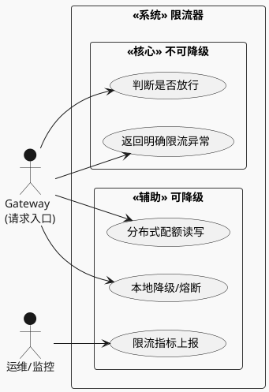
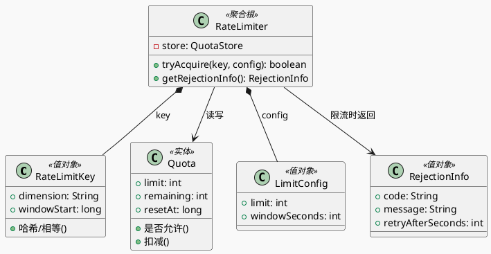
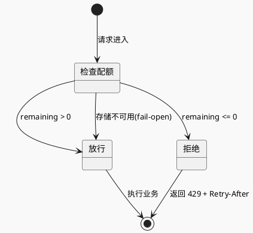
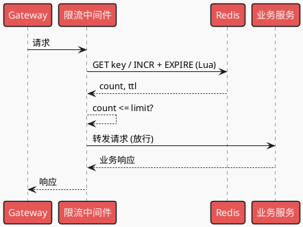
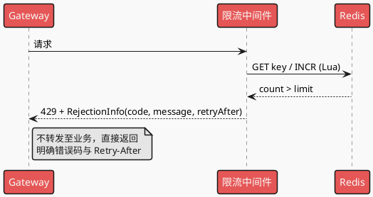
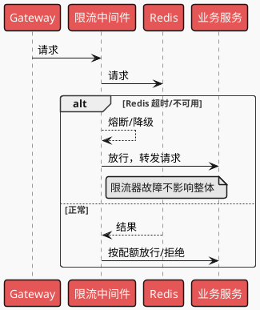
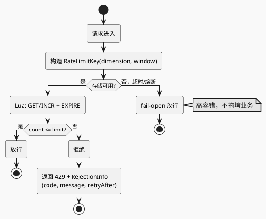
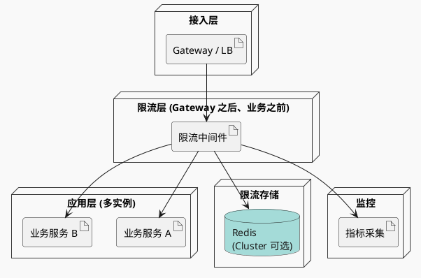
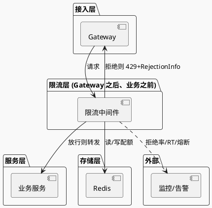

# 分布式限流器 — 系统设计

> 场景：**准确限流、低延迟、少内存、分布式共享、明确异常信息、高容错**（限流器故障不影响主业务）。  
> 本文档按 sys-design 五维框架编排，图示统一使用 **PlantUML** + **mars** 主题，图类型见 `.agents/rules/plantuml_use.md`。

---

## 一、业务建模、挑战与权衡 (Core Design)

### 1.1 业务建模与用例 (Context & Modeling)

**用例驱动 (Use Case)**  

* **角色定义**：**请求流** = 先经 Gateway，再经限流中间件，最后到达业务服务；**限流中间件** 位于 **Gateway 之后、业务服务之前**，在此做判断与拒绝，避免无效请求打到业务。
* **边界定义**：**核心链路** = Gateway → 限流判断 → 放行则转业务 / 拒绝则直接返回 429；**辅助链路** = 配额存储（Redis）、监控上报、降级策略（存储不可用时 fail-open）。

**用例图（PlantUML 用例图）**  

**业务建模 (Domain Modeling)**  

* **聚合根**：限流维度（如 userId、apiKey、ip + 时间窗口）下的配额与当前用量。
* **实体**：`RateLimitKey(dimension, window)`、`Quota(limit, remaining, resetAt)`；值对象：`LimitConfig(limit, windowSeconds)`。

**领域模型类图（PlantUML 类图）**  

**限流判断状态机**（单次请求视角，PlantUML 状态图）  

---

### 1.2 场景特性与量化 (Quantification)

**流量特征**  

| 项目 | 结论 |
|------|------|
| **读写比例** | 每次请求 = 1 次「读配额 + 条件写」（扣减），实为**高频读+条件更新**；QPS 与业务入口一致，需低延迟。 |
| **流量形状** | 与业务一致：平稳或突发；限流器需在突发下仍准确、不成为瓶颈。 |

**数据特性**  

| 项目 | 说明 |
|------|------|
| **数据生命周期** | 按时间窗口滑动或固定窗口；key 带 TTL，过期即删，**内存占用尽量少**。 |
| **一致性边界** | **最终一致**可接受（多节点扣减允许短暂超限）；或单 key 单节点原子操作（Lua）保证窗口内准确。 |

**封底估算 (Estimation)**  

| 符号 | 含义 | 假设值 |
|------|------|--------|
| $QPS_{gate}$ | 网关/入口 QPS | 1 万 ~ 10 万 |
| 单 key 大小 | dimension + 计数 + 时间戳 | 约 50–100 B |
| 维度基数 | 如 userId / apiKey | 百万 ~ 千万 |

* 存储量级：$10^6 \sim 10^7$ key × 100B ≈ **100MB–1GB**（Redis 可接受）；单次检查 RT 要求 **&lt; 1–2 ms**（P99），避免拉高 HTTP 延迟。

---

### 1.3 链路设计与防御 (Flow & Resilience)

**正常时序（放行，PlantUML 时序图）**  

* 请求路径：Gateway → 限流中间件 → 业务服务。

**正常时序（限流拒绝，返回明确异常）**  

**异常路径：Redis 不可用 / 超时（高容错，fail-open）**  

**限流判断流程（PlantUML 活动图）**  

**并发控制**  

| 场景 | 策略 |
|------|------|
| **原子性** | 单 key 内「读+扣减+过期」用 **Redis Lua** 原子执行，避免竞态。 |
| **幂等** | 限流为「每请求一次扣减」，非幂等；通过「同一请求只调一次 tryAcquire」由业务保证。 |

---

### 1.4 对账、监控与自愈 (Observability & Repair)

**对账**：限流器无业务对账需求；可选「抽样对比 Redis 计数与本地日志」做一致性校验，非必须。

**监控度量**（与第二节衔接）  

* **业务**：限流拒绝 QPS、按维度/接口的拒绝率。  
* **技术**：限流器 P99 RT、Redis 调用成功率与 RT、熔断/fail-open 触发次数。

---

### 1.5 架构选型与 Trade-off (The Soul of Design)

**选型理由**  

| 决策 | 选型与理由 |
|------|------------|
| **分布式存储** | **Redis**：单线程原子 Lua、低延迟、TTL 原生支持；替代方案如 etcd 延迟更高，本地内存无法跨进程共享。 |
| **算法** | **滑动窗口 / 固定窗口 + Lua**：平衡准确性与实现成本；令牌桶需额外定时补桶，本设计优先简单窗口计数。 |
| **容错** | **fail-open**：存储不可用时**放行**请求，限流器故障不拖垮业务；舍弃「严格限流」换取可用性。 |

**舍弃原则**  

| 维度 | 选择 |
|------|------|
| **CP vs AP** | 存储不可用时选 **AP**（放行），保证主业务可用；限流为保护手段，非强一致。 |
| **复杂度** | 先单维限流（如 userId + 接口），多维度与多级限流可后续扩展。 |

**完整部署架构图（PlantUML 部署图）**  

* 限流中间件位于 **Gateway 之后、业务服务之前**：请求先到 Gateway，经限流判断后再转发至业务；被限流则在此直接返回 429，不打到业务。

**完整系统设计图（PlantUML 组件图）**  

* 请求路径：**Gateway → 限流中间件 → 业务服务**；限流在业务之前，被拒请求不进入业务。

---

## 二、指标体系设计 (Observability - Metrics)

### 2.1 黄金指标

| 指标 | 含义 |
|------|------|
| `rate_limit_check_p99_seconds` | 单次限流判断 P99 延迟（须 &lt; 1–2 ms，不拉高 HTTP RT） |
| `rate_limit_reject_qps` | 被拒绝请求 QPS（按维度/接口打 tag） |
| `rate_limit_store_availability` | 存储（Redis）可用率；低于阈值触发 fail-open |

### 2.2 核心业务与系统指标

| 类型 | 指标 |
|------|------|
| 业务 | `rate_limit_allow_qps`、`rate_limit_reject_qps`（按 dimension、api 打 tag） |
| 系统 | `rate_limit_check_rt`、`rate_limit_fail_open_total`、`redis_callback_rt`、`redis_error_rate` |
| 依赖 | Redis 连接数、Redis 内存、网络分区检测 |

### 2.3 依赖与预警

* Redis 超时率、错误率升高 → 告警并观察 fail-open 是否触发。  
* 限流器 P99 RT 升高 → 排查 Redis 与网络，必要时扩容或本地缓存降级。

---

## 三、风险识别与告警设计 (Risk & Alerting)

### 3.1 风险矩阵

| 风险 | 等级 | 缓解 |
|------|------|------|
| Redis 单点/不可用 | 高 | Redis Cluster + fail-open；限流器不阻塞业务。 |
| 限流延迟拉高 HTTP RT | 高 | 控制单次 Redis 往返 &lt; 1–2 ms；超时即放行。 |
| 多节点时钟/窗口不一致 | 中 | 以 Redis 时间为准或统一 window 边界；接受小幅误差。 |
| 维度基数爆炸导致内存/Key 过多 | 中 | 限制维度组合、TTL 严格、必要时采样或聚合。 |

### 3.2 告警阈值

* **Critical**：`rate_limit_store_availability` &lt; 99%、`rate_limit_check_p99_seconds` &gt; 5 ms、业务侧 HTTP P99 明显升高且与限流 RT 相关。  
* **Warning**：`rate_limit_fail_open_total` 突增、Redis 错误率 &gt; 0.1%。

### 3.3 静默与收敛

* 按实例/维度聚合告警；同一 Redis 故障 5 分钟内合并。  
* fail-open 触发时可为「预期行为」做短期说明，避免误报。

---

## 四、标准化故障处理程序 (SOP - Emergency Response)

### 告警 A：限流器 P99 RT 过高 / Redis 不可用

**排查**：查 Redis 连接数、网络、慢查询；查限流 key 数量与 TTL 是否异常。

**止损（指令级）**  

1. **确认 fail-open 已生效**（限流器不阻塞请求）；若未生效，检查超时与熔断配置，确保超时后放行。  
2. 扩容 Redis 或检查网络/防火墙；必要时临时放宽限流阈值或关闭部分维度限流，减轻 Redis 压力。  
3. 恢复后观察 `rate_limit_check_p99_seconds` 与业务 HTTP P99。

**备选**：若 Redis 长时间不可用，依赖 fail-open 保证业务；限流暂时失效，可配合网关层或上游限流兜底。

---

### 告警 B：限流拒绝率异常升高

**排查**：是否配置误调、是否有刷量/攻击；按维度看哪个 key 或接口被拒最多。

**止损**  

1. 若为配置错误：回滚或修正 limit/window 配置并发布。  
2. 若为恶意流量：保持限流，并配合封禁、验证码等；对用户侧返回 **明确异常信息**（429 + `Retry-After` + 错误码与文案）。

---

### 告警 C：用户反馈「请求被限流但无明确提示」

**原则**：限流时必须返回**明确异常信息**。

1. **检查响应**：是否返回 HTTP 429、Body 中是否包含错误码（如 `RATE_LIMIT_EXCEEDED`）、文案与 `retry_after_seconds`。  
2. **修复**：确保限流中间件在拒绝时统一封装 `RejectionInfo`（code、message、retryAfter），由网关/统一异常层返回 429。  
3. 前端/客户端根据 `Retry-After` 或 body 中的 `retry_after_seconds` 做重试或提示。

---

## 五、架构演进与面试向 (Evolution & Interview)

### 5.1 瓶颈点预测

**假设 QPS 再翻 10 倍**（如单入口 100 万 QPS）：  

| 可能瓶颈 | 应对方向 |
|----------|----------|
| Redis 单机 QPS/连接数 | Redis Cluster 分片、本地缓存 + 异步同步配额（多级限流）。 |
| 限流器单次 RT 成为瓶颈 | 本地预扣减 + 批量同步、或滑动窗口近似算法降低 Redis 调用频率。 |
| 维度与 key 爆炸 | 限制维度组合、分层限流（先粗维度后细维度）、冷 key 过期与采样。 |

### 5.2 分阶段演进

| 阶段 | 内容 |
|------|------|
| V1.0 | 单维限流（如 userId）+ Redis 固定/滑动窗口 + fail-open + 429 明确返回。 |
| V2.0 | 多维度（userId + api）、多级限流（全局 + 单用户）；指标与告警完善。 |
| V3.0 | 本地缓存 + 异步同步、或令牌桶；支持更复杂策略与熔断策略可配置。 |

### 5.3 架构拷问（3 题）

**Q1：为什么选择 fail-open 而不是 fail-closed？**  
限流是**保护手段**，不是强一致业务。若限流器或 Redis 故障导致所有请求被拒，会放大故障；fail-open 下仅「暂时不限流」，业务仍可服务，符合高容错要求。

**Q2：如何保证「低延迟」不拉高 HTTP RT？**  
单次判断仅 1 次 Redis 往返（Lua 原子）；设置短超时（如 2 ms），超时即放行；监控 P99 并告警，确保限流逻辑本身 &lt; 1–2 ms。

**Q3：分布式下如何保证「准确」限流？**  
单 key 在 Redis 内用 **Lua 原子执行**「读 count + 判断 + 扣减 + 设置过期」，多进程/多实例共享同一 key，保证该维度下计数准确；多节点时钟差可用 Redis 时间或统一窗口边界弱化影响。

---

## 六、设计反馈与落地要点

- **准确**：Redis Lua 原子化「读+判+写」；窗口与维度设计清晰。  
- **低延迟**：单次 Redis 调用 + 短超时 + P99 监控；超时即放行。  
- **少内存**：key 带 TTL、控制维度基数、避免无限 key 增长。  
- **分布式**：同一维度 key 多实例共享 Redis。  
- **明确异常**：拒绝时返回 429 + `RejectionInfo`（code、message、retryAfter），便于前端/用户提示。  
- **高容错**：fail-open；Redis 不可用/超时时放行，限流器故障不影响整体系统。

---

*文档版本：按 sys-design 五维框架编写；图示统一 PlantUML + mars 主题，见 plantuml_use.md。*
