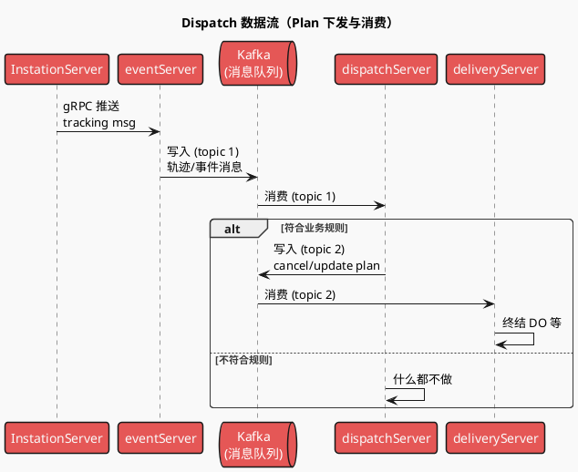
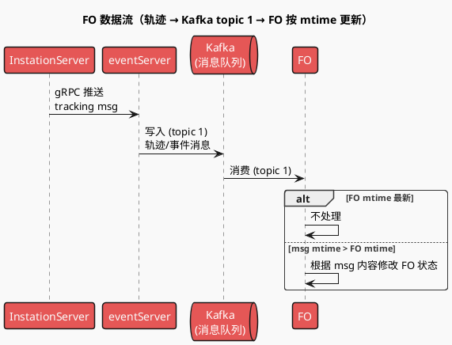

# 重构项目总结（STAR 格式）

> 参考 [.agents/rules/star.md](../../.agents/rules/star.md) 的 STAR 法则撰写。
> 材料来源见文末「参考链接」。

---

## 一、Situation（背景）

2022 年之前，为适配短平快的业务迭代，技术选型采用 **Python** 作为后端语言，且所有模块共用一个代码仓库，通过**目录**进行模块隔离。

随着业务复杂度和体量上升，该架构暴露出以下问题：


| 维度        | 具体表现                                                                                  |
| --------- | ------------------------------------------------------------------------------------- |
| **性能与资源** | Python 性能有限，难以支撑业务发展，需投入较多服务器资源部署服务                                                   |
| **依赖与耦合** | 各模块直接引用，依赖关系错综复杂                                                                      |
| **协作与发布** | 共用代码库下并行开发时代码冲突严重，发布风险陡增                                                              |
| **数据一致性** | 各模块高度依赖 FO 状态机；并发场景（如 onhold 订单：redelivery + hub receive）下易出现数据不一致，阻塞业务流程，需频繁 datafix |


---

## 二、Task（目标与挑战）

在**不中断业务迭代**的前提下，完成三项升级：

1. **服务拆分**：从大单体拆分为微服务，降低代码耦合与发布风险。
2. **解耦与一致性模型升级**：从「基于 FO 状态机的强一致性校验」改为「基于事件驱动的域内校验」，保障**最终一致性**，消除并发场景下的数据错乱与阻塞。
3. **语言与性能升级**：将核心服务从 Python 迁移至 Go，提升性能并节约资源（具体指标见 Result）。

---

## 三、Action（方案与行动）

### 3.1 服务解耦与一致性模型改造

- **引入 Plan 机制**：在 Plan 生命周期内，仅使用 **LM 域内状态机**管理域内流程，**不再依赖 FO 状态机**。由**调度中心**下发 Plan、控制灰度；**轨迹中心**接收作业域消息并做点对点轨迹推送。
- **事件驱动对外更新**：域内完成后只发送对应**事件/轨迹**，由 FO 按事件时间戳顺序更新 FO 状态，仅保证**最终一致性**。
- **解耦要点**（以 Delivery 为例）：
  - **AT/RAT 与 TO 解耦**：通过「是否有 Plan」判断走新架构或老逻辑；订单与 AT 的解绑通过 **Cancel Plan** 终结 Delivery 域内流程（先终结 DO，再 unlink AT/RAT，支持重入）。
  - **ONHOLD 后 Redelivery + Receive 并发**：解耦
  - **骑手操作与运单解耦**：有 Plan 时通过轨迹推送更新，不直接改 TO 状态；切流由调度中心按 **Plan 类型 + 站点 + 订单号百分比** 控制。
- **DDD 实践**：按限界上下文划分（Admin 派送任务管理 / 骑手派送、骑手派送/财务支付/订单子域/路径规划/骑手）；以 **DeliveryOrder** 为聚合根控制派送行为；完成派送/OnHold 时发送**领域事件**更新订单、骑手、财务等上游。

#### Plan 与 FO 更新流程（时序图）

**Dispatch 数据流**：站内轨迹经 eventServer 写入消息队列，dispatchServer 消费后按规则下发 cancel/update plan，deliveryServer 消费 plan 执行终结 DO 等。



**FO 数据流**：站内轨迹经 eventServer 写入 Kafka（topic 1），**FO 直接消费 topic 1**；通过比较当前 FO 的 mtime 与消息的 mtime 决定是否更新，保障按时间戳顺序更新、最终一致。



**参考**：[架构升级](https://confluence.shopee.io/pages/viewpage.action?pageId=654982850)、[解耦](https://confluence.shopee.io/pages/viewpage.action?pageId=1036575835)、[DDD 设计](https://confluence.shopee.io/pages/viewpage.action?pageId=623631526)。

### 3.2 治理跨模块引用（Python 阶段）

- **Facade 化**：将跨模块调用收敛为**函数 Facade**，模块间仅允许通过 **Facade** 或 **HTTP** 交互，消除直接引用与循环依赖。

### 3.3 Python 迁移至 Go

- **读写对比与切流**：采用**读对比 + 写灰度**。配置在 Middleware 层统一开关；引入 **XX 对比环境**，在一致率达标前可先对比再切流。读接口对比一致率 **≥99%（建议 99.99% 乃至 100%）** 后再切流；写接口按比例由小到大灰度。灰度比例采用**随机数**控制（避免按 driver 等业务 key 导致流量不均）。
- **灰度与兼容**：通过 `delivery.refactor_release`（path → 转发百分比）、`delivery.refactor_data_comparison`（需对比的 URL）等配置做接口维度灰度；APP 鉴权仍走 Python，Admin 对接权限系统并做**服务可降级**。切流顺序：对比 → Python 转发 → 客户端读配置 → 直连 Go；对新旧接口并存的情况，**提供新接口实现**而非复杂的新旧转换。
- **交付节奏**：22Q4 Python 功能迁移至 Go（除导出）；23Q1～23Q2 LM 所有 Python 应用下线（目标 23 年 5 月底）。

**参考**：[读对比](https://confluence.shopee.io/pages/viewpage.action?pageId=1264216680)、[去 Python 总结](https://confluence.shopee.io/pages/viewpage.action?pageId=1950323224)。

---

## 四、Result（结果与量化）

### 4.1 业务与技术价值

- **领域边界与依赖**：通过领域模型解耦，各模块业务边界更清晰，职责更明确，决策链路与时间缩短；P0 级作业域间依赖逐步解除，P1 模块（作业单、作业记录模型）按域独立建设。
- **服务稳定性**：按领域拆分后，单点故障不再导致整体不可用；作业环节从强校验改为**现场实物操作优先 + 兜底逻辑**，在系统/网络不稳定时仍可执行操作；后续配合离线化（如 Q3）进一步保障弱网不中断。

### 4.2 核心 API 性能（以 VN 为例，单位 ms）


| 领域         | 接口示例                                         | 老系统 95/99 线 RT            | 新系统 95/99 线 RT        |
| ---------- | -------------------------------------------- | ------------------------- | --------------------- |
| Delivery   | add_order / remove_order / complete / reopen | 701～863 / 12087～1606      | 424～535 / 5752～1011   |
| Delivery   | accept / take / on_hold                      | 372～735 / 372～735         | 198～432 / 198～432     |
| In-Station | uni_receive/order、general_to/order/add       | 1620～1764 / 2648～3063     | 966～1036 / 2015～2065  |
| In-Station | HUB Mass Receive / SOC Mass Receive          | 20524～32385 / 40196～56698 | 742～1301 / 3364～13991 |
| Pickup     | pickup_order/pickedup                        | 427.7 / 1934.3            | 398.5 / 1863.9        |


（更多接口见 Confluence「收益总结」核心 API RT 表。）

### 4.3 资源与交付

- **机器资源**：迁移完成后，约仅用**原 1/3 机器资源**（来源：去 Python 重构总结）。
- **质量**：去 Python 阶段共 12 个 live 相关问题，多与长尾接口、部署差异、并行需求冲突及读对比/灰度策略有关，经验已沉淀至总结文档。

### 4.4 工程效能

- **调用关系**：架构三期后，如 Pickup 扫描不再同步调 FO 更新字段与状态，改为轨迹处理，模块间调用更简单。
- **协作与发布**：按领域拆解后，代码冲突与协同成本降低，需求交付周期与开发成本预期下降（需 FPM/技术后续补充统计模型与案例）。

---

## 五、参考链接


| 主题                            | 链接                                                                                                                                           |
| ----------------------------- | -------------------------------------------------------------------------------------------------------------------------------------------- |
| 架构升级（大单体→微服务）+ 重构（Python→Go）  | [https://confluence.shopee.io/pages/viewpage.action?pageId=654982850](https://confluence.shopee.io/pages/viewpage.action?pageId=654982850)   |
| 解耦（架构升级六期 Delivery 技术方案）      | [https://confluence.shopee.io/pages/viewpage.action?pageId=1036575835](https://confluence.shopee.io/pages/viewpage.action?pageId=1036575835) |
| DDD 设计（领域驱动设计在骑手派送中的实践）       | [https://confluence.shopee.io/pages/viewpage.action?pageId=623631526](https://confluence.shopee.io/pages/viewpage.action?pageId=623631526)   |
| **总结（收益总结 / 项目价值收集）**         | [https://confluence.shopee.io/pages/viewpage.action?pageId=1016715928](https://confluence.shopee.io/pages/viewpage.action?pageId=1016715928) |
| 读对比（Delivery 重构读写对比 & 项目结构改造） | [https://confluence.shopee.io/pages/viewpage.action?pageId=1264216680](https://confluence.shopee.io/pages/viewpage.action?pageId=1264216680) |
| 去 Python 总结                   | [https://confluence.shopee.io/pages/viewpage.action?pageId=1950323224](https://confluence.shopee.io/pages/viewpage.action?pageId=1950323224) |


---

## 六、经验与风险（摘录自去 Python 总结）

- **长尾**：约 20% 的长尾事项（新接口、下线接口、依赖扯皮等）会占用约 80% 时间（23Q1～Q3），Plan 阶段需预留。
- **部署**：重构前后部署架构差异（如 live 与 nolive 使用不同 Redis 集群）可能导致 nolive 正常、live 异常，需提前对齐。
- **读对比**：读对比需支持**灰度**（大流量接口全量对比易压垮 DB/Redis/MQ）；支持**忽略字段**（读后即写导致异步对比误报）；比例控制用**随机数**而非 user 等业务 key；一致率建议 **99.99%+** 再切流。
- **并行需求**：重构与业务需求并行时需同步变更、在方案中写清相互影响；写接口灰度前需 review 两边实现一致；Saturn/权限树/MySQL/Apollo 等配置需在上线或切流前就绪，避免漏配。

---

## 述职重点

> 提取自正文，用于述职汇报时突出重点与难点，体现技术深度与问题解决能力。

### 一句话结论

在**不中断业务迭代**的前提下，通过**架构拆分、领域解耦与 Python→Go 迁移**，实现了性能与资源的大幅优化、域间依赖与发布风险的降低，以及系统稳定性的提升。

### 重点（述职可强调的亮点）


| 维度         | 要点                                                                                              | 述职时怎么说                     |
| ---------- | ----------------------------------------------------------------------------------------------- | -------------------------- |
| **问题规模**   | Python 大单体、共仓目录隔离；性能瓶颈、跨模块耦合、发布冲突、FO 强一致导致并发（onhold 下 redelivery + hub receive）数据不一致与频繁 datafix | 强调「大单体」「共仓冲突」「并发数据错乱」      |
| **架构升级**   | 按作业域拆微服务，Facade/HTTP 边界，独立部署与治理；单点故障不再拖垮整体                                                      | 强调「按域拆分」「边界清晰」「发布冲突降低」     |
| **解耦与一致性** | Plan + 调度/轨迹中心，域内状态机 + 事件/轨迹驱动，强一致→最终一致；AT/TO 解耦、Cancel Plan 终结、DDD 聚合根                         | 强调「事件驱动」「最终一致」「消除 datafix」 |
| **语言与工程**  | Python→Go，读对比（≥99.99%）+ 接口维度灰度（随机数比例、可降级），平滑切流并下线 Python                                        | 强调「读对比+灰度」「兼顾迭代」「安全切流」     |
| **量化指标**   | Delivery 99 线 RT 12087→5742ms，Mass Receive 4 万→1.3 万 ms 级；机器资源约**原 1/3**                        | 用具体数字体现「性能与资源」             |


### 难点（体现技术深度与问题解决能力）


| 难点                     | 具体内容                                                                                                                        | 述职时怎么说                                                |
| ---------------------- | --------------------------------------------------------------------------------------------------------------------------- | ----------------------------------------------------- |
| **1. 解耦与一致性模型升级**      | 从「基于 FO 状态机的强一致」改为「基于事件驱动的域内校验」；需 Plan 机制、调度/轨迹中心、AT/TO 解耦、Cancel Plan 终结；ONHOLD 下 Redelivery + Receive 并发需 FO 状态校验避免 DO 错乱 | 「在强依赖 FO 的前提下，设计 Plan + 事件驱动，实现域内状态机与最终一致，解决并发场景数据错乱」 |
| **2. 多源更新与流程终结**       | AT/RAT 与 TO 解耦、骑手与运单解耦；Cancel Plan 需先终结 DO 再 unlink AT/RAT，支持重入；FO 按事件 mtime 更新保障最终一致                                       | 「设计 Cancel Plan 终结流程与 FO mtime 比较策略，保证多源更新下的顺序与一致性」   |
| **3. Python→Go 迁移与切流** | 读对比需一致率 ≥99.99% 再切流；写接口按比例灰度；灰度用随机数控制；读对比需支持灰度、忽略字段；大流量全量对比易压垮 DB/Redis/MQ                                                  | 「设计读对比 + 接口灰度方案，兼顾日常迭代，保证 350+ 接口平滑切流与下线 Python」      |
| **4. 长尾与并行风险**         | 约 20% 长尾事项占 80% 时间；部署差异（live/nolive Redis 集群不同）导致 nolive 正常、live 异常；重构与业务需求并行时信息不同步、实现不一致                                   | 「预留长尾时间、提前对齐部署架构；并行需求时同步变更、写接口灰度前 review 两边实现」        |


### 述职口述示例（30 秒～1 分钟）

> 重构项目解决的是 Python 大单体下的性能瓶颈、跨模块耦合、发布冲突，以及强依赖 FO 状态机导致并发场景（如 onhold 下 redelivery + hub receive）数据不一致与频繁 datafix 等问题。  
> 分三路推进：**架构升级**（按域拆微服务、Facade/HTTP 边界）、**解耦与一致性**（Plan + 事件驱动、AT/TO 解耦、Cancel Plan 终结、DDD 聚合根）、**语言与工程**（Go 重写 + 读对比 + 接口灰度）。  
> 难点包括：从强一致到事件驱动最终一致的模型升级、Cancel Plan 终结流程与 FO mtime 更新策略、以及 350+ 接口的读对比与灰度切流。  
> 最终核心 API RT 大幅下降（如 Delivery 99 线 12087→5742ms），机器资源约**原 1/3**，单点故障不再拖垮整体。

### 可追问的深挖点（提前准备）

1. **强一致为何改为最终一致？** 并发场景（redelivery + hub receive）下强校验易阻塞；事件驱动 + FO 按 mtime 更新可保障顺序与最终一致。
2. **Cancel Plan 为何先终结 DO 再 unlink AT/RAT？** 支持重入，若先 unlink 则重入时无法确定订单属于哪个骑手。
3. **读对比为何要求 99.99%+ 一致？** 保证切流前数据与 Python 一致，降低风险；大流量接口需支持灰度对比避免压垮链路。
4. **灰度为何用随机数而非 driver 等业务 key？** 控制比例更稳定，避免按 driver 导致流量不均、难以验证。
5. **长尾为何占 80% 时间？** 新接口、下线接口、依赖扯皮等约 20% 事项会持续整个项目（23Q1～Q3），Plan 阶段需预留。

---

## 简历/述职用 STAR 表述（示例）

> 与「金字塔原理总结」对齐：结论先行，Action 按「架构升级 / 解耦与一致性 / 语言与工程」三块展开。

### 一段话版（简历/口述）

**结论先行**：在不中断业务的前提下，通过架构拆分、领域解耦与 Python→Go 迁移，实现了性能与资源优化、域间依赖与发布风险降低、系统稳定性提升。

**S&T**：SPX 派送与站内等模块原为 Python 大单体、共仓目录隔离，随体量上升暴露出性能瓶颈、跨模块耦合与发布冲突、以及强依赖 FO 状态机导致并发场景（如 onhold 下 redelivery + hub receive）数据不一致与频繁 datafix。目标是在持续迭代下完成服务拆分、解耦（强一致→最终一致）与 Python→Go 迁移。

**A**：分三路推进——

（1）**架构升级**：按作业域拆微服务，模块间 Facade/HTTP 边界，独立部署与治理；

（2）**解耦与一致性**：引入 Plan 与调度/轨迹中心，Plan 生命周期内用 LM 域状态机 + 事件/轨迹驱动更新 FO（最终一致），AT/TO 解耦、Cancel Plan 终结域内流程、ONHOLD 下 Redelivery 增加 FO 状态校验，并落地 DDD 限界上下文与 DeliveryOrder 聚合根；

（3）**语言与工程**：Golang 重写核心服务，读对比（一致率 ≥99.99%）+ 接口维度灰度（Apollo、随机数比例、可降级）平滑切流并下线 Python。

**R**：核心 API RT 显著下降（如 Delivery 99 线 12087→5742ms，Mass Receive 4 万→1.3 万 ms 级）；机器资源约**原 1/3**；域间依赖与代码冲突减少，单点故障不再导致整体不可用。

---

### 分条版（述职 PPT / 详细口述）


| 维度    | 表述要点                                                                                                                                                                                             |
| ----- | ------------------------------------------------------------------------------------------------------------------------------------------------------------------------------------------------ |
| **S** | Python 大单体 + 目录隔离；性能瓶颈、依赖复杂、发布冲突、FO 强一致导致并发数据不一致与频繁 datafix                                                                                                                                      |
| **T** | 不中断业务下完成：**架构拆分**、**解耦与一致性升级**（强一致→事件驱动最终一致）、**Python→Go 迁移与下线**                                                                                                                                 |
| **A** | **① 架构**：按域拆微服务，Facade/HTTP 边界，独立部署。**② 解耦与一致性**：Plan + 调度/轨迹中心，LM 域状态机 + 事件/轨迹更新 FO，AT/TO 解耦、Cancel Plan 终结、FO 状态校验，DDD 聚合根与领域事件。**③ 语言与工程**：Golang 重写，读对比（≥99.99%）+ 接口灰度（随机数比例、可降级），下线 Python。 |
| **R** | **性能与资源**：核心 API RT 大幅下降（Delivery 99 线 12087→5742ms 等），机器约 **1/3**。**稳定性与效能**：单点故障不拖垮整体，域间调用与发布冲突减少。                                                                                             |


---

### 金字塔对齐版（述职口述：先结论再三层）

**塔尖**：在不中断业务的前提下，通过架构拆分、领域解耦与 Python→Go 迁移，实现了性能↑、资源↓、稳定性↑。

**三层展开**：

- **1. 架构升级**：大单体按作业域拆微服务，Facade/HTTP 边界，独立部署治理；解决耦合与发布冲突。
- **2. 解耦与一致性**：Plan + 调度/轨迹中心，域内状态机 + 事件驱动、最终一致；AT/TO 解耦、Cancel Plan 终结、DDD 聚合根；解决并发数据错乱与 datafix。
- **3. 语言与工程**：Go 重写 + 读对比 + 接口灰度，平滑切流并下线 Python；带来 RT 大幅下降与机器约 1/3。

**收尾量化**：Delivery 99 线 RT 12087→5742ms，Mass Receive 4 万→1.3 万 ms 级，机器资源约原 1/3。

---

*使用说明：简历可只保留「一段话版」并据个人贡献改为「我」主导/参与；述职可用「分条版」或「金字塔对齐版」与金字塔总结页面对应讲述，并搭配第四节量化表格。*

---

## 金字塔原理总结

> 结论先行、以上统下、归类分组、逻辑递进。

### 塔尖（结论一句话）

在**不中断业务迭代**的前提下，通过**架构拆分、领域解耦与 Python→Go 迁移**，实现了性能与资源的大幅优化、域间依赖与发布风险的降低，以及系统稳定性的提升。

---

### 第二层（三个支撑论点）


| 论点                | 概括                                                                    |
| ----------------- | --------------------------------------------------------------------- |
| **1. 架构升级**       | 大单体按作业域拆分为微服务，各域独立部署与治理，单点故障不再拖垮整体。                                   |
| **2. 解耦与一致性模型升级** | 用 Plan + 事件/轨迹驱动替代对 FO 状态机的强依赖，域内状态机 + 最终一致性，消除并发场景下的数据错乱与频繁 datafix。 |
| **3. 语言与工程升级**    | Python 核心能力迁移至 Go，读对比 + 接口灰度保障平滑切流，机器资源约降至原 1/3，核心 API RT 显著下降。       |


---

### 第三层（论据支撑）

**1. 架构升级**

- 按站内、Order、Pickup、Delivery、LH 等作业域拆分服务与部署，边界清晰、职责明确。
- 模块间通过 Facade / HTTP 交互，消除共仓下的直接引用与并行冲突，发布与协作成本降低。

**2. 解耦与一致性模型升级**

- Plan 生命周期内仅用 LM 域状态机；对外通过调度中心下发 Plan、轨迹中心收轨迹，FO 按事件时间戳顺序更新，只保证最终一致。
- AT/TO 解耦、Cancel Plan 终结域内流程、ONHOLD 下 Redelivery 增加 FO 状态校验，避免 DO 状态错乱。
- DDD 限界上下文与聚合根（如 DeliveryOrder）落地，领域事件驱动上游更新。

**3. 语言与工程升级**

- Golang 重写核心接口；读对比（一致率 ≥99.99%）+ 接口维度灰度（随机数比例、可降级）保障安全切流。
- 结果：核心 API RT 大幅下降（如 Delivery 99 线 12087→5742ms，Mass Receive 4 万→1.3 万 ms 级）；机器资源约**原 1/3**。

---

### 结构示意

```
                    塔尖：不中断业务下，架构拆分 + 解耦 + 迁移 → 性能↑、资源↓、稳定性↑
                                        |
            +----------------------------+----------------------------+
            |                            |                            |
      1. 架构升级                  2. 解耦与一致性升级            3. 语言与工程升级
     (拆微服务、独立治理)          (Plan+事件驱动、最终一致)        (Python→Go、读对比+灰度)
            |                            |                            |
     · 按域拆分/部署              · 域状态机+轨迹/事件              · Golang 重写
     · Facade/HTTP 边界           · AT/TO 解耦、Cancel Plan        · RT↓、机器约 1/3
     · 发布冲突↓                  · DDD 聚合根与领域事件            · 平滑切流与下线 Python
```

