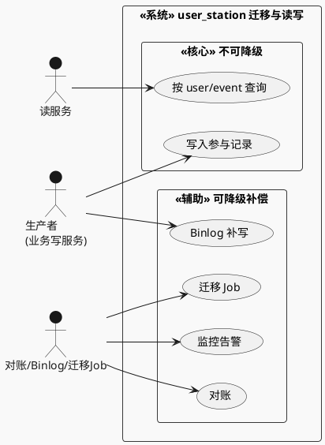
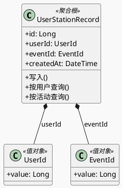
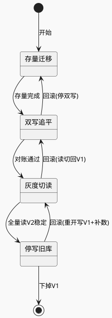
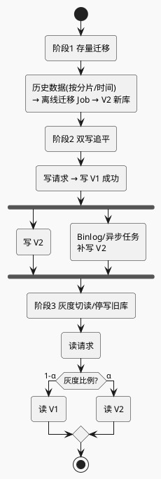
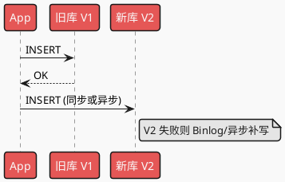
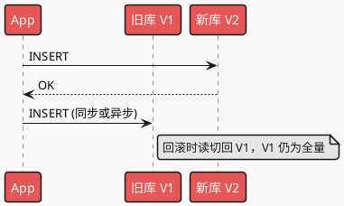
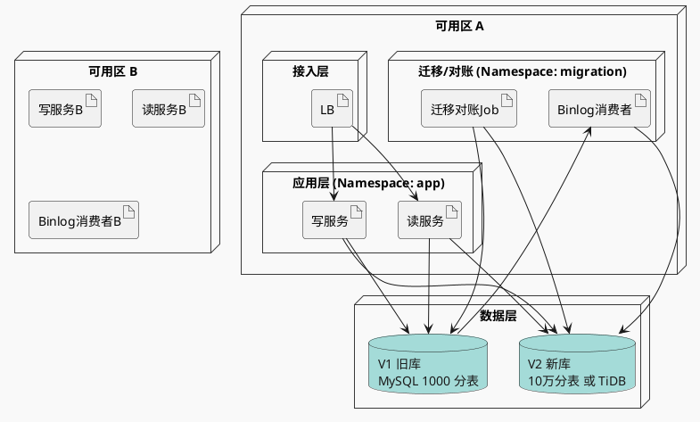
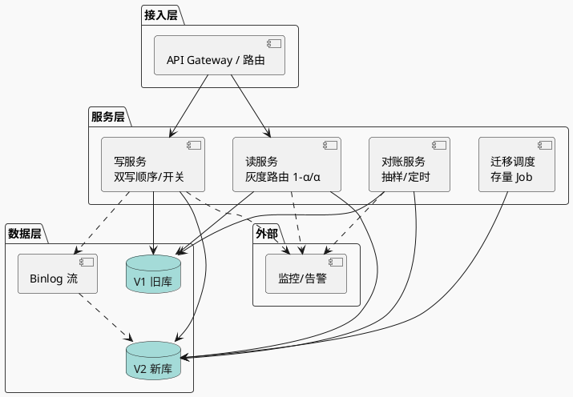

# user_station_tab 不停机迁移 — 系统设计

> 场景：用户参加活动记录表 1000 张分表 → 10 万分表或 TiDB，**不停机迁移**。  
> 本文档按最新 sys-design 五维框架编排：业务建模与用例 → 场景量化 → 链路与防御 → 对账与监控 → 选型与 Trade-off，并含指标、风险、SOP、演进与面试向。  
> **图示规范**：所有设计图统一使用 **PlantUML**，图类型与场景对应关系见 `.agents/rules/plantuml_use.md`。

---

## 一、业务建模、挑战与权衡 (Core Design)

### 1.1 业务建模与用例 (Context & Modeling)

**用例驱动 (Use Case)**  

* 角色定义：**生产者** = 业务写服务；**消费者** = 读服务、对账任务、Binlog 消费者、离线迁移 Job。
* 边界定义：**核心链路** = 写表 + 按 user/event 查询（不可降级）；**辅助链路** = Binlog 补写、对账、迁移 Job、监控（故障时降级/补偿）。

**用例图（UML Use Case Diagram）**  

**业务建模 (Domain Modeling)**  

* 聚合根：用户在某活动下的参与记录（一条记录 = 一次参与事件）。
* 实体：`UserStationRecord`；值对象：`UserId`、`EventId`；分表键一般为 `userId` 取模。

**领域模型类图（PlantUML 类图）**  

**迁移阶段状态机**（阶段级，非记录级，PlantUML 状态图）：

---

### 1.2 场景特性与量化 (Quantification)

**流量特征**  

| 项目 | 结论 |
|------|------|
| **读写比例** | 写少读多（$R_{rw}$ 高），适合读缓存、写路径简单；单表/分片 QPS 低，瓶颈在连接数与分片规模。 |
| **流量形状** | 以平稳为主；按活动有突发（整点抢购/秒杀），需在封底时预留峰值倍数。 |

**数据特性**  

| 项目 | 说明 |
|------|------|
| **数据生命周期** | 热数据：近期写入与高频查询；冷数据：历史参与记录，可归档或冷热分离。归档策略与业务约定（如 1 年后只读/归档）。 |
| **一致性边界** | **最终一致性**（BASE）。迁移期要求：读到的要么是 V1 全量，要么是 V2 与 V1 对账一致后的视图，不出现「半写」被读。 |

**封底估算 (Estimation)**  

参考 `.agents/rules/system_design_estimation_template.md`。

| 符号 | 含义 | 假设值 |
|------|------|--------|
| $U_{dau}$ | 日活 | 10M |
| $F_{write}$ | 单用户日均参与活动次数 | 2 |
| $R_{rw}$ | 读写比 | 50 : 1 |
| 单行 | id + user_id + event_id | ≈ 0.1 KB（轻量级） |
| $M_{peak}$ | 峰值倍数 | 3 |
| $T_{day}$ | 一天秒数 | $10^5$ |

- 写 TPS：$TPS_{avg} = \frac{10^7 \times 2}{10^5} = 200$，$TPS_{peak} \approx 600$
- 读 QPS：$QPS_{avg} = 10^4$，$QPS_{peak} \approx 3 \times 10^4$
- 每日增量：$V_{day} = 10^7 \times 2 \times 0.1\text{KB} \approx 2\text{GB}/天$
- **存储容量（3–5 年）**：$2\text{GB} \times 365 \times 5 \approx 3.5\text{TB}$ 量级（按 5 年保留估算）
- **带宽/IOPS**：瓶颈在**分片数、连接数、扩容与运维复杂度**，单分片 IOPS 压力不大；若选 TiDB，需评估集群带宽与调度。

---

### 1.3 链路设计与防御 (Flow & Resilience)

**迁移三阶段总览**：存量迁移 → 双写追平 → 灰度切读/停写旧库（PlantUML 活动图）。

**正常时序（阶段2：先 V1 后 V2，PlantUML 时序图）**  

**阶段3 灰度期（先 V2 后 V1，便于回滚，PlantUML 时序图）**  

**各阶段双写顺序与回滚**  

| 阶段 | 双写顺序 | 回滚支持 | 回滚动作 |
|------|----------|----------|----------|
| 阶段1 存量 | 无业务双写 | ✅ | 停迁移 Job，不启用双写 |
| 阶段2 双写追平 | 先 V1 后 V2 | ✅ | 关闭写 V2，仅写 V1 |
| 阶段3 灰度切读 | 先 V2 后 V1 | ✅ | 读 100% 切回 V1，双写顺序改回先 V1 后 V2 |
| 阶段3 停写旧库后 | 只写 V2 | ⚠️ 难 | 重开写 V1 + 从 V2/Binlog 补写 V1 |

**异常路径分析**  

| 异常 | 系统表现 | 防御措施 |
|------|----------|----------|
| 写 V2 超时/失败 | 不影响主路径；Binlog/异步任务补写 V2 | 监控 `dual_write_fail_count`、`v2_catchup_lag_seconds`；超阈值告警并暂停灰度 |
| Binlog 消费延迟/断流 | V2 落后于 V1，对账 diff 增加 | 告警 lag；暂停放读 V2；扩容消费者或新库资源 |
| 新库 V2 不可用 | 双写失败、读 V2 失败 | **降级**：读切回 V1（SOP 第一步）；写可暂时只写 V1，待 V2 恢复后补写 |
| 对账/修复任务打满新库 | V2 延迟升高、连接数/IO 打满 | **限流**：对账/修复限速、闲时执行、分片分批；必要时暂停对账 |

**并发控制**  

| 场景 | 策略 |
|------|------|
| **锁** | 单条记录插入无跨行事务，不需分布式锁；迁移 Job 按分片/时间片划分，避免多 Job 同分片并发写同范围。 |
| **幂等** | 按 `(user_id, event_id)` 唯一约束或业务幂等键；对账修复脚本「读 V1 写 V2」需幂等（INSERT IGNORE 或 ON DUPLICATE 或先查再插）。 |

---

### 1.4 对账、监控与自愈 (Observability & Repair)

**对账设计**  

| 方式 | 选用 | 说明 |
|------|------|------|
| 实时流式对账（Flink） | 非必须 | 延迟低但成本高，本场景写少读多，非强实时。 |
| 离线批处理对账（Spark/SQL） | ✅ 推荐 | 按分片/时间窗口抽样或全量比对 V1 与 V2 的 `(user_id, event_id)` 集合；闲时跑，限速，避免打满存储。 |
| 访问时抽样对账 | ✅ 可选 | 读路径上按比例抽样触发对账，用于发现 diff 并触发修复。 |

**修复逻辑**  

- **原则**：以 **V1 为准**。  
- **自动**：V2 少/错 → 用 V1 补写/覆盖 V2；V2 多 → 记日志/打标，人工或离线判断是否删。  
- **人工**：按 `(user_id, event_id)` 或分片+时间范围 Datafix 脚本（读 V1 → 写 V2），`--dry-run`、限速、备份后执行。

**监控度量**（与第二节指标体系衔接）  

- 业务：迁移成功率、对账一致率、读 V2 成功率。  
- 技术：P99 RT（读 V1/V2）、双写失败率、`v2_catchup_lag_seconds`、Binlog lag、V2 连接数/CPU/IO。

---

### 1.5 架构选型与 Trade-off (The Soul of Design)

**选型理由**  

| 决策 | 选 A 而非 B 的理由 |
|------|---------------------|
| **10 万分表 vs TiDB** | 10 万分表：沿用 MySQL 生态，无新组件，但路由与运维复杂，1000→10 万需一致哈希或映射表。TiDB：自动分片与弹性，协议兼容 MySQL，但引入新栈与调度成本。若团队无 TiDB 经验且求稳，先 10 万分表；若追求弹性与运维简化，选 TiDB。 |
| **双写 + Binlog/异步补写** | 双通道（应用双写 + Binlog 补写）降低漏写概率、可对账；舍弃「只双写」或「只 Binlog」的简单方案，换取一致性与可观测性。 |

**舍弃原则**  

| 维度 | 选择 |
|------|------|
| **CP vs AP** | 迁移期接受**最终一致（AP）**，不追求强一致；保证「读源单一且一致」（要么只读 V1，要么 V2 与 V1 对账一致后再放读）。 |
| **复杂度** | 先上线「存量 + 双写 + 对账 + 灰度切读」，再视需要做停写旧库与下掉 V1；为回滚与 Datafix 留好开关与脚本，避免一步到位导致难回滚。 |

**完整部署架构图 (PlantUML 部署图)**  

* 物理/逻辑节点、集群、网络与部署边界（示例：同城双可用区，迁移相关组件独立部署边界）。

**完整系统设计图 (PlantUML 组件图)**  

* 核心模块/组件、数据流与依赖、与外部边界；分层：接入层 → 服务层 → 数据层。

---

## 二、指标体系设计 (Observability - Metrics)

### 2.1 黄金指标

| 指标 | 含义 |
|------|------|
| `dual_write_match_rate` | 对账一致条数 / 对账采样条数（按分片） |
| `migration_lag_seconds` | 当前时间 − 已迁移最大写入时间（增量追平程度） |
| 读 V2 成功率 / P99 | 读新库成功率与延迟，与 V1 同维度对比 |

### 2.2 核心业务与系统指标

| 类型 | 指标 |
|------|------|
| 业务 | `user_station_write_tps`、`user_station_read_qps`（按库/集群、灰度 tag） |
| 系统 | `v1_v2_reconcile_diff_count`、`v2_catchup_lag_seconds`、`dual_write_fail_count` |
| 依赖 | `binlog_consumer_lag`、对账/修复任务队列长度与失败次数、V2 连接数/CPU/IO |

### 2.3 依赖与预警

- Binlog 消费延迟、异步补写延迟超阈值即预警。  
- 新库连接数、CPU、磁盘 IO 按实例/分片监控，避免对账/修复拖垮存储。

---

## 三、风险识别与告警设计 (Risk & Alerting)

### 3.1 风险矩阵

| 风险 | 等级 | 缓解 |
|------|------|------|
| 双写顺序反了导致 V2 多写、V1 未写 | 高 | 严格先 V1 后 V2（阶段2）；对账发现 V2 多只修 V2 或标记 |
| Binlog 断流/延迟导致 V2 长期落后 | 高 | 监控 lag，超阈值告警并暂停灰度 |
| 灰度读 V2 发现缺数/错数 | 高 | 读 V2 失败或一致率掉即切回只读 V1（见 SOP） |
| 对账/修复打满新库 | 中 | 限速、闲时、分片分批 |
| 回滚时 V1 未继续写导致缺新数据 | 高 | 灰度期保持「先 V2 后 V1」双写，V1 继续接全量 |

### 3.2 告警阈值

- **Critical**：`dual_write_match_rate` < 99.9%、`v2_catchup_lag_seconds` > 300s、读 V2 失败率 > 0.1%、`dual_write_fail_count` 持续升。  
- **Warning**：`v2_catchup_lag_seconds` > 60s、`v1_v2_reconcile_diff_count` > 0 且增长、Binlog lag 升高。

### 3.3 静默与收敛

- 按迁移任务/分片聚合，同分片 5 分钟内同类告警只报 1 次。  
- 预期中的对账 diff 可短期静默或提高阈值，避免风暴。

---

## 四、标准化故障处理程序 (SOP - Emergency Response)

### 告警 A：双写一致性骤降 / 读 V2 失败率上升

**排查**：查 `dual_write_fail_count`、`v2_catchup_lag_seconds`、Binlog lag、对账结果是否集中某分片/时段；查近期配置与发布（双写顺序、灰度比例、新库变更）。

**止损（指令级）**  

1. **读流量 100% 切回 V1**（灰度比例置 0）。  
2. 若双写失败率仍高：**关闭写 V2**，仅写 V1，靠 Binlog/异步追平后再开双写。  
3. 根因修复后，先恢复双写与对账，待 `dual_write_match_rate` 恢复再放读 V2。

**备选**：若无法关写 V2，则只做 Step 1 + 非关键写入限流，优先保读正确性。

---

### 告警 B：V2 迁移延迟过大（catchup / Binlog lag 高）

**排查**：Binlog 位点与消费进程、新库 CPU/IO/连接数、对账/修复是否大批量扫库。

**止损**  

1. 限流或暂停对账/修复任务。  
2. 扩容 Binlog 消费者或新库资源（TiDB 加节点/调并发）。  
3. lag 恢复后再放开对账与灰度。

---

### 告警 C：对账发现 V1/V2 不一致

**原则**：以 V1 为准。

1. **自动修复**：V2 少/错 → 用 V1 补写/覆盖 V2；V2 多 → 记日志/打标，人工或离线处理。  
2. **人工 datafix**：按 `(user_id, event_id)` 或分片+时间范围脚本（读 V1 → 写 V2），`--dry-run` + 限速，重要操作前备份。  
3. 修复后对该分片再对账，确认 diff 归零再继续灰度。

---

## 五、架构演进与面试向 (Evolution & Interview)

### 5.1 瓶颈点预测

**假设业务量级再翻 10 倍**（如 DAU 1 亿、写 TPS 2k、读 QPS 30 万）：  

| 可能瓶颈 | 应对方向 |
|----------|----------|
| 单库/单分片连接数、QPS 上限 | 增加分片数（10 万→更多）或迁 TiDB 做自动分片与弹性。 |
| Binlog 消费与补写延迟 | 增加消费者并行度、分库分表消费；或缩小双写窗口、批量补写。 |
| 对账与修复任务扫库压力 | 更严格限速、更多闲时窗口、按分片分批；考虑流式/增量对账。 |
| 应用层双写 RT 与失败率 | 双写异步化（MQ 或本地队列）+ 最终一致；或只保留 Binlog 通道，应用只写 V1。 |

### 5.2 分阶段演进

| 阶段 | 内容 | 回滚依据 |
|------|------|----------|
| V1.0 | 存量迁移 + 双写（先 V1 后 V2）+ 对账 | 未放读 V2；回滚 = 停写 V2，Binlog 追平 |
| V2.0 | 灰度读 V2（比例 α）+ 双写改为先 V2 后 V1 | `dual_write_match_rate`、读 V2 失败率；回滚 = 读切回 V1、双写顺序改回先 V1 后 V2 |
| V3.0 | 只写 V2、全量读 V2、下掉 V1 | 观察对账与业务指标；回滚 = 重新开写 V1 并双写、读切回 V1 |

### 5.3 架构拷问（3 题）

**Q1：如何保证回滚时 V1 数据完整？**  
灰度期双写顺序改为先 V2 后 V1，回滚窗口内不关 V1 写入，回滚后 V1 仍是全量源；V2 多出的通过对账修复或忽略。

**Q2：判断「立即回滚」的唯一业务依据？**  
读 V2 失败率/错误率超过 SLA（或对账一致率低于阈值）。一旦超过，SOP 第一步即：读流量 100% 切回 V1。

**Q3：对账/修复脚本误操作如何兜底？**  
以 V1 为真相源，V2 仅做「从 V1 补写/覆盖」单向修复；脚本 dry-run、限速、分片分批；删除类操作二次确认或仅打标人工处理。

---

## 六、设计反馈与落地要点

- **1.1 用例与建模**：明确生产者/消费者与核心/辅助链路；迁移阶段用状态机表达，便于评审回滚路径。  
- **1.2 量化**：封底按 3–5 年存储与峰值倍数估算；瓶颈在分片数与运维复杂度，不在单机 IOPS。  
- **1.3 链路与防御**：正常时序 + 异常路径（V2 超时、Binlog 延迟、新库不可用）对应降级/限流；幂等与分片划分避免并发冲突。  
- **1.4 对账与自愈**：离线批处理对账为主，V1 为准的自动/人工修复；与第二节指标打通。  
- **1.5 选型与图示**：10 万分表 vs TiDB、双通道写入的取舍写清；须含**完整部署架构图**（节点/集群/可用区/Namespace）、**完整系统设计图**（接入/服务/数据层与依赖）。
- **SOP 第一步**：任何数据一致性告警，第一步均为「读切回 V1」，并明确开关/配置路径（便于值班执行）。

---

*文档版本：按最新 sys-design 五维框架完善；图示已统一为 PlantUML（用例图、类图、状态图、活动图、时序图、部署图、组件图），见 plantuml_use.md。*
