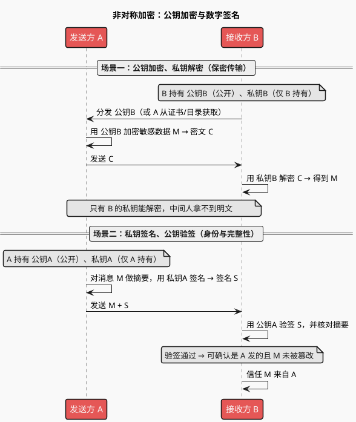
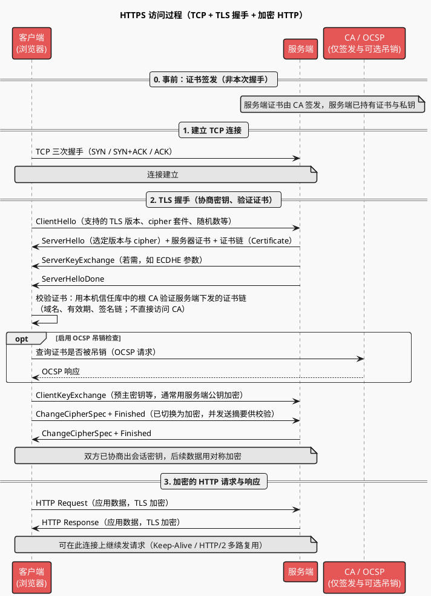
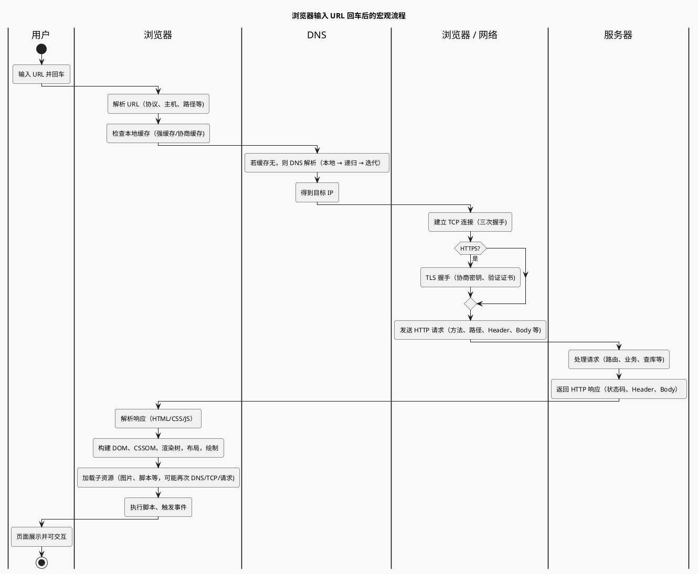

# HTTP 与 HTTPS：通用技术说明

> 本文档概括 **HTTP/1.1**、**HTTP/2**、**HTTP/3** 的演进，**HTTPS** 与加密/身份验证，以及 **Cookie/Session/Token**、**浏览器输入 URL 后发生什么** 等常见问题。参考：[基础理论：网络与信息安全](http://47.112.114.53:18080/shanguigu/%E5%9F%BA%E7%A1%80%E7%90%86%E8%AE%BA%EF%BC%9A%E7%BD%91%E7%BB%9C%E4%B8%8E%E4%BF%A1%E6%81%AF%E5%AE%89%E5%85%A8/%E5%9F%BA%E7%A1%80%E7%90%86%E8%AE%BA%EF%BC%9A%E7%BD%91%E7%BB%9C%E4%B8%8E%E4%BF%A1%E6%81%AF%E5%AE%89%E5%85%A8.html)。

---

## 一、HTTP/1.1 的局限与 HTTP/2 的改进

### 1.1 HTTP/1.1 的典型问题

- 每个请求往往占用一个连接，**并发多请求 = 多连接**，连接建立与队头阻塞影响延迟。
- 头部**重复发送**，未压缩，浪费带宽。
- 服务器无法主动推送资源，需客户端多次请求（HTML → CSS/JS/图片）。

### 1.2 HTTP/2 解决了什么

| 特性 | 说明 |
|------|------|
| **多路复用** | 单连接上并行多个请求/响应，二进制分帧，减少连接数与队头阻塞（在流级别）。 |
| **头部压缩** | HPACK 压缩头部，减少重复字段传输。 |
| **服务器推送** | 服务器可主动把相关资源（如 CSS/JS）随主资源一起推给客户端。 |
| **流量控制** | 对流进行流控，避免发送方压垮接收方。 |
| **优先级** | 可设置请求优先级，重要资源优先处理。 |

---

## 二、HTTP/2 的局限与 HTTP/3（QUIC）

### 2.1 HTTP/2 仍存在的问题

- **基于 TCP**：丢包或拥塞时，TCP 重传会导致**整条连接**上的流被阻塞（TCP 层队头阻塞）。
- **握手与迁移**：TCP + TLS 多次 RTT，且连接与四元组绑定，网络切换（如 WiFi→4G）需重建连接。

### 2.2 为什么需要 HTTP/3

- **基于 QUIC（UDP）**：QUIC 在 UDP 上实现可靠传输、拥塞控制、加密；**流之间独立**，单流丢包不阻塞其他流。
- **更快建连**：QUIC 将传输与加密合并，减少握手 RTT。
- **连接迁移**：连接 ID 与四元组解耦，换网络可复用连接。

---

## 三、HTTPS：不只是「更安全的 HTTP」

HTTPS 在 HTTP 与 TCP 之间加入 **TLS/SSL**，提供**加密、身份验证、完整性**，而不仅是「更安全」的笼统说法。

| 能力 | 说明 |
|------|------|
| **数据加密** | 传输内容经 TLS 加密，防止窃听、篡改。 |
| **身份验证** | 通过**数字证书**（CA 签发）验证服务器身份，防中间人冒充。 |
| **数据完整性** | 通过 MAC 等机制保证数据在传输中未被篡改。 |

对称加密与非对称加密（HTTPS 相关）：

- **对称加密**：加解密用同一密钥，速度快，适合大量数据；密钥需安全协商。
- **非对称加密**：公钥加密、私钥解密（或私钥签名、公钥验签）；用于密钥交换与身份验证。HTTPS 通常用非对称协商会话密钥，再用对称密钥加密业务数据。

### 3.1 非对称加密时序图

非对称加密中，**公钥可公开**，**私钥仅持有者保存**。常见两种用法：**公钥加密 / 私钥解密**（保密）、**私钥签名 / 公钥验签**（身份与完整性）。

**要点**：

- **场景一**：任何人用 B 的**公钥**加密，只有 B 用**私钥**能解密，用于密钥交换或保密传输（如 TLS 中客户端用服务端公钥加密预主密钥）。
- **场景二**：A 用**私钥**签名，任何人用 A 的**公钥**可验签，用于身份验证与防篡改（如 CA 用私钥签发证书，客户端用 CA 公钥验证证书）。

**在 REST/HTTPS 中的实际分工**：

- 非对称的**私钥解密**成本高，若对整份请求/响应体都用公钥加密、服务端私钥解密，会非常耗时，因此**业务数据的保密传输不用非对称做整包加解密**。
- 在 TLS 里，非对称实际只用在两处：**(1) 密钥交换**：客户端用服务端公钥加密的仅是「预主密钥」等**少量数据**，服务端用私钥**只解密一次**（每连接一次），之后用协商出的**对称会话密钥**加密所有 HTTP 报文；**(2) 身份与完整性**：证书的签发/验签（场景二）。
- 因此：**身份与完整性**全程依赖非对称（签名/验签）；**保密传输**在握手阶段用非对称只传「密钥」，真正对 REST 请求/响应体做加密的是**对称加密**，既安全又高效。

### 3.2 证书与 CA 的关系（先澄清）

**签发**：服务端的证书是**事先向 CA（证书颁发机构）申请**得到的，签发过程是「服务端 / 管理员 ↔ CA」，不发生在本次浏览器与服务器的握手过程中。

**验证**：握手时，服务端把**证书（及证书链）**下发给客户端。客户端**不直接与 CA 通信**，而是用**本机预置的信任库**（操作系统或浏览器内置的根 CA 证书）来验证：服务端证书是否由某根 CA 签发的链所信任、域名是否一致、是否在有效期内等。因此「验证证书」是客户端本地行为，依赖的是「服务端下发的链 + 本机信任的根 CA」。

**可选：吊销检查**：若启用 OCSP（Online Certificate Status Protocol）或拉取 CRL，客户端会向 **OCSP 服务器**（通常由 CA 或运营商提供）发起请求，查询该证书是否已被吊销，这时才出现与「CA 侧」的第三方交互。

### 3.3 HTTPS 访问过程时序图

下图从「建立 TCP」到「TLS 握手」再到「加密的 HTTP 请求/响应」。证书验证在客户端本地完成（用本机信任库校验服务端下发的证书链），图中用「客户端本地」表示，不画成与 CA 的实时交互；可选地标出 OCSP 吊销检查。

**要点**：

- **TCP**：先建立可靠传输通道（见 [TCP建立与销毁_通用技术.md](./TCP建立与销毁_通用技术.md)）。
- **证书与 CA**：验证是客户端用**本机信任库（根 CA）**校验**服务端下发的证书链**，不直接和 CA 通信；只有做 OCSP/CRL 吊销检查时才会访问 CA 侧的 OCSP 服务器。
- **TLS**：ClientHello/ServerHello 协商版本与 cipher；服务端下发证书（链）；客户端本地验证通过后，ClientKeyExchange 等完成密钥交换；ChangeCipherSpec + Finished 后双方用会话密钥加密/解密应用数据。
- **HTTP**：在 TLS 之上发送的请求与响应均为加密载荷，对中间人不可见。

---

## 四、Cookie、Session、Token 的区别

| 方式 | 存储位置 | 典型用途 | 特点 |
|------|----------|----------|------|
| **Cookie** | 客户端（浏览器） | 会话标识、偏好、跟踪 | 可被禁用/删除；需防 XSS、CSRF；可设域/路径/过期。 |
| **Session** | 服务端（内存/DB/缓存） | 会话状态、敏感信息 | 通过 Session ID（常存于 Cookie）与客户端关联；占用服务端资源。 |
| **Token** | 客户端（Cookie/本地存储/请求头） | 无状态认证、分布式 | 服务端不存会话，校验签名即可；适合分布式与无状态 API。 |

- **Cookie**：服务端 Set-Cookie，浏览器后续请求自动携带。
- **Session**：服务端存用户状态，用 Session ID 区分用户。
- **Token**（如 JWT）：自包含、可校验的令牌，多用于 API 与跨域场景。

---

## 五、浏览器输入 URL 回车后发生了什么

从「输入 URL 回车」到「页面展示」的宏观流程可概括为：

### 5.1 步骤摘要

1. **URL 解析**：协议、主机、端口、路径、查询串。
2. **DNS 解析**：本地缓存 → 递归查询（本地 DNS）→ 迭代查询（根/顶级/权威）→ 得到 IP。
3. **TCP 连接**：三次握手（见 [TCP建立与销毁_通用技术.md](./TCP建立与销毁_通用技术.md)）。
4. **TLS 握手**（HTTPS）：协商版本、 cipher、证书校验、密钥交换。
5. **HTTP 请求**：发送请求行、请求头、请求体。
6. **服务端处理**：路由、业务逻辑、数据库、生成响应。
7. **HTTP 响应**：状态码、响应头、响应体。
8. **渲染**：解析 HTML→DOM、CSS→CSSOM，构建渲染树，布局，绘制；加载并执行脚本与子资源。
9. **连接关闭**：可保持 Keep-Alive 复用，或四次挥手关闭。

---

## 六、跨域与 CORS（简要）

**同源策略**：脚本默认只能访问**同源**（协议+域名+端口相同）资源。

**跨域**：请求的 URL 与当前页不同源时，浏览器会发请求但可能**限制脚本读取响应**，除非服务端返回允许的 CORS 头。

**常见解决方式**：

- **服务端设置 CORS**：如 `Access-Control-Allow-Origin`、`Access-Control-Allow-Methods` 等。
- **代理**：同源服务器转发请求到目标域，浏览器只与同源服务器通信。
- **JSONP**：通过 `<script>` 跨域加载并执行回调（仅 GET，已较少用）。

---

## 七、可延伸阅读

- HTTP 方法、状态码、缓存（强缓存、协商缓存）、Range 请求。
- TLS 握手细节、证书链、OCSP。
- HTTP/2 帧类型、流与优先级；QUIC 与 HTTP/3 的迁移与部署。
- 正向代理与反向代理、CDN 与缓存（见参考链接中同系列笔记）。
