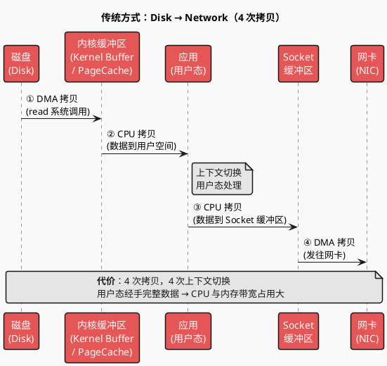
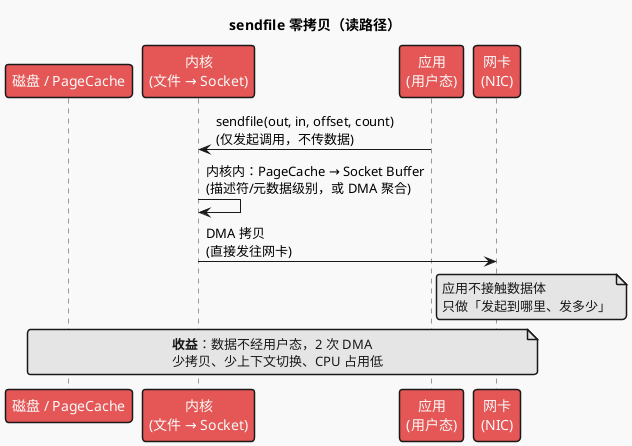
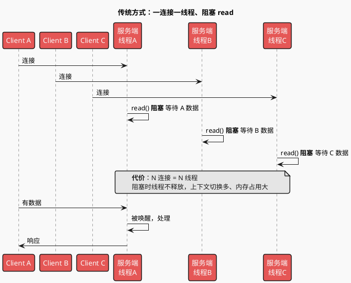
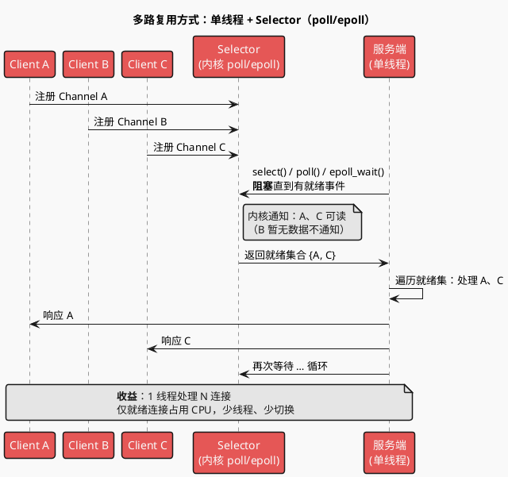
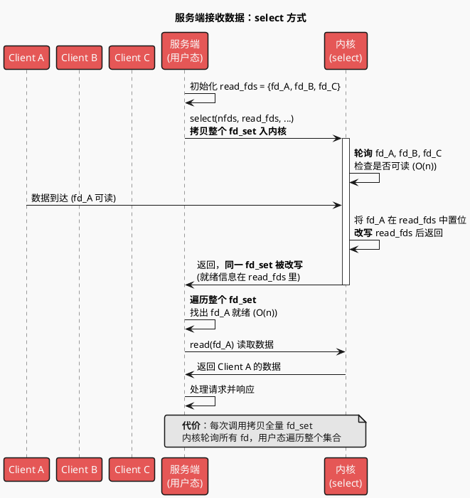
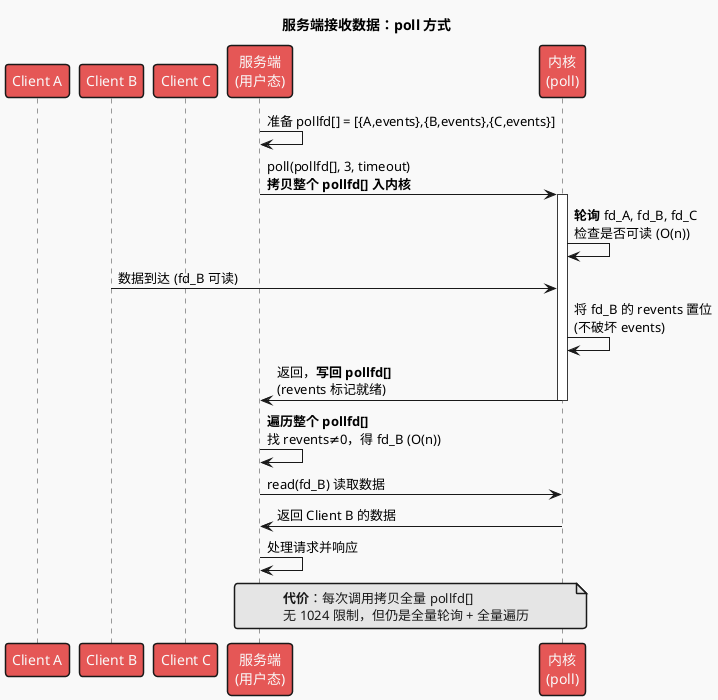
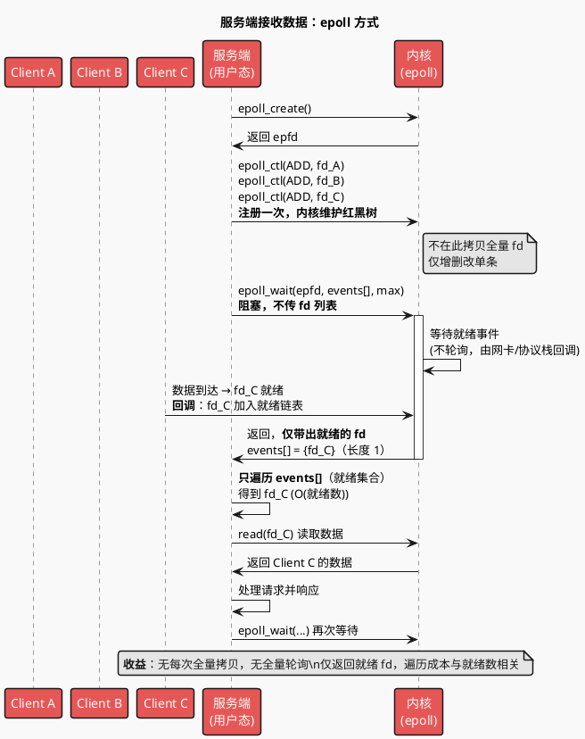

# NIO 与零拷贝：通用技术说明

> 多路复用 IO（NIO/select-poll-epoll）与零拷贝（Zero-Copy）是操作系统与网络栈的通用能力，在 **Kafka、Nginx、Redis、Netty** 等中间件中广泛使用。本文档从原理与时序图角度说明，不绑定单一组件。

---

## 一、零拷贝（Zero-Copy）

**场景**：将磁盘/内核缓冲区的数据发往网络（例如：服务端读文件并返回给客户端）。传统方式需多次拷贝与上下文切换，零拷贝通过 `sendfile` 等系统调用让数据在内核内完成传递，不经用户态。

### 1.1 传统方式：多次拷贝 + 多次上下文切换

数据需经过**用户态**，共 **4 次数据拷贝**、**4 次上下文切换**。CPU 参与两次「内核↔用户」的数据搬运，占用 CPU 且延迟高。

### 1.2 sendfile 零拷贝

**sendfile(out_fd, in_fd, offset, count)**：数据在**内核内**从文件描述符拷贝到 Socket，再 DMA 到网卡，**不经过用户态**。仅 **2 次 DMA + 少量描述符拷贝**，上下文切换与 CPU 参与大幅减少。

### 1.3 对比小结（零拷贝）

| 项 | 传统 read + write | sendfile 零拷贝 |
|----|-------------------|-----------------|
| 数据拷贝次数 | 4 次 | 2 次（DMA） |
| 上下文切换 | 4 次 | 2 次 |
| 用户态是否经手数据 | 是，完整数据 | 否，仅系统调用参数 |
| CPU 占用 | 高（搬运数据） | 低（仅控制逻辑） |

**典型应用**：Kafka Broker 读 .log 发往 Consumer、Nginx 静态文件下发、各类文件下载/流式传输服务。

---

## 二、多路复用 IO（Multiplexed I/O / NIO）

**场景**：服务端同时处理大量连接（多个 socket），若「一连接一线程」在 read() 上阻塞，线程与内存开销大。多路复用通过 **select / poll / epoll**（Linux）或 **kqueue**（BSD/macOS）在一线程上等待「多个 fd 中至少一个就绪」，再只处理就绪的 fd。

### 2.1 传统方式：多线程 + 阻塞 IO（一连接一线程）

每来一个连接就分配一个线程，该线程在 **read()** 上**阻塞**直到有数据。连接多时线程多，上下文切换与栈内存开销大。

### 2.2 多路复用方式：单线程 + Selector（select/poll/epoll）

**一个线程**持有一个 **Selector**，把多个连接的 fd **注册**到内核，通过 **select() / poll() / epoll_wait()** 等待「至少有一个 fd 就绪」。就绪后只处理有事件的连接。**1 个线程可管理大量连接**。

### 2.3 对比小结（多路复用 IO）

| 项 | 传统多线程阻塞 IO | NIO 多路复用（Selector） |
|----|-------------------|--------------------------|
| 线程与连接关系 | 1 连接 1 线程 | 1 线程 N 连接 |
| 阻塞发生位置 | 每线程在 read() 阻塞 | 单线程在 select/poll/epoll_wait 阻塞，内核通知就绪 |
| 上下文切换 | 连接多时切换多 | 与连接数弱相关，主要与就绪事件数相关 |
| 内存占用 | 每线程栈（如 1MB×万连接） | 单线程 + 内核就绪队列，占用小 |

**典型应用**：Kafka Broker、Redis、Nginx、Netty、各类高并发网关与 RPC 框架。

---

## 三、select、poll、epoll 的区别与原理（Linux）

Java NIO 的 **Selector** 在 Linux 上底层会优先用 **epoll**，未满足时退化为 **poll**；在 BSD/macOS 上多为 **kqueue**。下面以 Linux 为例，说明 select / poll / epoll 的机制与差异。

**共同目标**：在一组 fd（如多个 socket）上等待「至少有一个可读/可写」，避免为每个 fd 开一个阻塞线程。

### 3.1 以服务端接收数据为例：三种方式时序图

场景：服务端同时监听多个客户端（A、B、C）的连接，等待其中任意一个有数据到达并读取处理。

---

**（1）select 方式**

每次调用都把完整 fd_set 传入内核，内核轮询所有 fd，返回时改写同一 fd_set；服务端再遍历整个集合找出就绪的 fd。

---

**（2）poll 方式**

每次调用传入完整 pollfd 数组，内核轮询所有 fd，结果写回各元素的 revents；服务端遍历整个数组找 revents≠0 的 fd。

---

**（3）epoll 方式**

先通过 epoll_ctl 把 fd 注册到内核（一次），之后只调用 epoll_wait；内核用事件驱动把就绪 fd 放入链表，返回时只带出就绪的 fd，服务端只遍历就绪集合。

### 3.2 select / poll / epoll 文字说明与对比表

**select**

- **接口**：`select(nfds, read_fds, write_fds, except_fds, timeout)`，传入三个 fd_set 位图（可读/可写/异常）和最大 fd 值。
- **原理**：每次调用把当前关心的 fd 集合从用户态拷贝到内核；内核**轮询**所有传入的 fd（O(n)）；返回时内核**改写**传入的 fd_set，用户态再**遍历整个 fd_set** 找出就绪的 fd。
- **特点**：有最大 fd 数量限制（如 `FD_SETSIZE=1024`）；入参出参复用同一块内存，每次调用前需重新初始化；每次调用都拷贝整个 fd 集合。

**poll**

- **接口**：`poll(pollfd[], nfds, timeout)`，传入 pollfd 数组（fd + events + revents）。
- **原理**：每次调用把 pollfd 数组拷贝到内核；内核轮询所有 fd（O(n)）；就绪结果写回 revents，用户态遍历数组找 revents≠0。
- **特点**：无 1024 限制；输入输出分离（events/revents）；仍为每次全量拷贝与全量轮询。

**epoll**

- **接口**：`epoll_create()`、`epoll_ctl(epfd, op, fd, event)`、`epoll_wait(epfd, events[], maxevents, timeout)`。
- **原理**：fd 通过 epoll_ctl **注册一次**，内核维护红黑树；就绪时通过**回调**将 fd 挂入就绪链表，epoll_wait 只返回就绪的 fd，用户只遍历就绪集合；内核不轮询所有 fd，事件驱动。
- **特点**：无每次调用的 fd 集合拷贝；只返回就绪 fd；支持 LT/ET；连接数大时性能优于 select/poll。

**对比小结**

| 项 | select | poll | epoll |
|----|--------|------|-------|
| fd 集合传递 | 每次调用传入/传出 fd_set | 每次调用传入 pollfd[] | 注册用 epoll_ctl，等待用 epoll_wait，不重复传全量 fd |
| 内核实现 | 轮询所有 fd，O(n) | 轮询所有 fd，O(n) | 事件驱动，就绪 fd 入链表，epoll_wait 只取就绪，O(就绪数) |
| 最大 fd 数 | 受 FD_SETSIZE 限制（如 1024） | 理论受资源限制 | 同左，单机可支撑大量连接 |
| 用户态获取就绪 | 遍历整个 fd_set | 遍历整个 pollfd[] | 仅遍历 epoll_wait 返回的 events[] |
| 内核↔用户拷贝 | 每次调用拷贝 fd 集合 | 每次调用拷贝 pollfd[] | 仅拷贝就绪的 fd 信息 |
| 触发模式 | 水平触发 | 水平触发 | 支持 LT / ET |
| 平台 | 通用（POSIX） | 通用（POSIX） | Linux 特有；BSD/macOS 用 kqueue 思路类似 |

---

## 四、在中间件中的使用（简要）

| 技术 | 典型使用场景 |
|------|--------------|
| **零拷贝 sendfile** | Kafka 读 .log 发 Consumer、Nginx 静态文件、文件下载/流式传输 |
| **NIO 多路复用** | Kafka Broker、Redis 单线程事件循环、Nginx、Netty、各类网关与 RPC |

Kafka 流程中涉及这两部分时，可参见本文档；Kafka 自身的写入/消费流程与 acks、刷盘等仍保留在 Kafka 流程文档中。
