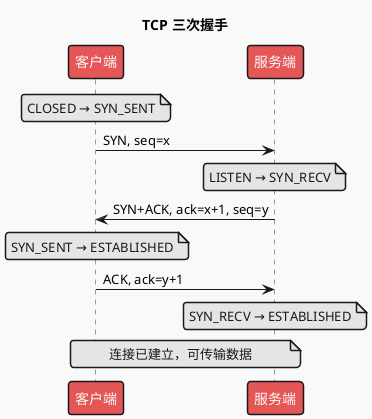
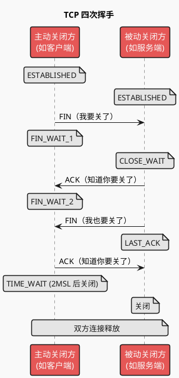

# TCP 建立与销毁：通用技术说明

> TCP 是面向连接的可靠传输协议。本文档说明**连接建立（三次握手）**、**连接关闭（四次挥手）**、**粘包/拆包**及**可靠传输**要点。参考：[基础理论：网络与信息安全](http://47.112.114.53:18080/shanguigu/%E5%9F%BA%E7%A1%80%E7%90%86%E8%AE%BA%EF%BC%9A%E7%BD%91%E7%BB%9C%E4%B8%8E%E4%BF%A1%E6%81%AF%E5%AE%89%E5%85%A8/%E5%9F%BA%E7%A1%80%E7%90%86%E8%AE%BA%EF%BC%9A%E7%BD%91%E7%BB%9C%E4%B8%8E%E4%BF%A1%E6%81%AF%E5%AE%89%E5%85%A8.html)。

---

## 一、三次握手（连接建立）

**目的**：双方确认**都具有收发能力**，并**同步初始序列号**，防止失效连接请求被误当成新连接。

### 1.1 过程简述

| 步骤 | 方向 | 报文 | 含义 | 客户端状态 | 服务端状态 |
|------|------|------|------|------------|------------|
| 第一次 | 客户端 → 服务端 | **SYN**，携带客户端初始序列号 seq=x | 请求建立连接 | SYN_SENT | LISTEN |
| 第二次 | 服务端 → 客户端 | **SYN+ACK**，ack=x+1，seq=y | 同意建立，并携带服务端初始序列号 | SYN_SENT | SYN_RECV |
| 第三次 | 客户端 → 服务端 | **ACK**，ack=y+1 | 确认连接，可开始传数据 | ESTABLISHED | ESTABLISHED |

### 1.2 时序图

### 1.3 记忆要点

1. **第一次**：客户端告诉服务端——我要和你连接。
2. **第二次**：服务端回应——我知道你要连接，你可以连。
3. **第三次**：客户端再确认——好的，连上了，我要开始发数据了。

---

## 二、四次挥手（连接关闭）

**目的**：双方**安全、有序地终止**连接，确保数据发完再关，避免丢包或误关。

TCP 是全双工：一端关闭写方向后，仍可接收对方数据，因此**关闭需要两次「请求 + 确认」**（先关一方写向，再关另一方写向）。

### 2.1 过程简述

| 步骤 | 方向 | 报文 | 含义 | 主动关闭方状态 | 被动关闭方状态 |
|------|------|------|------|----------------|----------------|
| 第一次 | 主动方 → 被动方 | **FIN** | 我要关闭我到你方向的连接 | ESTABLISHED → FIN_WAIT_1 | ESTABLISHED → CLOSE_WAIT |
| 第二次 | 被动方 → 主动方 | **ACK** | 收到你的关闭请求 | FIN_WAIT_1 → FIN_WAIT_2 | CLOSE_WAIT |
| 第三次 | 被动方 → 主动方 | **FIN** | 我也要关闭我到你方向的连接 | FIN_WAIT_2 | CLOSE_WAIT → LAST_ACK |
| 第四次 | 主动方 → 被动方 | **ACK** | 收到，都关掉 | TIME_WAIT → (关闭) | LAST_ACK → (关闭) |

主动关闭方在发完最后一次 ACK 后进入 **TIME_WAIT**，等待 2MSL 再真正释放连接，防止对方重传的 FIN 丢失或迟到的报文干扰新连接。

### 2.2 时序图

### 2.3 记忆要点

1. **第一次**：告诉对方，我要关了。
2. **第二次**：对方知道我要关了。
3. **第三次**：对方告诉我，他要关了。
4. **第四次**：我知道对方要关了，我们都关掉。

---

## 三、TCP 粘包与拆包

TCP 是**字节流**协议，不维护应用层消息边界，因此会出现**粘包**和**拆包**，需在**应用层**设计协议处理。

| 现象 | 含义 | 典型原因 |
|------|------|----------|
| **粘包** | 多个小包被一次读出，边界不清 | 发送快、接收慢，多个包在缓冲区连在一起 |
| **拆包** | 一个大包被拆成多次读出 | 包大于缓冲区或 MTU，被分成多个段 |

### 3.1 常见解决方式

1. **消息长度字段**：在消息头用固定长度表示「后续 body 长度」，接收方先读长度再读 body。
2. **消息分隔符**：在消息尾加特定分隔符（如 `\n`、自定义 delimiter），按分隔符切分。
3. **固定长度消息**：所有消息同一长度，不足用 padding 补齐。
4. **应用层协议**：如 HTTP、自定义二进制协议，明确定义帧格式与边界。

---

## 四、TCP 如何保证可靠传输（简述）

| 机制 | 作用 |
|------|------|
| **序列号与确认** | 每个字节有序号，接收方 ACK 确认已收到，未确认则重传。 |
| **超时重传** | 发送后未在约定时间内收到 ACK，认为丢包并重传。 |
| **数据分段与重组** | 大块数据分成段传输，接收方按序号重组；缺段可请求重传。 |
| **流量控制** | 滑动窗口：接收方通告可接收窗口，发送方不发送超过窗口的数据。 |
| **拥塞控制** | 慢启动、拥塞避免等，根据网络状况调整发送速率。 |

**注意**：可靠传输的前提是「底层设备、程序正常」；物理层断线、断电等不在传输层保证范围内。

---

## 五、可延伸阅读

- **状态机**：LISTEN、SYN_SENT、SYN_RECV、ESTABLISHED、FIN_WAIT_1/2、CLOSE_WAIT、LAST_ACK、TIME_WAIT 等状态迁移。
- **TIME_WAIT 与 2MSL**：为何等待、端口占用与 `SO_REUSEADDR`。
- **半连接队列 / 全连接队列**：服务端 backlog 与 SYN_RECV、ESTABLISHED 队列。
